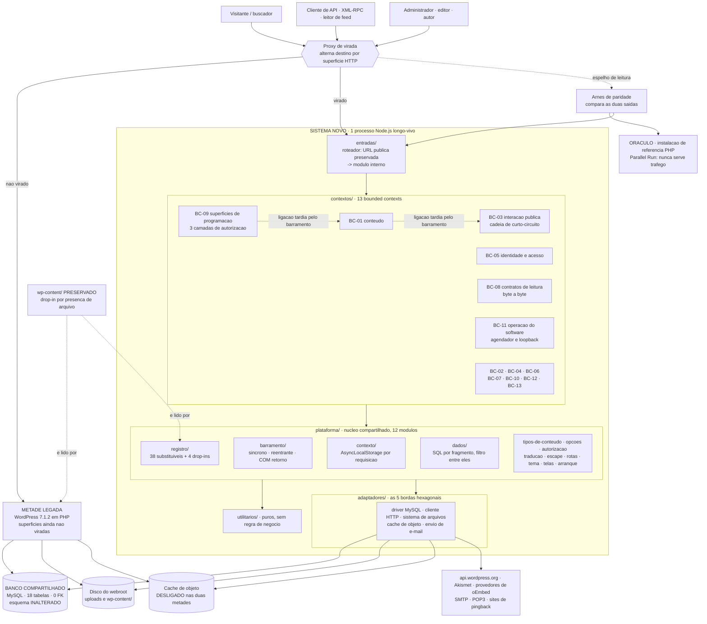

# Target Architecture

> Arquitetura alvo do sistema novo, respeitando o paradigma escolhido em
> [`paradigm_decision.md`](paradigm_decision.md) e a estratégia recomendada em
> [`migration_strategy.md`](migration_strategy.md).

> 📌 **DUAS PREMISSAS DECLARADAS, porque as duas decisões estão PENDENTES.**
> 1. **Topologia**: este desenho aplica a **opção 3 — híbrido** de
>    [`topology_decision.md`](topology_decision.md), que **não foi aprovada** (`answer_mode` é `file`,
>    esta execução não teve conversa). A § *Honra à topologia escolhida* declara o que muda em cada opção.
> 2. **Estratégia**: pressupõe **A — Strangler Fig por superfície HTTP com banco compartilhado + Parallel
>    Run obrigatório**, recomendada em [`migration_strategy.md`](migration_strategy.md) § 4.2, cuja § 6
>    está **em branco**.
>
> Nenhuma decisão foi tomada em nome de ninguém. Nada aqui é irreversível: a § *Notas* item 1 lista o que
> é refeito em cada resposta.

| Escala de confiança | Significado |
|---|---|
| 🟢 CONFIRMADO | Evidência direta, com artefato ou `arquivo:linha` citado |
| 🟡 INFERIDO | Decisão de desenho deste agente, derivada de evidência |
| 🔴 LACUNA | Depende de resposta que não existe |

---

## Visão geral

O sistema novo é o **núcleo do CMS** — não um site ([`questions.md`](../questions.md) P1, P4, P13, P14) —
reescrito em **TypeScript `strict` sobre Node.js LTS, sem framework opinativo, sobre MySQL/MariaDB com SQL
escrito à mão e sem ORM, e sem mensageria alguma**. Ele é **um processo longo-vivo** atendendo requisições
concorrentes, o que é a diferença mais consequente em relação ao legado, que monta e descarta um processo
PHP por requisição.

Internamente são **três camadas declaradas** — plataforma (12 módulos), utilitários puros (6) e 13
*bounded contexts* — com **portas e adaptadores somente nas 5 bordas de infraestrutura** que o porte troca
de qualquer forma. Não há fronteira de processo: 1 único artefato de implantação, porque
[`architecture.md`](../architecture.md) §9 risco 1 mediu que o legado tem **zero** fronteira de processo
para usar como linha de corte, logo qualquer decomposição em serviços seria **desenho novo, não extração**.

Durante a migração o sistema novo **coexiste** com a metade PHP sobre **um banco só**, atrás de um *proxy*
que alterna destino por superfície HTTP. São 12 viradas, sem janela de indisponibilidade, com *rollback* de
uma regra de *proxy* em ≤ 2 min ([`cutover_plan.md`](cutover_plan.md)).

---

## Diagrama (Mermaid)



> **Como ler este diagrama.** Não há caixa com fronteira de processo dentro de `Novo`: é **um** processo.
> As camadas são fronteiras de *build* verificadas por regra de dependência, não de rede. As duas setas
> pontilhadas **entre contextos** (`BC-09 → BC-01` e `BC-01 → BC-03`) são as únicas ligações horizontais
> desenhadas, e são **de ligação tardia, de propósito**: estão ali como amostra das **130 arestas BC→BC
> medidas**, que não cabem num diagrama legível — ver § *Honra à topologia escolhida* e **AD-10**. O
> `Oráculo` nunca serve tráfego: é o Parallel Run obrigatório.

---

## Componentes

| Componente | Tipo | Responsabilidade | Origem (legado / novo / fundido) |
|---|---|---|---|
| `entradas/` (roteador) | API | Mapear a **URL pública preservada** para o módulo interno. Em PHP não existe: os 109 *front controllers* são a própria tabela de rotas, porque caminho servido = caminho de fonte | **novo** — é a indireção que a *stack* alvo tem e o legado não, e é ela que torna a opção 3 gratuita |
| `plataforma/contexto/` | Serviço | `AsyncLocalStorage` por requisição: identidade, consulta corrente, conexão e requisição. **Pré-requisito de tudo** | **novo por necessidade** — implicação 2 de [`paradigm_decision.md`](paradigm_decision.md); no legado vinha de graça do processo morrer |
| `plataforma/barramento/` | Serviço | Barramento de *hooks*: síncrono, reentrante, ordenado por prioridade inteira e **com retorno de valor** em 69,7% dos pontos | fundido — `hooks-e-plugin-api` (64 de 71 dependentes, peso 5.472) |
| `plataforma/registro/` | Serviço | Registro explícito que substitui as **38 funções substituíveis**, as 176 guardas `function_exists` e os **4 *drop-ins*** | **novo por necessidade** — implicação 7; TypeScript não permite redefinir função importada |
| `plataforma/arranque/` | Serviço | Ordem de carregamento **como contrato público** (`EXT-ORDEM`) | fundido — `bootstrap-e-carregamento` (60 de 71 dependentes, peso 2.101) |
| `plataforma/dados/` | Serviço | Montagem de SQL **por fragmento, com ponto de filtro entre cada fragmento** | fundido — `camada-de-dados-wpdb` (33 dependentes); 9 classes montam SQL assim ([`architecture.md`](../architecture.md) §9 risco 5) |
| `plataforma/tipos-de-conteudo/` | Serviço | Registro de tipo de conteúdo e acesso ao registro | **dividido** de `posts-e-tipos-de-conteudo` (42 de 71 dependentes) |
| `plataforma/opcoes/` | Serviço | Opções e as 4 famílias de metadado, com o *codec* de `serialize()` do PHP | fundido — `opcoes-e-metadados` (53 de 71 dependentes) |
| `plataforma/autorizacao/` | Serviço | A **decisão** de capacidade e a tradução de capacidade sobre objeto (`map_meta_cap`) | **dividido** de `capacidades-e-papeis` (48 de 71 dependentes) |
| `plataforma/traducao/` | Serviço | Tradução. **Não ganha porta**: 13.335 pontos de entrada de **68 dos 71 módulos** | fundido — `l10n-e-traducoes` |
| `plataforma/escape/` | Serviço | Formatação e escape de saída. **Não ganha porta**: 3.416 pontos de 65 de 71 | fundido — `formatacao-e-escape` |
| `plataforma/rotas/` | Serviço | Reescrita e permalink | fundido — `rewrite-e-permalinks` |
| `plataforma/tema/` | Serviço | **Resolução** da hierarquia de template | **dividido** de `temas-e-hierarquia-de-templates` |
| `plataforma/telas/` | Serviço | Arcabouço das ~100 telas | **dividido** de `telas-do-painel` (32 dependentes; recebe 1.075 chamadas de tradução) |
| `utilitarios/` | Serviço | 6 módulos puros, sem regra de negócio: parser de HTML, saneamento, cache de objeto, configuração de visão, registro *pluggable*, *diff* de texto | fundido |
| 13 × `contextos/<bc>/` | Serviço | Um por *bounded context* — tabela da § *Bounded contexts* | fundido / dividido / 1-para-1 com justificativa |
| `adaptadores/driver-mysql` | DB | Porta de dados. **Reproduz a ausência de transação**: zero `START TRANSACTION`, zero `COMMIT` | fundido — `mysqli` trocado de qualquer forma |
| `adaptadores/cliente-http` | Serviço | Porta HTTP. **Reproduz o rebaixamento para `http://`** em 13 canais, 7 deles repetindo em claro quando o TLS falha (`ESC-HTTP`) | fundido — `cliente-http` (37 dependentes), 2 transportes já selecionáveis |
| `adaptadores/sistema-de-arquivos` | Serviço | Porta de arquivos, 5 *backends* já presentes no legado | fundido — `WP_Filesystem` |
| `adaptadores/cache-de-objeto` | DB | Porta de cache, *drop-in* por presença. **Desligada nas duas metades** durante a coexistência | fundido — `object-cache` (27 dependentes) |
| `adaptadores/envio-de-email` | Serviço | Porta de e-mail. **O número de e-mails é critério de aceite** (`A5`, `A6`, `A7`) | fundido — PHPMailer trocado de qualquer forma |
| `compatibilidade/` | Serviço | Prateleira para `deprecated-e-compatibilidade` (10.160 linhas) | 🔴 destino pende de `BR-HUMANA-006` |
| `wp-content/` | DB (disco) | **Preservado como caminho**: `plugins/`, `themes/`, `uploads/` e os *drop-ins* na raiz | preservado — a presença do arquivo **é** a API (`wp-settings.php:98` · `wp-includes/load.php:711`, `:825`) |
| Arnês de paridade | Worker | Espelha leitura para o oráculo e compara as duas saídas pelo critério de área da Decisão 2 | **novo** — exigido por `ESC-ORACULO` ([`BR-MIGRAR-116`](target_business_rules.md#br-migrar-116)) |
| Oráculo | API | Instalação PHP de referência na mesma versão. **Nunca serve tráfego** | preservado — [`questions.md`](../questions.md) P16 |
| *Proxy* de virada | API | Alterna destino por superfície HTTP. É onde a estratégia A vive | **novo** — temporário, sai no corte final |
| **Fila / mensageria** | — | **NÃO EXISTE, por decisão** | [`questions.md`](../questions.md) P10: *"trocar por agendador do sistema produz um produto que se comporta diferente no primeiro dia"*. O agendador é lista em `wp_options` disparada por requisição HTTP ao próprio host |

---

## Bounded contexts

Os 13 contextos cobrem os 53 módulos de domínio; os outros 18 estão nas duas camadas compartilhadas e 3
ficam fora da partição de desenho (2 adotados + 1 prateleira). A partição foi conferida **total e
disjunta** em [`decompor.py`](../../.reversa/work/reversa-designer/decompor.py).

> **Nenhum contexto publica evento.** O paradigma alvo decidido é a **Opção 3 — híbrido**, cuja fronteira
> mantém o barramento **síncrono e com retorno de valor**, e a *stack* alvo **não tem mensageria**. Logo
> os campos *Eventos publicados* e *Eventos consumidos* do *template* não se aplicam a nenhum contexto, e
> isso é decisão registrada e não omissão — ver § *Honra ao paradigma escolhido*, item 1. O que existe no
> lugar é **ponto de filtro** e **ponto de ação**, que são chamada de função na mesma pilha.

### BC-01: Conteúdo
- **Responsabilidade**: o ciclo de vida do conteúdo — publicar, agendar, revisar, descartar, restaurar,
  expirar — e a serialização de bloco dentro de `post_content`.
- **Justificativa do agrupamento**: fusão de **8 módulos** (`wp-query`, `editor-de-blocos`,
  `blocos-do-nucleo`, `block-supports`, `block-bindings`, `block-patterns`, `shortcodes`,
  `importacao-e-exportacao`) porque todos leem ou escrevem **a mesma coluna**: o bloco é *"serializado em
  comentário HTML dentro de `post_content` — não em tabela"* ([`domain.md`](../domain.md) §1.5), o
  *shortcode* é resolvido no mesmo texto, e a exportação WXR é serialização do mesmo conteúdo. Uma
  fronteira entre eles não teria o que policiar.
- **Justificativa da separação de mídia**: o anexo é um `post` por armazenamento, mas `R3`
  ([`BR-MIGRAR-032`](target_business_rules.md#br-migrar-032)) diz que ele só vai para a lixeira se
  `MEDIA_TRASH` estiver ligada, e ela é `false` por padrão — a regra de retenção do anexo é o **oposto** da
  do post. Forma de armazenamento não decide contexto.
- **Componentes internos**: `AGG-Conteudo`, `AGG-Revisao`, cadeia de serialização de bloco, a cascata de
  7 etapas de exclusão com reparenteamento (`wp-includes/post.php:3908` e `:3923`).
- **Regras**: `P1`–`P8`, `R1`–`R4`, `R6`, `DB-TRG3`, `SM-ALL` (parcial), `EXT-EXCLUSAO`.

### BC-02: Classificação
- **Responsabilidade**: termos, taxonomias, o vínculo polimórfico objeto↔termo e o contador `count`.
- **Justificativa do agrupamento**: fusão **contraintuitiva e necessária** de `taxonomias-e-termos` com
  `links-e-bookmarks`. `links` parece morto — [`erd-complete.md`](../erd-complete.md) §8 registra
  *"nenhum módulo ativo"* como dono da tabela — mas `term_relationships.object_id` é **polimórfico e serve
  `posts` e `links`** (§7.1 relações 5 e 10). Separá-los deixaria a coluna polimórfica sem dono, que é
  exatamente o defeito que o risco 7 do §9 daquele artefato manda corrigir.
- **Componentes internos**: `AGG-Termo`, resolução do termo padrão, os **dois** critérios de cálculo de
  `term_taxonomy.count`.
- **Regras**: `P3`, `DB-TRG2`, `DB-TRG4`, `DB-UNIQ`.

### BC-03: Interação Pública
- **Responsabilidade**: receber, decidir e moderar comentário, *pingback* e *trackback*, e manter o
  contador `posts.comment_count`.
- **Justificativa da separação (1-para-1, e por isso com justificativa obrigatória)**: apesar de
  `comments.comment_post_ID` apontar para `posts`, esta é *"a área de maior densidade de regra de negócio
  do sistema"* ([`domain.md`](../domain.md) §2.2), com **12 regras em que a ordem de avaliação importa e
  cada etapa pode encerrar a decisão**, devolvendo **409 e 429 na mesma resposta ao visitante**. Fundir com
  `BC-01` dissolveria a ordem — e a ordem **é** a regra (implicação 3 de
  [`paradigm_decision.md`](paradigm_decision.md)).
- **Componentes internos**: `AGG-Comentario` e a **cadeia síncrona de curto-circuito** com ordem
  declarada: `C1` duplicata → `C4` moderação manual → `C3` atalho de confiança → `C2` vazão → `C9` lista
  de proibição → `C6` palavra em 6 campos → `C5` excesso de link → `C7` autor já aprovado → `C10` tamanho
  → `C8` pingback/trackback → `C11` fechamento por idade → `C12` nota editorial.
- **Regras**: `C1`–`C12`, `DB-TRG1`.

### BC-04: Mídia
- **Responsabilidade**: ingestão de arquivo, redução na entrada, geração de derivadas e edição de imagem.
- **Justificativa do agrupamento**: fusão de `midia-e-anexos` com `edicao-de-imagem` porque as duas
  operam o **mesmo artefato em disco** e compartilham o modo de falha de `M4`: *"falha ao gerar derivada de
  imagem é silenciosa"*. Separá-las criaria duas políticas de falha para a mesma operação.
- **Componentes internos**: `AGG-Anexo`, política dos 4 tamanhos nativos, o teto de `srcset` em 2048 px.
- **Regras**: `M1`–`M4`, `R3`.

### BC-05: Identidade e Acesso
- **Responsabilidade**: conta, perfil, sessão, senha de aplicação e o **dado** do papel.
- **Justificativa do agrupamento**: fusão de `usuarios-e-perfis`, `autenticacao-e-sessoes` e
  `application-passwords` porque são **uma invariante só**: a chave do HMAC do cookie embute **4 caracteres
  do hash da senha** ([`gaps.md`](../gaps.md) A-05), logo trocar a senha e a validade da sessão são o mesmo
  fato — e `ESC-SESSAO` ([`BR-MIGRAR-111`](target_business_rules.md#br-migrar-111)) manda **não** revogar.
  Separar sessão de conta tornaria essa regra inexprimível.
- **Justificativa da divisão com a plataforma**: a **decisão** de capacidade é chamada 1.279 vezes em 224
  arquivos e precisa estar abaixo de todo contexto; o **dado** do papel mora em metadado serializado por
  site, com o papel dentro do nome da `meta_key` (`PERM-2`), e pertence à identidade.
- **Componentes internos**: `AGG-Conta`, `AGG-Sessao`, `AGG-SenhaDeAplicacao`, `VO-Papel`.
- **Regras**: `U1`–`U9`, `PERM-1`–`PERM-13` (o lado dado), `ESC-ENUMERACAO`, `ESC-SESSAO`.

### BC-06: Privacidade
- **Responsabilidade**: solicitação de exportação e de apagamento de dado pessoal, com confirmação do
  titular.
- **Justificativa da separação (1-para-1, com justificativa obrigatória)**: separado **por regime, não por
  tamanho**. É domínio regulado (LGPD/GDPR) e dispara o caso de borda do SKILL do Strategist: **Parallel
  Run permanente** e **nunca Big Bang**. `D1` diz literalmente *"a solicitação é um Post"* e ainda assim
  fica fora de `BC-01`: o ciclo de vida `user_request` (`request-pending` → `request-confirmed` →
  `request-completed` / `request-failed`) **não tem interseção** com a máquina de `post_status`, e tratar a
  forma de armazenamento como fronteira juntaria dois domínios com reguladores diferentes.
- **Componentes internos**: `AGG-SolicitacaoDeDadoPessoal`, a chave com *hash* de 24 h, o arquivo de
  exportação com validade de 3 dias.
- **Regras**: `D1`–`D6`, `R7`, `R8`.

### BC-07: Apresentação
- **Responsabilidade**: resolver contrato declarado em dado (`theme.json`, `block.json`, `view-config`)
  para CSS, HTML e *script*, e montar menu, widget e personalização.
- **Justificativa do agrupamento**: fusão de **12 módulos** por duas razões independentes. (a) Todos são o
  **estilo D** de [`paradigm_decision.md`](paradigm_decision.md): *dataflow* declarativo, contrato em dado
  resolvido por estágios. (b) [`architecture.md`](../architecture.md) registra o ciclo secundário
  `customize ↔ menus-de-navegacao ↔ widgets-e-sidebars`: **já estão no mesmo ciclo**, logo não existe
  fronteira entre eles a declarar — declarar uma seria inventar uma que o código não tem.
- **Componentes internos**: `AGG-Tema`, `AGG-Changeset`, `AGG-AreaDeWidget`, `AGG-MenuDeNavegacao`,
  motor de estilo, registro de *script* e de módulo de *script*.
- **Regras**: `SM-CHANGESET`, `ESC-CLIENTE` (o lado servidor que alimenta o cliente).

### BC-08: Contratos de Leitura
- **Responsabilidade**: as superfícies públicas **somente de leitura** com contrato de terceiro: feeds RSS
  e Atom, `wp-sitemap.xml`, oEmbed e OPML.
- **Justificativa do agrupamento**: fusão de `feeds-rss-atom`, `sitemaps` e `oembed-e-embeds` **pelo
  critério de aceite**, que é a coesão mais afiada disponível neste pacote: os três são **byte a byte**
  pela Decisão 2, e são juntos a **fatia 2** da estratégia — a primeira virada, escolhida justamente porque
  uma divergência em leitura não corrompe estado compartilhado.
- **Componentes internos**: serializadores de RSS 2.0, Atom, RDF, *sitemap* e OPML; o provedor de oEmbed.
- **Regras**: `ESC-HTTP` (parcial, no consumo de oEmbed), `ESC-ORACULO`.

### BC-09: Superfícies de Programação
- **Responsabilidade**: as quatro superfícies de escrita paralelas à API — REST, XML-RPC, canal assíncrono
  do painel e *abilities* — **com o comportamento atual**.
- **Justificativa do agrupamento, que é a de maior valor de diagnóstico deste desenho**: `PERM-11`
  ([`BR-MIGRAR-097`](target_business_rules.md#br-migrar-097)) registra **três camadas paralelas de
  autorização, cada uma com a sua própria falha padrão** — capacidades, `permission_callback` do REST
  (falha **ABERTA**: rota sem *callback* funciona) e `permission_callback` da Abilities API (falha
  **FECHADA**, mas filtrável para conceder). Hoje elas moram em pastas separadas e **ninguém vê a
  divergência**. Num contexto só, ela é comparável, e é a condição para responder `BR-HUMANA-008`.
- **Justificativa de não fundir com `BC-10`**: as telas autorizam por *nonce* (228 `check_admin_referer`),
  não por `permission_callback`, e `ESC-SUPERFICIES` manda preservar **as quatro** com o comportamento
  atual — inclusive a diferença.
- **Componentes internos**: despachante REST, servidor XML-RPC (77 métodos), despachante assíncrono (108
  ações), registro de *abilities* (5 registradas: 3 do núcleo, 2 do Akismet).
- **Regras**: `I4`–`I7`, `PERM-11`, `ESC-SUPERFICIES`.

### BC-10: Painel
- **Responsabilidade**: as ~100 telas de administração, as listagens e o painel inicial.
- **Justificativa da separação**: dividido de `telas-do-painel` (cujo **arcabouço** é plataforma) e fundido
  com `admin-list-tables` e `dashboard`. É a **fatia 9** da estratégia e o ponto em que a **implicação 2**
  mais morde: 224 arquivos com `current_user_can`, e nenhum dos 985 testes de
  [`backlog/tests.md`](../backlog/tests.md) exercita duas requisições concorrentes.
- **Componentes internos**: tabelas de listagem, telas de edição, painel inicial, editor de arquivo de
  extensão (que `ESC-SUPERFICIES` proíbe cortar).
- **Regras**: `ESC-SUPERFICIES` (parcial), `PERM-8`.

### BC-11: Operação do Software
- **Responsabilidade**: atualização de núcleo e de extensão, instalação, evolução de esquema,
  agendamento, *loopback*, diagnóstico de saúde e modo de recuperação.
- **Justificativa do agrupamento**: fusão de **7 módulos** porque `A5`, `A6`, `A7` e `A9` são **uma só
  invariante**: a atualização é agendada pelo cron, o modo de recuperação é o tratador de falha da
  atualização, e os três escrevem pelo sistema de arquivos. É também o que dá **dono único** às **4
  implementações independentes do protocolo de *loopback*** — a duplicação está admitida em comentário em
  `wp-admin/includes/class-wp-site-health.php:3622` — e é esse dono que `BR-HUMANA-005` pede.
- ⚠️ **Divergência deliberada da fatia 5**, declarada para não parecer erro: a fatia 5 de
  [`migration_strategy.md`](migration_strategy.md) § 4.4 entrega o agendador **sozinho**, por mandato da
  implicação 6. **Fatia é unidade de entrega; bounded context é unidade de desenho.** A fatia 5 passa por
  dentro de `BC-11`, e os dois documentos estão corretos.
- **Componentes internos**: `AGG-AtualizacaoAutomatica`, `AGG-ModoDeRecuperacao`, `AGG-TarefaAgendada`,
  verificador de assinatura (que **não verifica**), evolução de esquema por comparação de estrutura.
- **Regras**: `A1`–`A12`, `DB-MIG`, `DB-SEED`, `ESC-LIMITE-TAXA`.

### BC-12: Rede (multisite)
- **Responsabilidade**: a rede de sites, o cadastro em rede e a supervisão de site.
- **Justificativa da separação (1-para-1, com justificativa obrigatória)**: é a única fronteira deste
  desenho que é também **fronteira de instalação**. `ESC-MULTISITE`
  ([`BR-MIGRAR-109`](target_business_rules.md#br-migrar-109)) diz que multisite é **capacidade do
  produto**, logo o contexto tem de **poder estar ausente** — e tem 6 tabelas próprias mais a relação 24,
  em que o `blog_id` entra **no nome da tabela** (`wp_7_posts`), de modo que *"cada linha nova cria 10
  tabelas"* ([`erd-complete.md`](../erd-complete.md) §7.2).
- **Componentes internos**: `AGG-SiteDaRede` (com os **quatro** campos de supervisão), `AGG-Cadastro`,
  `AGG-Rede`.
- **Regras**: `N1`–`N7`, `U7`, `U8`, `D4`, `PERM-9`, `PERM-10`, `ESC-MULTISITE`.

### BC-13: Integração Externa
- **Responsabilidade**: a **política** de integração — precedência de credencial, registro de conector,
  cliente de IA e o rebaixamento para canal sem cifra.
- **Justificativa do agrupamento**: fusão de `cliente-http`, `ai-client`, `connectors` e `envio-de-email`
  porque é onde vivem **os 5 achados de segurança** de [`integrations/integrations.md`](../integrations/integrations.md),
  e `ESC-HTTP` ([`BR-MIGRAR-115`](target_business_rules.md#br-migrar-115)) manda migrá-los **inteiros**.
  Juntar política de integração num contexto só é o que permite auditar os 5 de uma vez.
- **Justificativa da divisão com os adaptadores**: [`refactor/architectures.md`](../refactor/architectures.md)
  §6 item 1 põe as 5 portas **no núcleo compartilhado**. Logo o **adaptador** mora em `adaptadores/` e a
  **política** mora aqui. Sem essa divisão, o contexto seria o único com dependência de infraestrutura
  dentro de si.
- **Componentes internos**: resolução de credencial (ambiente → constante → banco), registro dos 3
  conectores de IA (🔴 **sem provedor que os execute nesta árvore**), o conector Akismet, o construtor de
  *prompt* com tempo limite de 30 s.
- **Regras**: `I1`–`I3`, `ESC-IA`, `ESC-HTTP`.

---

## Decisões arquiteturais (ADR-style resumido)

### AD-01: Um processo, nenhuma fronteira de rede
- **Decisão**: o sistema novo é **um único artefato de implantação**, sem serviços, sem mensageria e sem
  fronteira de processo interna.
- **Alternativas descartadas**: microsserviços (`fit` **6**), SOA com BFF (**17**), *serverless* (**7**),
  CQRS com *event sourcing* (**12**) — todas em [`refactor/architectures.md`](../refactor/architectures.md) §7.
- **Justificativa**: **68 dos 71 módulos num único componente fortemente conexo**, e a melhor fronteira de
  domínio que existe (os 15 épicos do backlog, revisados por humano) deixa **92,5% do peso atravessando a
  si mesma**. Mais: [`architecture.md`](../architecture.md) §9 risco 1 mediu **zero fronteira de processo**
  no legado, logo não há o que extrair. E `serverless` é impossível por regra: o agendador depende de
  `ignore_user_abort(true)` em `wp-cron.php:19` e de uma requisição que **continua depois de o cliente
  desistir**.
- **Rastreabilidade**: [`refactor/architectures.md`](../refactor/architectures.md) §2.1, §7 ·
  [`architecture.md`](../architecture.md) §9 risco 1.

### AD-02: Contexto por requisição é o primeiro componente, não um refinamento
- **Decisão**: `plataforma/contexto/` (`AsyncLocalStorage`) é construído **antes** de qualquer módulo de
  domínio, e nenhum módulo pode guardar identidade, consulta corrente ou conexão em estado de módulo.
- **Alternativas descartadas**: passar contexto como parâmetro em toda assinatura (toca os 216 arquivos
  com superglobal e muda toda assinatura pública); estado de módulo (é o defeito).
- **Justificativa**: implicação 2 de [`paradigm_decision.md`](paradigm_decision.md), a mais grave da
  travessia. No legado `$wpdb`, `$wp_query`, `$wp_filter` e `$current_user` **são de fato** variáveis de
  requisição, porque o processo é descartado no fim da resposta. Numa runtime longo-viva, duas requisições
  concorrentes **trocam de identidade entre si** — e [`permissions.md`](../permissions.md) descreve três
  camadas paralelas de autorização, uma falhando **aberta**. **Nenhum** dos 985 testes apanha isso.
- **Rastreabilidade**: [`BR-MIGRAR-105`](target_business_rules.md#br-migrar-105) (`EXT-CONTEXTO`), marcado
  como **pré-requisito** e não refinamento; fatia 0 de [`migration_strategy.md`](migration_strategy.md).

### AD-03: O barramento permanece síncrono e com retorno de valor
- **Decisão**: o barramento de *hooks* é chamada de função na mesma pilha, reentrante, ordenado por
  prioridade inteira, e **devolve valor ao chamador**.
- **Alternativas descartadas**: emissor de evento assíncrono (desfaz 2.460 pontos de filtro); *middleware*
  com contrato novo (muda o contrato de extensão que a P3 chama de produto).
- **Justificativa**: 2.460 `apply_filters` contra 1.068 `do_action` — **69,7% dos pontos devolvem valor e o
  chamador usa na mesma expressão**. O exemplo que decide: `C11` reescreve `comment_status` e `ping_status`
  para `closed` **em memória, e o banco não muda**; o efeito observável existe **só porque o retorno volta**.
  E `await` no meio dos 1.463 `echo`/`print` muda a **ordem de emissão do HTML**, que é saída observável.
- **Rastreabilidade**: [`BR-MIGRAR-102`](target_business_rules.md#br-migrar-102) (`EXT-FILTROS`) ·
  implicação 1 de [`paradigm_decision.md`](paradigm_decision.md).

### AD-04: A fronteira de `await` fica nos adaptadores
- **Decisão**: `adaptadores/` é assíncrono; `contextos/` e `plataforma/` são **síncronos**. A I/O é
  resolvida **antes** de entrar no domínio, ou exposta por fachada síncrona sobre dado já carregado.
- **Alternativas descartadas**: `await` livre no domínio (contamina todo chamador e muda ordem de emissão);
  tornar o barramento assíncrono (desfaz AD-03).
- **Justificativa**: implicações 1 e 6. São 949 chamadas `$wpdb->` em 86 arquivos e 15 `fsockopen` em 10 —
  em TypeScript cada uma vira `Promise` e a assincronia **contamina** os chamadores. Sem essa linha
  declarada, a ordem do HTML muda em lugar que nenhum teste de caso de uso apanha.
- **Rastreabilidade**: implicação endereçada ao Designer em
  [`paradigm_decision.md`](paradigm_decision.md) § *Implicações pendentes*, linha *Designer / 1 e 6*.

### AD-05: A moderação é cadeia de curto-circuito com ordem declarada
- **Decisão**: `BC-03` implementa `C1`–`C12` como **cadeia síncrona** em ordem explícita, em que cada etapa
  pode **encerrar** a decisão, preservando **409 e 429 na mesma resposta** ao visitante.
- **Alternativas descartadas**: coreografia de eventos (perde ordem **e** curto-circuito, e a resposta vira
  202); conjunto de validadores independentes (perde o encerramento).
- **Justificativa**: `C4` — com `comment_moderation = '1'`, a verificação retorna falso **na primeira
  linha** e *"nenhuma outra regra é consultada"*. `C3` — o autor do post ou quem tem `moderate_comments`
  entra aprovado *"sem passar por nenhuma verificação"*. As duas propriedades que **são** a regra são a
  ordem e o encerramento.
- **Rastreabilidade**: implicação 3 · [`domain.md`](../domain.md) §2.2 ·
  [`BR-MIGRAR-009`](target_business_rules.md#br-migrar-009) a
  [`BR-MIGRAR-020`](target_business_rules.md#br-migrar-020).

### AD-06: Nenhum retry de infraestrutura; a política de nova tentativa é escrita à mão
- **Decisão**: não há *broker*, DLQ nem `retry` genérico. `A5`, `A6` e `A7` são implementadas como estão, e
  **o número de e-mails ao administrador é critério de aceite**.
- **Alternativas descartadas**: fila com *retry* e DLQ (não existe mensageria, por decisão); *retry*
  exponencial genérico (sobrepõe `A6`, que dá **exatamente uma** segunda chance, em uma hora, e **não**
  notifica).
- **Justificativa**: o legado não usa exceção para falha de negócio — `D3`: *"falha de envio de e-mail é
  **estado**, não exceção"*. E `A5` **congela** a atualização automática até intervenção humana
  ([ADR-0008](../adrs/0008-falha-critica-de-atualizacao-exige-intervencao-humana.md)). Quem tratar isso
  como *"o broker resolve"* quebra ADR-0008 e `A7` de uma vez.
- **Rastreabilidade**: implicação 4 · [`migration_strategy.md`](migration_strategy.md) § 5.3.

### AD-07: O disparo não bloqueante tem de **falhar**, e o critério de aceite é a falha
- **Decisão**: o agendador e o *loopback* reproduzem o disparo deliberadamente não bloqueante — *timeout*
  0,01 s, `blocking` falso, `sslverify` falso — e o critério de aceite verifica **a falha**, não a latência.
- **Alternativas descartadas**: agendador do sistema operacional ou *worker* de verdade (P10:
  *"produz um produto que se comporta diferente no primeiro dia"*); `fetch` com `await` (completaria).
- **Justificativa**: em PHP o disparo **aborta** a requisição de saída; numa runtime assíncrona o laço de
  eventos continua vivo depois da resposta e a requisição pode **completar**. O comportamento que `R5` e
  o [ADR-0006](../adrs/0006-retencao-agendada-por-visita-ao-painel.md) descrevem — *um site que ninguém
  administra nunca executa a própria limpeza*, porque a coleta só é agendada por visita **autenticada** ao
  painel (`wp-admin/admin.php:104`, depois de `auth_redirect()`) — **depende de o disparo falhar**. Um
  porte fiel reproduz a falha, não a intenção.
- **Rastreabilidade**: implicação 6 · [`BR-MIGRAR-053`](target_business_rules.md#br-migrar-053) (`A9`) ·
  fatia 5 de [`migration_strategy.md`](migration_strategy.md).

### AD-08: Portas somente nas 5 bordas, e o barramento fica explicitamente fora
- **Decisão**: cinco portas — dados, HTTP, sistema de arquivos, cache de objeto e e-mail. **O barramento de
  *hooks* NÃO ganha porta**, e `traducao` e `escape` **também não**.
- **Alternativas descartadas**: hexagonal no núcleo (produz *"um domínio puro que ninguém pode estender"*);
  porta para tradução e escape (13.335 e 3.416 pontos de entrada — *"o custo de indireção não tem
  contrapartida nenhuma nessa escala"*).
- **Justificativa**: as cinco são as únicas que o legado **já declara substituíveis**, com mais de uma
  implementação presente, e são as que o porte troca de qualquer forma. Os 2.460 `apply_filters`
  interceptam valor **no meio do domínio, de propósito**.
- **Rastreabilidade**: [`refactor/architectures.md`](../refactor/architectures.md) §6 *Por onde começa*,
  itens 1, 4 e 5.

### AD-09: O adaptador reproduz o modo de falha de propósito
- **Decisão**: cada um dos 5 adaptadores **reproduz** o modo de falha do legado. A única exceção autorizada
  é o tempo limite do cliente de IA (P18), e ela é **nomeada como exceção única** para não abrir precedente.
- **Alternativas descartadas**: escrever adaptadores corretos (conserta por acidente e quebra o critério de
  idêntico); consertar e documentar (vira precedente).
- **Justificativa**: os 5 achados de segurança vivem exatamente nessas bordas — `wp_trusted_keys()` devolve
  **lista vazia** desde 2021-04-01, com o `TODO` da chave #2 ainda aberto (`wp-admin/includes/file.php:1548`,
  `:1553`); 13 canais nascem em `http://` e **7 repetem a requisição em claro quando o TLS falha**,
  inclusive o de *checksums*; a senha POP3 trafega em texto puro na porta 110. As respostas P11 e P12 mandam
  **preservar**. Onde o conserto for desejado, é decisão separada e registrada — **nunca** efeito colateral
  de reescrita.
- **Rastreabilidade**: [`BR-MIGRAR-052`](target_business_rules.md#br-migrar-052) (`A8`) ·
  [`BR-MIGRAR-115`](target_business_rules.md#br-migrar-115) (`ESC-HTTP`) ·
  [ADR-0010](../adrs/0010-tolerar-pacote-sem-assinatura-verificada.md).

### AD-10: Nenhum contexto importa outro contexto no topo do módulo
- **Decisão**: a regra de dependência verificada no *build* é **ligação tardia entre contextos** — toda
  chamada BC→BC é resolvida no momento da chamada, pelo barramento da plataforma ou por porta injetada.
  A regra **não** é "os contextos formam um DAG".
- **Alternativas descartadas**: regra de aciclicidade (**mediu-se que é impossível**); importação direta
  entre contextos (é erro de inicialização em ESM).
- **Justificativa**: medido em [`limiar.py`](../../.reversa/work/reversa-designer/limiar.py) — o grafo dos
  13 contextos tem um **SCC de 14**, e varrendo o limiar de corte até 200 (cortando **41 das 130** arestas
  BC→BC) o maior SCC cai de 14 para **13** e para ali. O ciclo se sustenta em pares **simétricos** pesados;
  o caso irredutível é `conteúdo ↔ apresentação`, **167 contra 95**. Uma regra de aciclicidade falharia
  sem nada a propor.
- **Rastreabilidade**: implicação 5 · [`topology_decision.md`](topology_decision.md)
  § *O achado que muda a conclusão*.

### AD-11: A regra de dependência começa vermelha, e o esquema não muda
- **Decisão**: a regra núcleo ↛ domínio entra no *build* **falhando** nas **175** violações conhecidas, com
  lista de exceções datada. E **nenhuma mudança de esquema** é permitida nesta fase.
- **Alternativas descartadas**: regra começando verde (*"não pega nada e não é regra"*); normalizar o
  esquema durante o porte (derruba o banco compartilhado, que é o *enabler* da estratégia A).
- **Justificativa**: as 175 violações mudam código sem mudar comportamento, logo são **invisíveis** para
  quem valida por critério de aceite — e por isso são a primeira coisa cortada quando o prazo aperta. E a
  condição 3 da coexistência exige **dono único da evolução de esquema**: as duas metades disputando o
  esquema arriscam corromper a instalação de referência, **que é o oráculo**.
- **Rastreabilidade**: [`refactor/architectures.md`](../refactor/architectures.md) §5 item 2 ·
  [`migration_strategy.md`](migration_strategy.md) § 4.3 condições 1 a 4.

### AD-12: O caminho público é preservado; o caminho de fonte não
- **Decisão**: todo caminho servido e todo caminho de *drop-in* em `wp-content/` é **preservado byte a
  byte**. A árvore de fonte é reorganizada livremente, e um **roteador** liga os dois.
- **Alternativas descartadas**: preservar a árvore de fonte inteira (paga os 254 ciclos ESM sem fronteira
  contra a qual resolvê-los); reorganizar também os caminhos públicos (quebra contrato de terceiro, que é
  área **byte a byte**).
- **Justificativa**: em PHP o caminho servido **é** o caminho de fonte — 109 *front controllers* e zero
  roteador no painel. No alvo existe roteador, logo os dois **se separam sem custo**. E a presença de um
  arquivo num caminho **é** a API: `wp-content/advanced-cache.php` (`wp-settings.php:98`, `:100`),
  `wp-content/db.php` (`wp-includes/load.php:711`, `:712`), `wp-content/object-cache.php`
  (`wp-includes/load.php:825`).
- **Rastreabilidade**: [`topology_decision.md`](topology_decision.md) § *Opções apresentadas* opção 3 ·
  [`questions.md`](../questions.md) P3.

---

## Honra ao paradigma escolhido

> Seção obrigatória. O paradigma alvo é **híbrido** e o legado é **híbrido com outra mistura**, logo há
> mudança de paradigma e esta seção é exigida. Uma linha por implicação do § *Gap identificado* de
> [`paradigm_decision.md`](paradigm_decision.md) — as 8, não só as 4 endereçadas ao Designer, porque o
> *template* pede a demonstração completa.

- **Paradigma alvo**: **Opção 3 — híbrido** 🟢 DECIDIDA. *Comportamento observável conservador, estrutura
  interna idiomática*, com o teste de borda: *muda a saída HTTP, o efeito no banco ou o comportamento de
  caso de uso?* `derived_appetite: balanced`.

| # | Implicação do paradigma | Como esta arquitetura a materializa |
|---|---|---|
| **1** | O barramento deixa de devolver valor, e 2.460 pontos dependem de que ele devolva | **AD-03**: `plataforma/barramento/` é chamada de função na mesma pilha, reentrante, por prioridade inteira, **com retorno**. Nenhum contexto publica evento — e a § *Bounded contexts* declara que os campos de evento do *template* **não se aplicam**, em vez de deixá-los vazios |
| **2** | Estado global deixa de ser escopo de requisição e passa a ser escopo de processo | **AD-02**: `plataforma/contexto/` é o **primeiro** componente e pré-requisito de todos. Mais: a Decisão 2 já comprou **um teste próprio de concorrência**, porque os 47 UCs não descrevem concorrência e é ali que esta implicação passaria sem ser vista |
| **3** | A cascata de moderação é curto-circuito; coreografia de eventos não tem curto-circuito | **AD-05**: `BC-03` é cadeia síncrona com ordem **declarada no desenho** (`C1` → `C4` → `C3` → `C2` → `C9` → `C6` → `C5` → `C7` → `C10` → `C8` → `C11` → `C12`), preservando 409 e 429 na mesma resposta |
| **4** | `WP_Error` como valor de retorno vira *retry*/DLQ, e o legado tem política própria e observável | **AD-06**: zero *broker*, zero DLQ, zero *retry* genérico. `A5`/`A6`/`A7` como estão, e **o número de e-mails é critério de aceite**. Falha de negócio é **valor de retorno**, não exceção (`D3`) |
| **5** | Os 254 ciclos de dois módulos atravessam de graça em `require`; em ESM, não | **AD-10** + **AD-11**: três camadas declaradas, regra no *build* começando **vermelha** nas 175 violações, os 65 ciclos de volta de peso 1 cortados primeiro, `arranque ↔ barramento` (515 contra 60) **inteiro** dentro da plataforma, e ligação tardia onde o ciclo sobrar. ⚠️ E a arquitetura **declara** que isso não produz ordem de construção — ver AD-10 |
| **6** | "Idêntico" passa a depender de onde se põe o `await` | **AD-04** (fronteira de `await` nos adaptadores) + **AD-07** (o disparo precisa **falhar**, e o critério de aceite é a falha) |
| **7** | As 38 funções substituíveis e os 4 *drop-ins* não têm equivalente em módulo ESM | **`plataforma/registro/`** é componente de primeira classe, e **AD-12** preserva o *drop-in* por presença de arquivo em `wp-content/`. O alvo compra injeção de dependência **por necessidade**, não por gosto |
| **8** | Sem transação a quebrar, a sequência de 7 passos vira saga sem compensação | **AD-01** (um processo, nenhuma saga possível) + **AD-11** (esquema inalterado, zero FK). As 7 etapas ficam **inteiras dentro de `BC-01`**, na mesma pilha, com o reparenteamento de `wp-includes/post.php:3908` e `:3923` preservado. Não há compensação a escrever porque não há passo remoto |

**Onde o gap é zero, e isso também é honra ao paradigma**: o lado cliente dos 5 módulos do editor já é
TypeScript na origem. `ESC-CLIENTE` ([`BR-MIGRAR-117`](target_business_rules.md#br-migrar-117)) o adota
como dependência de versão cravada, e o que entra nesta arquitetura é o **lado servidor** que o alimenta,
dentro de `BC-07` e `BC-09`, com contrato servidor→cliente **byte a byte**.

**Checklist de `references/paradigm-checklist.md` do SKILL, seção *Geral*** — as quatro linhas que valem
para qualquer paradigma:

| Item | Estado |
|---|---|
| Cada elemento aponta para origem no legado ou para `discard_log.md` | 🟢 — a coluna *Origem* da § *Componentes*, a § *Bounded contexts* e o mapeamento de [`topology_decision.md`](topology_decision.md) cobrem os 71 módulos |
| Bounded contexts justificados por coesão, não por estrutura legada | 🟢 — 9 fusões, 4 separações 1-para-1 com justificativa de **separação**, 4 módulos divididos. Nenhum nome vem de arquivo do legado |
| Diagrama Mermaid renderiza sem erro | 🟢 — 27 nós e 4 *subgraphs*, conferidos em [`lint_mermaid.py`](../../.reversa/work/reversa-designer/lint_mermaid.py): tipo declarado, `subgraph`/`end` balanceados, colchete, parêntese, chave e aspas balanceados **por linha**, e **todo id citado em aresta declarado como nó ou *subgraph*** |
| Decisões arquiteturais no formato ADR resumido | 🟢 — 12 decisões, todas com alternativas descartadas e rastreabilidade |

As seções *Event-driven*, *Actor model* e *Funcional* do *checklist* **não se aplicam**: o paradigma alvo
não é nenhum dos três, e marcá-las seria ruído com aparência de rigor.

---

## Honra à topologia escolhida

> Seção obrigatória pelo passo 9 do SKILL. Descreve como a árvore de pastas do sistema novo materializa a
> opção registrada em [`topology_decision.md`](topology_decision.md) — e declara o que muda em cada opção,
> porque **a decisão está PENDENTE**.

- **Opção aplicada**: **3 — híbrido**, como **premissa declarada** (ver o aviso no topo).
- **A borda, em uma frase**: **o que é servido é preservado; o que é fonte é reorganizado**, e existe um
  roteador entre os dois porque a *stack* alvo tem uma indireção que o legado não tem.

### O que esta arquitetura preserva do legado, por ser observável

| Elemento preservado | Por que é observável | Onde vive nesta arquitetura |
|---|---|---|
| `/wp-admin/*.php`, `/wp-login.php`, `/wp-cron.php`, `/xmlrpc.php`, `/wp-json/…`, `/wp-sitemap.xml`, `/wp-comments-post.php`, `/wp-activate.php`, `/wp-signup.php`, `/wp-trackback.php`, `/wp-mail.php`, `/wp-links-opml.php` | contrato de terceiro, área **byte a byte** da Decisão 2 | `entradas/` — uma rota por caminho, mesmo nome, mesmo método, mesmo código de resposta |
| `wp-content/plugins/`, `wp-content/themes/`, `wp-content/uploads/` | caminho que extensão de terceiro escreve e lê | preservado na raiz, fora de `src/` |
| `wp-content/advanced-cache.php`, `db.php`, `object-cache.php`, `fatal-error-handler.php`, `blog-deleted.php` | **a presença do arquivo é a API** (`wp-settings.php:98` · `wp-includes/load.php:711` e `:825`) | `plataforma/registro/` consulta os mesmos caminhos |
| A ordem de arranque | `EXT-ORDEM` / [`BR-MIGRAR-106`](target_business_rules.md#br-migrar-106): contrato público; gancho cedo ou tarde demais **não funciona** | `plataforma/arranque/`, com a sequência declarada e testada |
| As 4 superfícies de escrita, **com as 3 autorizações diferentes** | `ESC-SUPERFICIES` / [`BR-MIGRAR-107`](target_business_rules.md#br-migrar-107) | `BC-09` (três delas) e `BC-10` (telas e editor de arquivo) |
| O esquema do banco, **inalterado** | área *efeito no banco* da Decisão 2, e condição da coexistência | `adaptadores/driver-mysql` + `target_data_model.md` |

### O que esta arquitetura reorganiza, por não ser observável

```
src/
├── entradas/                   roteador: caminho público PRESERVADO → módulo
├── plataforma/                 12 módulos · o joelho medido · 8,4%
│   ├── contexto/ barramento/ registro/ arranque/ dados/
│   └── tipos-de-conteudo/ opcoes/ autorizacao/ traducao/ escape/ rotas/ tema/ telas/
├── utilitarios/                 6 módulos puros, sem regra de negócio
├── contextos/                  13 bounded contexts
│   ├── conteudo/                BC-01 · 8 módulos fundidos
│   ├── classificacao/           BC-02 · 2
│   ├── interacao-publica/       BC-03 · 1, separação justificada
│   ├── midia/                   BC-04 · 2
│   ├── identidade-e-acesso/     BC-05 · 3
│   ├── privacidade/             BC-06 · 1, separação por regime
│   ├── apresentacao/            BC-07 · 12
│   ├── contratos-de-leitura/    BC-08 · 3, agrupados pelo critério de aceite
│   ├── superficies-de-programacao/ BC-09 · 4, agrupados para expor a falha ABERTA
│   ├── painel/                  BC-10 · 2
│   ├── operacao-do-software/    BC-11 · 7
│   ├── rede/                    BC-12 · 1, fronteira de instalação
│   └── integracao-externa/      BC-13 · 4 (política; o adaptador fica fora)
├── adaptadores/                 as 5 portas, com modo de falha reproduzido
└── compatibilidade/             🔴 pende de BR-HUMANA-006

wp-content/                      🔒 PRESERVADO — ver tabela acima
```

**A regra de dependência, que é o que torna esta árvore verificável e não decorativa:**

1. `contextos/` → `plataforma/` → `utilitarios/`: permitido, e é **66,1% do peso medido**.
2. `plataforma/` → `contextos/`: **proibido**. Começa com **175** exceções datadas (AD-11).
3. `contextos/<a>/` → `contextos/<b>/` **por `import` no topo do módulo**: **proibido sempre, sem
   exceção**. Toda chamada BC→BC é ligação tardia (AD-10). É a regra que substitui a aciclicidade, porque
   mediu-se que a aciclicidade é inalcançável.
4. `contextos/` ou `plataforma/` → `adaptadores/` concreto: **proibido**. Só pela porta.
5. `utilitarios/` → qualquer outra camada: **proibido**. São folhas.

### O que muda em cada resposta à decisão de topologia

| Se a resposta for | O que é refeito neste artefato | O que **não** muda |
|---|---|---|
| **3 — híbrido** (premissa) | nada: a premissa vira decisão | — |
| **1 — preservar** | a § *O que esta arquitetura reorganiza* e o esboço de árvore são refeitos: `src/` passa a ser `wp-includes/` + `wp-admin/` transliterados, e os 13 contextos deixam de ser pasta e viram agrupamento lógico. ⚠️ AD-10 e AD-11 **ficam sem fronteira contra a qual resolver os 254 ciclos ESM** — é preciso decidir como, e o custo passa a ser maior que o da opção 3 | AD-01 a AD-09 e AD-12; os aggregates; o modelo de dados; o plano de migração de dados |
| **2 — adotar a moderna sem reserva** | muda **somente** a § *O que esta arquitetura preserva*: `wp-content/`, as URLs e a ordem de arranque passam a ser redesenhados. ⚠️ Isso **quebra área byte a byte** da Decisão 2 e exige **decisão registrada de exceção ao idêntico** — não pode ser efeito colateral | AD-01 a AD-11; os aggregates; o modelo de dados |

---

## Bordas com o legado durante a migração

A estratégia A faz as duas metades conviverem. São **cinco** bordas, e quatro delas são as condições de
coexistência da § 4.3 de [`migration_strategy.md`](migration_strategy.md) — nenhuma existe hoje.

| # | Borda | Como funciona | Se falhar |
|---|---|---|---|
| 1 | **O *proxy* de virada** | alterna destino por superfície HTTP. 12 viradas, cada uma ≤ 1 h de operação, **sem indisponibilidade**; *rollback* é uma regra de *proxy*, ≤ 2 min | a virada deixa de ser reversível e a estratégia A perde o que a distingue |
| 2 | **O *codec* de `serialize()` do PHP, byte a byte** | 4 famílias de `longtext` guardam estrutura PHP serializada (`DB-SER`), e a autorização mora num metadado serializado por site, com o papel **dentro do nome** da `meta_key` (`PERM-2`) | a metade PHP não lê o que a metade TypeScript escreve. **Coexistência impossível** |
| 3 | **Compatibilidade de *cookie*, *nonce* e sessão** | a chave do HMAC embute **4 caracteres do hash da senha** (`wp-includes/pluggable.php:855-867`, [`gaps.md`](../gaps.md) A-05); o *nonce* amarra tique, ação, usuário e token de sessão. As chaves e sais são transportados | administrador que atravessa a fronteira do *proxy* é **deslogado**. Quebra o painel sem quebrar nenhum teste |
| 4 | **Dono único da evolução de esquema** | a metade PHP mantém `db_version` (**61833**, `wp-includes/version.php:26`); a metade nova **lê e nunca escreve** estrutura | as duas metades disputam o esquema e arriscam corromper a instalação de referência, **que é o oráculo** |
| 5 | **Cache de objeto desligado nas duas metades** | `object-cache` é *drop-in* por presença com **27 dependentes**; durante a coexistência **nenhuma** metade o usa | cada metade serve dado obsoleto escrito pela outra, e a divergência aparece como falha de paridade **intermitente** — a mais cara de diagnosticar |

**E uma borda que não é com o legado, mas com o oráculo**: o Parallel Run espelha leitura para a
instalação de referência e compara pelo critério de área da Decisão 2, com **portão de paridade de 7 dias
corridos sem divergência nova** por área. ⚠️ [`cutover_plan.md`](cutover_plan.md) declara que esse número
é **escolha do Strategist, não medida**: há 0 arquivo de log e nenhuma instalação em operação de onde
derivá-lo.

> ⚠️ **O que nenhuma destas bordas resolve, e precisa ser dito aqui:** a coluna *"atrás dela"* da tabela de
> fatias diz **68 de 71 módulos já na fatia 2**. A primeira virada é barata; o código atrás dela não é. A
> arquitetura muda o custo de **manter**, não o de **chegar à primeira entrega**.

---

## Notas

**Para o agente de codificação, em uma frase:** construa `plataforma/contexto/` e
`plataforma/barramento/` antes de qualquer outra coisa, trate `adaptadores/` como a única camada
assíncrona, e grave no *build* a regra *"nenhum contexto importa outro contexto no topo do módulo"* —
porque os contextos **não** formam um DAG e uma regra de aciclicidade falharia sem nada a propor.

1. **O que é refeito em cada decisão pendente**, reunido num lugar só:

   | Decisão pendente | Onde está | O que é refeito aqui |
   |---|---|---|
   | Topologia (1 / 2 / 3) | [`topology_decision.md`](topology_decision.md) § *Decisão do usuário* | só as duas seções de *Honra à topologia* — a tabela acima detalha |
   | Estratégia (A / B / C) | [`migration_strategy.md`](migration_strategy.md) § 6 | a § *Bordas com o legado* inteira. Se for C, as 5 bordas **deixam de existir** e o arnês de paridade muda de permanente para pontual |
   | `BR-HUMANA-003` sentinela de data | [`ambiguity_log.md`](ambiguity_log.md) [AMB-006](ambiguity_log.md) | se for **(a)**, AD-11 cai e `target_data_model.md` e `data_migration_plan.md` são **reavaliados, não ajustados** |
   | `BR-HUMANA-004` os 15 módulos sem spec | [AMB-007](ambiguity_log.md) | 🔴 **5 dos 12 módulos da plataforma não têm spec** — `plataforma/` é desenhada sobre retrato incompleto, e isso está declarado aqui e não só nas notas |
   | `BR-HUMANA-005` as 4 implementações de *loopback* | [AMB-008](ambiguity_log.md) | `BC-11` recebe dono único, mas **a equivalência das 4 precisa ser conferida contra o oráculo antes de unificar**: a falha é silenciosa por projeto |
   | `BR-HUMANA-006` as 6 bibliotecas que nada chama | [AMB-009](ambiguity_log.md) | o destino de `compatibilidade/` |
   | `BR-HUMANA-008` rota REST sem `permission_callback` | [AMB-011](ambiguity_log.md) | `BC-09` reproduz a falha **ABERTA** por padrão, como o legado. Mudar isso produz um sistema **mais fechado** que o legado, e é decisão humana |

2. **Nenhum número deste documento é cronograma.** O `migration_brief.md` não existe: prazo, orçamento e
   tamanho de time não foram lidos de lugar nenhum. As três camadas e os 13 contextos descrevem
   **estrutura**, não sequência de trabalho — a sequência é a tabela de 13 fatias da estratégia.

3. **Zero arquivo de teste é o risco mais subestimado desta arquitetura.** São 0 testes em 3.378 arquivos.
   Os 985 testes de [`backlog/tests.md`](../backlog/tests.md) são **especificação, não evidência**: nenhum
   rodou contra o legado. Toda afirmação de equivalência deste desenho é verificável **só** contra o
   oráculo que `ESC-ORACULO` comprou — e enquanto ele não estiver no ar, *"idêntico"* é afirmado, não
   verificado.

4. **Três riscos de arquitetura que nenhum artefato anterior registrou como riscos de arquitetura:**
   - **`traducao` com 13.335 pontos de entrada de 68 dos 71 módulos é o sinal medido de que não existe
     separação entre domínio e apresentação.** Uma regra que proíba contexto de domínio de traduzir ou de
     escapar saída **quebra a saída** — e a saída é o critério de idêntico. Por isso os dois ficam na
     plataforma e **não** ganham porta (AD-08), e por isso a camada compartilhada é inevitavelmente maior
     do que o gosto recomendaria.
   - **`BC-09` reúne três autorizações divergentes de propósito, e isso é desconfortável por desenho.** O
     contexto passa a conter, lado a lado, uma camada que falha **aberta** e uma que falha **fechada**.
     Quem "harmonizar" as duas sem decisão registrada muda comportamento observável de segurança — em
     qualquer direção.
   - **O legado NÃO está em descomissionamento.** É o *upstream*, que segue lançando (RISK-021), e é
     cliente do editor cujo contrato servidor precisa casar na **mesma versão** cravada. Esta arquitetura
     tem, portanto, uma dependência de versão permanente com um projeto que ela clona — o que é condição
     de desenho, não detalhe de operação.

5. **Como reproduzir cada número deste documento**: os cinco scripts listados na § *Notas* item 7 de
   [`topology_decision.md`](topology_decision.md), mais
   [`fanin.py`](../../.reversa/work/reversa-designer/fanin.py), que resolve a diferença entre *fan-in* por
   **aresta** e por **módulo distinto** — os artefatos anteriores publicam o segundo, e os números desta
   arquitetura usam o segundo.
