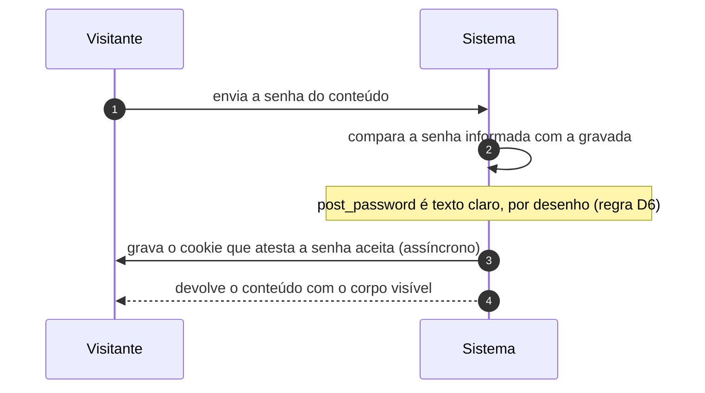

# UC-02 · Abrir conteúdo protegido por senha

> Grupo: **Conteúdo** · Confiança: 🟢 `confirmado`
> Índice: [`use-cases.md`](use-cases.md)

## Identificação

| Campo | Valor |
|---|---|
| **Objetivo** | ver o corpo de um conteúdo publicado que pede senha, sem ter conta no site |
| **Ator principal** | Visitante (`visitante`, `human`) |
| **Atores secundários** | — nenhum |
| **Gatilho** | o visitante envia a senha no formulário que substituiu o corpo do conteúdo |
| **Autorização** | não é capacidade e não é conta: a prova é um cookie cujo valor é o hash da senha informada, comparado com `post_password`, que está em texto claro na tabela |
| **Relações UML** | estende [UC-01 — Consultar conteúdo publicado](UC-01-consultar-conteudo-publicado.md) |

## Pré-condições

- o conteúdo está publicado e tem `post_password` preenchido

## Fluxo principal

1. Visitante envia a senha do conteúdo
2. Sistema compara a senha informada com a senha gravada no conteúdo
3. Sistema grava no navegador do visitante o cookie que atesta a senha aceita
4. Sistema devolve o conteúdo com o corpo visível

## Sequência

O mesmo fluxo principal com remetente e destinatário explícitos. `self` é decisão interna do sistema.

| # | De | Para | Mensagem | Tipo | Condição ou regra |
|---|---|---|---|---|---|
| 1 | Visitante | Sistema | envia a senha do conteúdo | `sync` | — |
| 2 | Sistema | Sistema | compara a senha informada com a gravada | `self` | post_password é texto claro, por desenho (regra D6) |
| 3 | Sistema | Visitante | grava o cookie que atesta a senha aceita | `async` | — |
| 4 | Sistema | Visitante | devolve o conteúdo com o corpo visível | `return` | — |

## Fluxos alternativos

### Quem edita o conteúdo não precisa da senha

1. Sistema verifica `edit_post` do registro antes de pedir a senha
2. Quem pode editar vê o corpo direto, e a senha lhe é exibida em texto claro na tela de edição

## Exceções

| O que dá errado | Como o sistema reage |
|---|---|
| Senha errada | o formulário volta e o corpo continua oculto; não há contador de tentativas nem bloqueio |
| Visitante tenta comentar sem a senha | `wp_handle_comment_submission()` recusa com `comment_on_password_protected` |

## Pós-condições

- o cookie de senha fica no navegador do visitante, sem prazo declarado
- nada muda no armazenamento do site

## Regras de negócio aplicadas

- D6 — senha de post é texto claro por desenho: é senha de acesso a conteúdo, não de conta, e precisa poder ser exibida a quem edita (domain.md §2.5)
- Senha de post é um dos cinco mecanismos de autorização que não consultam o modelo de capacidades (permissions.md §9)

## Implementado em

- `wp-includes/post-template.php:882`
- `wp-includes/comment.php:4053`
- `wp-includes/comment.php:4064`

## O que um porte precisa saber

- 🟢 **Sem prazo e sem limite de tentativa.** A senha de post não expira, não é trocada por rotação e não tem contador de erro. É o portão mais fraco do sistema e o único que protege conteúdo publicado de quem não tem conta.
- 🟡 **Uma senha por conteúdo, nunca por pessoa.** Não existe registro de quem abriu o quê: revogar o acesso de uma pessoa significa trocar a senha para todas.
