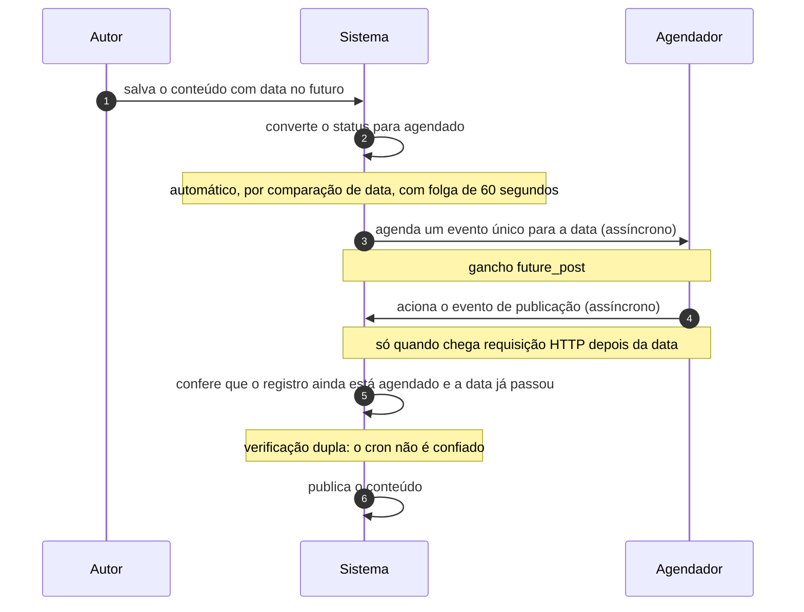

# UC-04 · Agendar publicação de conteúdo

> Grupo: **Conteúdo** · Confiança: 🟢 `confirmado`
> Índice: [`use-cases.md`](use-cases.md)

## Identificação

| Campo | Valor |
|---|---|
| **Objetivo** | marcar uma data futura para o conteúdo aparecer sozinho |
| **Ator principal** | Autor (`autor`, `human`) |
| **Atores secundários** | Agendador (`agendador`) |
| **Gatilho** | o autor salva conteúdo publicado com data no futuro — não há comando "agendar" |
| **Autorização** | a mesma de UC-03: `publish_posts` do tipo de conteúdo |
| **Relações UML** | estende [UC-03 — Publicar conteúdo](UC-03-publicar-conteudo.md) |

## Pré-condições

- o ator tem capacidade de publicar aquele tipo
- a data informada está mais de 60 segundos à frente do instante atual

## Fluxo principal

1. Autor salva o conteúdo com data no futuro
2. Sistema compara a data pedida com o instante atual e converte o status para agendado
3. Sistema agenda um evento único para a data da publicação
4. Agendador aciona o evento quando alguma requisição chega depois da data
5. Sistema confere que o registro ainda está agendado e que a data já passou
6. Sistema publica o conteúdo

## Sequência

O mesmo fluxo principal com remetente e destinatário explícitos. `self` é decisão interna do sistema.

| # | De | Para | Mensagem | Tipo | Condição ou regra |
|---|---|---|---|---|---|
| 1 | Autor | Sistema | salva o conteúdo com data no futuro | `sync` | — |
| 2 | Sistema | Sistema | converte o status para agendado | `self` | automático, por comparação de data, com folga de 60 segundos |
| 3 | Sistema | Agendador | agenda um evento único para a data | `async` | gancho future_post |
| 4 | Agendador | Sistema | aciona o evento de publicação | `async` | só quando chega requisição HTTP depois da data |
| 5 | Sistema | Sistema | confere que o registro ainda está agendado e a data já passou | `self` | verificação dupla: o cron não é confiado |
| 6 | Sistema | Sistema | publica o conteúdo | `self` | — |

## Fluxos alternativos

### A data ainda não chegou quando o evento rodou

1. Sistema reagenda o evento em lugar de publicar
2. Nenhuma publicação acontece fora de hora

### O conteúdo saiu de agendado antes da data

1. Qualquer transição de status limpa o evento pendente
2. O comentário no código diz o motivo: "in case the post status bounced from future to draft"

### Autor salva conteúdo agendado com data no passado

1. A mesma comparação de data o publica na hora
2. A conversão é bidirecional e ninguém a comanda

## Exceções

| O que dá errado | Como o sistema reage |
|---|---|
| Nenhuma requisição HTTP chega depois da data | o conteúdo permanece agendado indefinidamente. O agendador não é cron de sistema operacional: a fila só avança quando chega visita |
| O registro saiu de agendado | `check_and_publish_future_post()` recusa publicar o que não está mais em `future` |

## Pós-condições

- o registro está em `future` até a data, e em `publish` depois dela
- há um evento único na fila de `wp_options` apontando para o registro

## Regras de negócio aplicadas

- P6 — agendamento é guardado por verificação dupla: recusa publicar o que não está em `future` e reagenda se a data não chegou (domain.md §2.1)
- A9 — cron não é cron: a fila só avança quando chega requisição HTTP (domain.md §2.6)
- [ADR 0005](../adrs/0005-agendamento-por-comparacao-de-data-nao-por-transicao.md) — agendamento por comparação de data, não por transição

## Implementado em

- `wp-includes/post.php:4800`
- `wp-includes/post.php:4804`
- `wp-includes/post.php:5482`
- `wp-includes/post.php:8205`
- `wp-includes/post.php:8188`

## O que um porte precisa saber

- 🟢 **Agendar não é um comando.** É o efeito de salvar com data futura, e a conversão `publish` ↔ `future` é automática e bidirecional, com 60 segundos de folga. Quem reimplementar isso como transição explícita muda o comportamento do produto.
- 🟢 **Dois guardas independentes.** A publicação agendada confere o status *e* a data no momento de executar, porque o agendador pode disparar atrasado, repetido ou para um registro que mudou. É o único ponto do sistema que desconfia da própria fila.
