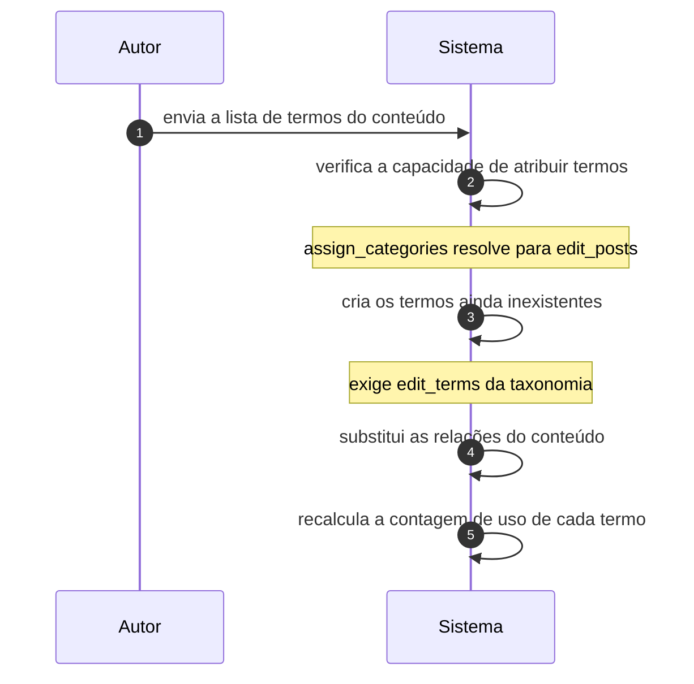

# UC-05 · Classificar conteúdo com termos

> Grupo: **Conteúdo** · Confiança: 🟢 `confirmado`
> Índice: [`use-cases.md`](use-cases.md)

## Identificação

| Campo | Valor |
|---|---|
| **Objetivo** | colocar o conteúdo nas categorias, tags e demais classificações que o farão ser encontrado |
| **Ator principal** | Autor (`autor`, `human`) |
| **Atores secundários** | — nenhum |
| **Gatilho** | o autor escolhe termos na tela de edição, ou publica sem escolher nenhum |
| **Autorização** | `assign_categories` e `assign_post_tags` resolvem para `edit_posts` — atribuir termo é poder de conteúdo, não de classificação. Criar termo novo exige `edit_terms` da taxonomia |
| **Relações UML** | incluído por [UC-03 — Publicar conteúdo](UC-03-publicar-conteudo.md) |

## Pré-condições

- a taxonomia está registrada e declarada para aquele tipo de conteúdo

## Fluxo principal

1. Autor envia a lista de termos do conteúdo
2. Sistema verifica a capacidade de atribuir termos daquela taxonomia
3. Sistema cria os termos que ainda não existem, se a taxonomia o permitir ao ator
4. Sistema substitui as relações do conteúdo pela lista enviada
5. Sistema recalcula a contagem de uso de cada termo afetado

## Sequência

O mesmo fluxo principal com remetente e destinatário explícitos. `self` é decisão interna do sistema.

| # | De | Para | Mensagem | Tipo | Condição ou regra |
|---|---|---|---|---|---|
| 1 | Autor | Sistema | envia a lista de termos do conteúdo | `sync` | — |
| 2 | Sistema | Sistema | verifica a capacidade de atribuir termos | `self` | assign_categories resolve para edit_posts |
| 3 | Sistema | Sistema | cria os termos ainda inexistentes | `self` | exige edit_terms da taxonomia |
| 4 | Sistema | Sistema | substitui as relações do conteúdo | `self` | — |
| 5 | Sistema | Sistema | recalcula a contagem de uso de cada termo | `self` | — |

## Fluxos alternativos

### Nenhum termo informado

1. Sistema aplica o termo padrão da taxonomia que declara um
2. Para o tipo `post` isso significa `default_category`, que nasce com o identificador 1
3. A regra se repete na publicação, para toda taxonomia com termo padrão

### O mesmo rótulo em duas taxonomias

1. Sistema grava uma linha em `terms` e duas em `term_taxonomy`
2. O rótulo é deliberadamente ignorante do contexto em que serve

## Exceções

| O que dá errado | Como o sistema reage |
|---|---|
| Ator sem `edit_terms` tenta criar termo novo | o termo não é criado e a atribuição ignora o rótulo desconhecido |
| Conteúdo é `auto-draft` | o termo padrão não é aplicado: o registro ainda não é conteúdo |

## Pós-condições

- as relações do conteúdo refletem exatamente a lista enviada
- a contagem de uso de cada termo afetado está recalculada
- nenhum conteúdo do tipo `post` ficou sem categoria

## Regras de negócio aplicadas

- P3 — post do tipo `post` sempre tem categoria; sem categoria informada e fora de `auto-draft`, recebe `default_category` (domain.md §2.1)
- Glossário — Term é o rótulo e Taxonomy é o contexto: o mesmo Term vive em duas taxonomias como duas linhas de `term_taxonomy` e uma de `terms` (domain.md §1.2)
- Um menu de navegação é uma taxonomia e cada item do menu é um Post (domain.md §1.2)

## Implementado em

- `wp-includes/post.php:4719`
- `wp-includes/post.php:5419`
- `wp-includes/capabilities.php:758`
- `wp-includes/taxonomy.php:2851`
- `wp-includes/taxonomy.php:3587`

## O que um porte precisa saber

- 🟢 **Atribuir termo é poder de conteúdo.** `assign_categories` e `assign_post_tags` resolvem para `edit_posts`: quem pode escrever pode classificar. Gerenciar a lista de termos é outra coisa, e está em UC-08.
- 🟡 **A classificação não tem estado.** Não há rascunho de categoria nem aprovação de termo: a existência do termo é o seu estado. Quem migrar esperando um ciclo de vida não vai encontrá-lo.
