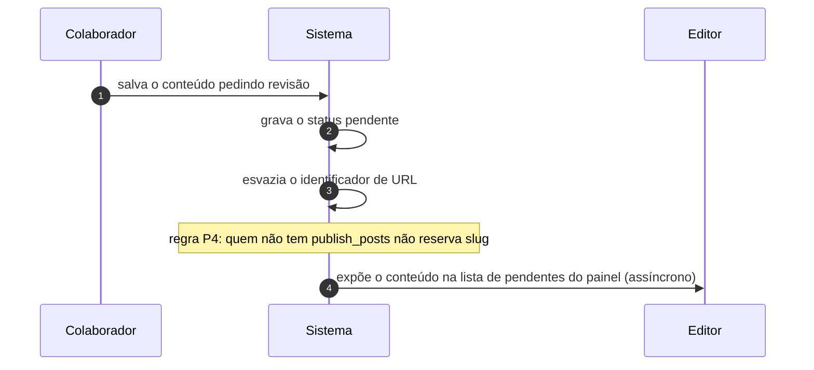

# UC-06 · Submeter conteúdo para revisão

> Grupo: **Conteúdo** · Confiança: 🟢 `confirmado`
> Índice: [`use-cases.md`](use-cases.md)

## Identificação

| Campo | Valor |
|---|---|
| **Objetivo** | entregar o próprio texto para que alguém com poder de publicar o avalie |
| **Ator principal** | Colaborador (`colaborador`, `human`) |
| **Atores secundários** | Editor (`editor`) |
| **Gatilho** | o colaborador salva o conteúdo pedindo revisão |
| **Autorização** | `edit_posts` basta. O que falta ao colaborador é `publish_posts`, e é essa falta que define o caso |
| **Relações UML** | — nenhuma |

## Pré-condições

- o ator tem `edit_posts` e **não** tem `publish_posts`

## Fluxo principal

1. Colaborador salva o conteúdo pedindo revisão
2. Sistema grava o status pendente
3. Sistema esvazia o identificador de URL do conteúdo, porque quem não publica não reserva endereço
4. Sistema deixa o conteúdo na lista do painel para quem tem poder de publicar

## Sequência

O mesmo fluxo principal com remetente e destinatário explícitos. `self` é decisão interna do sistema.

| # | De | Para | Mensagem | Tipo | Condição ou regra |
|---|---|---|---|---|---|
| 1 | Colaborador | Sistema | salva o conteúdo pedindo revisão | `sync` | — |
| 2 | Sistema | Sistema | grava o status pendente | `self` | — |
| 3 | Sistema | Sistema | esvazia o identificador de URL | `self` | regra P4: quem não tem publish_posts não reserva slug |
| 4 | Sistema | Editor | expõe o conteúdo na lista de pendentes do painel | `async` | — |

## Fluxos alternativos

### O ator tem `publish_posts` e ainda assim pede revisão

1. Sistema grava pendente e **mantém** o identificador de URL
2. A regra do slug vazio só vale para quem não pode publicar

### O editor devolve ao autor

1. Sistema volta o status para rascunho
2. O ciclo recomeça sem perder o conteúdo

## Exceções

| O que dá errado | Como o sistema reage |
|---|---|
| Colaborador tenta enviar arquivo junto | não tem `upload_files`: o envio é recusado. É a fronteira que separa colaborador de autor |
| Colaborador tenta ler o pendente de outro | `read_post` de status não público cai em `edit_post`, logo ler o rascunho de outro exige poder editá-lo — o que o colaborador não tem |

## Pós-condições

- o registro está em `pending` e invisível ao público
- o identificador de URL está vazio e será atribuído na publicação
- o conteúdo aparece na fila de revisão de quem tem `publish_posts`

## Regras de negócio aplicadas

- P4 — colaborador não escolhe a URL do que está em revisão (domain.md §2.1)
- P5 — a unicidade do slug é dispensada em `pending` (domain.md §2.1)
- A progressão de papéis é de escopo: `contributor` → `author` é "pode publicar e subir arquivo" (permissions.md §2)

## Implementado em

- `wp-includes/post.php:4731`
- `wp-includes/post.php:5561`
- `wp-includes/capabilities.php:369`

## O que um porte precisa saber

- 🟢 **Nenhuma notificação sai daqui.** O conteúdo pendente aparece na lista do painel e nada mais acontece: não há e-mail ao editor, não há fila com prazo, não há aviso. A revisão depende de alguém abrir a tela.
- 🟢 **O slug vazio é uma decisão de produto, não um bug.** Quem não pode publicar não reserva endereço público — e por isso o endereço final do texto só existe depois que outra pessoa o aprova.
