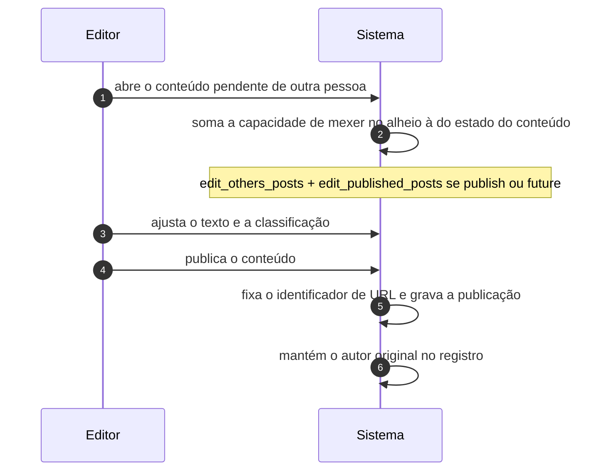

# UC-07 · Revisar e publicar conteúdo de outro autor

> Grupo: **Conteúdo** · Confiança: 🟢 `confirmado`
> Índice: [`use-cases.md`](use-cases.md)

## Identificação

| Campo | Valor |
|---|---|
| **Objetivo** | avaliar o texto que outra pessoa escreveu e decidir se ele vai ao ar |
| **Ator principal** | Editor (`editor`, `human`) |
| **Atores secundários** | Colaborador (`colaborador`) · Autor (`autor`) |
| **Gatilho** | o editor abre um conteúdo pendente na lista do painel |
| **Autorização** | `edit_others_posts`, somada a `edit_published_posts` quando o conteúdo já está publicado e a `edit_private_posts` quando está privado. É o salto de papel que significa "pode mexer no que não é seu" |
| **Relações UML** | — nenhuma |

## Pré-condições

- o conteúdo existe e não é do ator
- o ator tem `edit_others_posts` e `publish_posts` do tipo

## Fluxo principal

1. Editor abre o conteúdo pendente de outra pessoa
2. Sistema resolve a autorização somando a capacidade de mexer no alheio à do estado do conteúdo
3. Editor ajusta o texto e a classificação
4. Editor publica o conteúdo
5. Sistema fixa o identificador de URL, que estava vazio, e grava a publicação
6. Sistema mantém o autor original no registro

## Sequência

O mesmo fluxo principal com remetente e destinatário explícitos. `self` é decisão interna do sistema.

| # | De | Para | Mensagem | Tipo | Condição ou regra |
|---|---|---|---|---|---|
| 1 | Editor | Sistema | abre o conteúdo pendente de outra pessoa | `sync` | — |
| 2 | Sistema | Sistema | soma a capacidade de mexer no alheio à do estado do conteúdo | `self` | edit_others_posts + edit_published_posts se publish ou future |
| 3 | Editor | Sistema | ajusta o texto e a classificação | `sync` | — |
| 4 | Editor | Sistema | publica o conteúdo | `sync` | — |
| 5 | Sistema | Sistema | fixa o identificador de URL e grava a publicação | `self` | — |
| 6 | Sistema | Sistema | mantém o autor original no registro | `self` | — |

## Fluxos alternativos

### Devolver ao autor

1. Editor volta o status para rascunho
2. Nenhuma notificação é enviada ao autor: o sistema não avisa

### O conteúdo está na lixeira

1. A autorização passa a depender do **estado anterior**, lido de `_wp_trash_meta_status`
2. Um conteúdo que estava publicado continua exigindo `delete_published_posts` enquanto está na lixeira

### O conteúdo é uma página

1. A capacidade muda de família: `edit_others_pages`
2. Nenhuma capacidade de página chega a autor ou colaborador — páginas são território editorial

## Exceções

| O que dá errado | Como o sistema reage |
|---|---|
| O conteúdo é a página inicial ou a página de posts | exige `manage_options`, que o editor não tem: o editor não consegue editar a página inicial |
| O registro não existe | `do_not_allow`: o caminho de erro fecha a porta |
| O conteúdo é uma revisão | `do_not_allow` para apagar — revisão não se apaga por capacidade |

## Pós-condições

- o conteúdo está publicado com o autor original preservado
- o identificador de URL está fixado e único
- nenhum registro de quem aprovou foi gravado

## Regras de negócio aplicadas

- A resolução de `edit_post` depende de quem é o autor e de em que estado o conteúdo está (permissions.md §5.1)
- Nenhuma capacidade de página chega a `author` ou `contributor`: a assimetria com posts é deliberada (permissions.md §3.2)
- `editor` tem `unfiltered_html`, logo pode inserir `<script>` no que publica (permissions.md §2)

## Implementado em

- `wp-includes/capabilities.php:149`
- `wp-includes/capabilities.php:113`
- `wp-includes/capabilities.php:103`
- `wp-includes/capabilities.php:108`
- `wp-admin/post.php:236`
- `wp-admin/includes/schema.php:797`

## O que um porte precisa saber

- 🟢 **Não há trilha de aprovação.** O sistema não grava quem revisou, quando, nem o que mudou — só a revisão do texto, como conteúdo. Para quem precisa de auditoria editorial, isso é um requisito a construir, não a migrar.
- 🟢 **O editor não edita a página inicial.** A proteção da página inicial e da página de posts troca a família de capacidade por `manage_options`, que é de administrador. É a exceção que mais surpreende quem desenha o papel de editor a partir da tabela.
