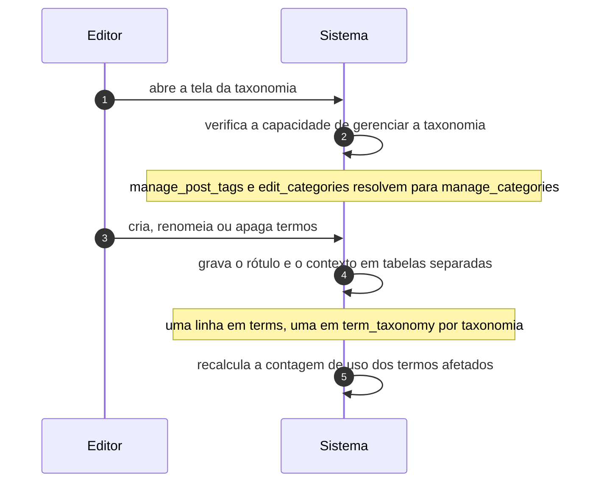

# UC-08 · Gerenciar termos de classificação

> Grupo: **Conteúdo** · Confiança: 🟢 `confirmado`
> Índice: [`use-cases.md`](use-cases.md)

## Identificação

| Campo | Valor |
|---|---|
| **Objetivo** | manter a lista de categorias, tags e demais classificações do site |
| **Ator principal** | Editor (`editor`, `human`) |
| **Atores secundários** | — nenhum |
| **Gatilho** | o editor abre a tela de uma taxonomia no painel |
| **Autorização** | as quatro capacidades da taxonomia (`manage_terms`, `edit_terms`, `delete_terms`, `assign_terms`), que para categorias e tags resolvem todas para `manage_categories` |
| **Relações UML** | — nenhuma |

## Pré-condições

- a taxonomia está registrada e visível no painel
- o ator tem a capacidade declarada pela taxonomia

## Fluxo principal

1. Editor abre a tela da taxonomia
2. Sistema verifica a capacidade de gerenciar aquela taxonomia
3. Editor cria, renomeia ou apaga termos
4. Sistema grava o rótulo e o contexto em tabelas separadas
5. Sistema recalcula a contagem de uso dos termos afetados

## Sequência

O mesmo fluxo principal com remetente e destinatário explícitos. `self` é decisão interna do sistema.

| # | De | Para | Mensagem | Tipo | Condição ou regra |
|---|---|---|---|---|---|
| 1 | Editor | Sistema | abre a tela da taxonomia | `sync` | — |
| 2 | Sistema | Sistema | verifica a capacidade de gerenciar a taxonomia | `self` | manage_post_tags e edit_categories resolvem para manage_categories |
| 3 | Editor | Sistema | cria, renomeia ou apaga termos | `sync` | — |
| 4 | Sistema | Sistema | grava o rótulo e o contexto em tabelas separadas | `self` | uma linha em terms, uma em term_taxonomy por taxonomia |
| 5 | Sistema | Sistema | recalcula a contagem de uso dos termos afetados | `self` | — |

## Fluxos alternativos

### Apagar um termo que tem conteúdo

1. O conteúdo não é apagado: perde a relação
2. Se o conteúdo ficar sem nenhum termo e a taxonomia tiver termo padrão, o padrão é atribuído

### Taxonomia hierárquica

1. Sistema aceita o termo pai e mantém a árvore em `term_taxonomy.parent`
2. Tags não têm hierarquia e não têm termo padrão

## Exceções

| O que dá errado | Como o sistema reage |
|---|---|
| Apagar o termo padrão da taxonomia | `do_not_allow`: o termo padrão é indestrutível, e a negação vence até o super administrador |
| Ator sem `delete_terms` | a ação em lote é recusada antes de tocar qualquer registro |

## Pós-condições

- a lista de termos reflete as alterações
- nenhum conteúdo do tipo `post` ficou sem categoria
- o termo padrão da taxonomia continua existindo

## Regras de negócio aplicadas

- `manage_post_tags`, `edit_categories`, `edit_post_tags`, `delete_categories` e `delete_post_tags` resolvem todas para `manage_categories` (permissions.md §5.4)
- O termo padrão da taxonomia é indestrutível (permissions.md §5.2)
- `terms` não tem coluna de estado: o "estado" de um termo é a existência dele (state-machines.md §10)

## Implementado em

- `wp-admin/edit-tags.php:26`
- `wp-admin/edit-tags.php:81`
- `wp-admin/edit-tags.php:91`
- `wp-admin/edit-tags.php:112`
- `wp-includes/taxonomy.php:2458`
- `wp-includes/capabilities.php:738`
- `wp-includes/capabilities.php:751`

## O que um porte precisa saber

- 🟢 **Cinco nomes de capacidade, um poder.** Toda a família de categoria e tag colapsa em `manage_categories`. Quem migrar esperando controle fino por taxonomia vai descobrir que ele não existe para as duas taxonomias de fábrica — existe apenas para taxonomias que um plugin registre com capacidades próprias.
- 🟡 **Apagar classificação não apaga conteúdo, e isso é silencioso.** O conteúdo perde a relação e, se tinha só aquele termo, ganha o termo padrão sem avisar ninguém.
