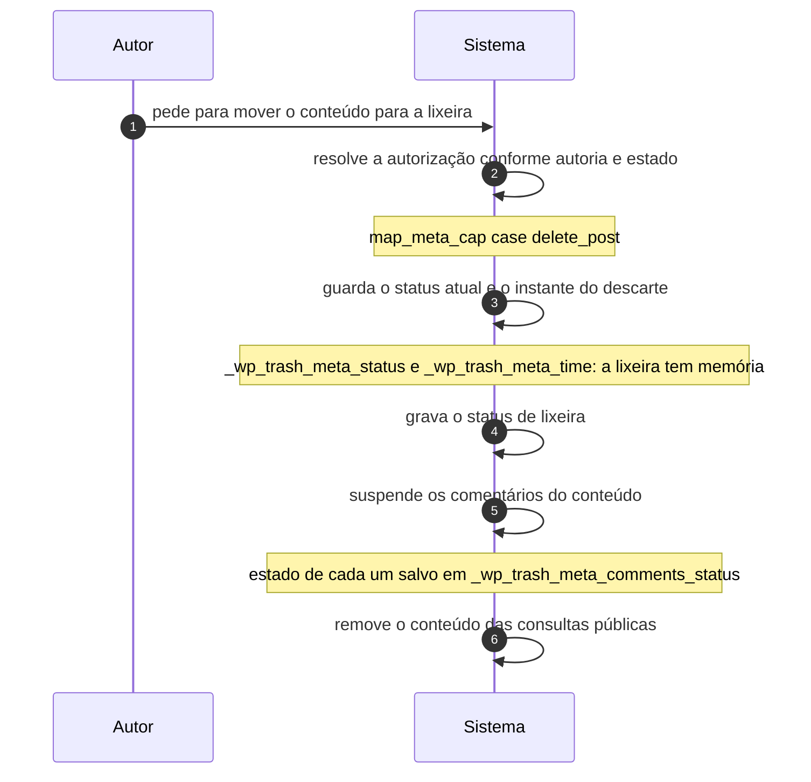

# UC-09 · Descartar conteúdo na lixeira

> Grupo: **Conteúdo** · Confiança: 🟢 `confirmado`
> Índice: [`use-cases.md`](use-cases.md)

## Identificação

| Campo | Valor |
|---|---|
| **Objetivo** | tirar o conteúdo do ar sem perdê-lo |
| **Ator principal** | Autor (`autor`, `human`) |
| **Atores secundários** | — nenhum |
| **Gatilho** | o autor pede para mover o conteúdo para a lixeira |
| **Autorização** | `delete_post` do registro, resolvida conforme autoria e estado: do próprio e publicado exige `delete_published_posts`; de outro, `delete_others_posts` |
| **Relações UML** | — nenhuma |

## Pré-condições

- o conteúdo existe e não é uma revisão
- `EMPTY_TRASH_DAYS` é diferente de zero — do contrário não há lixeira

## Fluxo principal

1. Autor pede para mover o conteúdo para a lixeira
2. Sistema resolve a autorização conforme autoria e estado do conteúdo
3. Sistema guarda o status atual e o instante do descarte como metadados
4. Sistema grava o status de lixeira
5. Sistema suspende os comentários do conteúdo, guardando o estado de cada um
6. Sistema remove o conteúdo das consultas públicas

## Sequência

O mesmo fluxo principal com remetente e destinatário explícitos. `self` é decisão interna do sistema.

| # | De | Para | Mensagem | Tipo | Condição ou regra |
|---|---|---|---|---|---|
| 1 | Autor | Sistema | pede para mover o conteúdo para a lixeira | `sync` | — |
| 2 | Sistema | Sistema | resolve a autorização conforme autoria e estado | `self` | map_meta_cap case delete_post |
| 3 | Sistema | Sistema | guarda o status atual e o instante do descarte | `self` | _wp_trash_meta_status e _wp_trash_meta_time: a lixeira tem memória |
| 4 | Sistema | Sistema | grava o status de lixeira | `self` | — |
| 5 | Sistema | Sistema | suspende os comentários do conteúdo | `self` | estado de cada um salvo em _wp_trash_meta_comments_status |
| 6 | Sistema | Sistema | remove o conteúdo das consultas públicas | `self` | — |

## Fluxos alternativos

### Lixeira desligada

1. Com `EMPTY_TRASH_DAYS` em zero, a primeira linha chama a exclusão definitiva
2. Apagar passa a ser irreversível, e o ator não é avisado da diferença

### O conteúdo é um anexo

1. A lixeira exige também `MEDIA_TRASH`, que é `false` por padrão
2. No comportamento de fábrica, apagar mídia é definitivo

### Exclusão definitiva pedida direto

1. As revisões vão em cascata
2. Os filhos e os anexos são reparentados ao avô, não apagados

## Exceções

| O que dá errado | Como o sistema reage |
|---|---|
| O conteúdo é uma revisão | `do_not_allow`: revisão não se apaga por capacidade |
| O conteúdo é a página inicial ou a página de posts | exige `manage_options` em lugar da capacidade de conteúdo |
| O conteúdo é a página de política de privacidade | `manage_privacy_options` é somada às capacidades normais de apagar |

## Pós-condições

- o registro está em `trash` com o estado anterior e o instante gravados
- os comentários do conteúdo estão em `post-trashed`, com o estado anterior de cada um guardado no conteúdo
- o conteúdo saiu das consultas públicas e continua existindo

## Regras de negócio aplicadas

- R1 — lixeira de 30 dias, e desligá-la torna apagar irreversível (domain.md §2.4)
- R3 — anexo só vai para a lixeira se `MEDIA_TRASH` estiver ligada, e ela é `false` por padrão (domain.md §2.4)
- Glossário — a lixeira é estado reversível com memória (domain.md §1.1)
- [ADR 0004](../adrs/0004-lixeira-com-memoria-e-restauracao-para-rascunho.md) — lixeira com memória e restauração para rascunho

## Implementado em

- `wp-admin/post.php:250`
- `wp-includes/post.php:4084`
- `wp-includes/post.php:4085`
- `wp-includes/post.php:4128`
- `wp-includes/post.php:4295`
- `wp-includes/post.php:3908`
- `wp-includes/post.php:6829`
- `wp-includes/capabilities.php:149`

## O que um porte precisa saber

- 🟢 **Uma constante troca "esconder" por "destruir".** `EMPTY_TRASH_DAYS = 0` faz `wp_trash_post()` chamar a exclusão forçada na primeira linha. O mesmo botão, dois comportamentos irreconciliáveis, e nada na tela distingue os dois.
- 🟢 **A mídia já é exceção por padrão.** `MEDIA_TRASH` nasce `false`: apagar um arquivo é definitivo enquanto apagar um texto é reversível. É a assimetria mais fácil de perder num porte.
- 🟢 **A cascata de comentários é um estado derivado.** `post-trashed` não é alcançável pela API de status: só a lixeira do conteúdo o grava. Num porte, não é um estado que a interface oferece.
