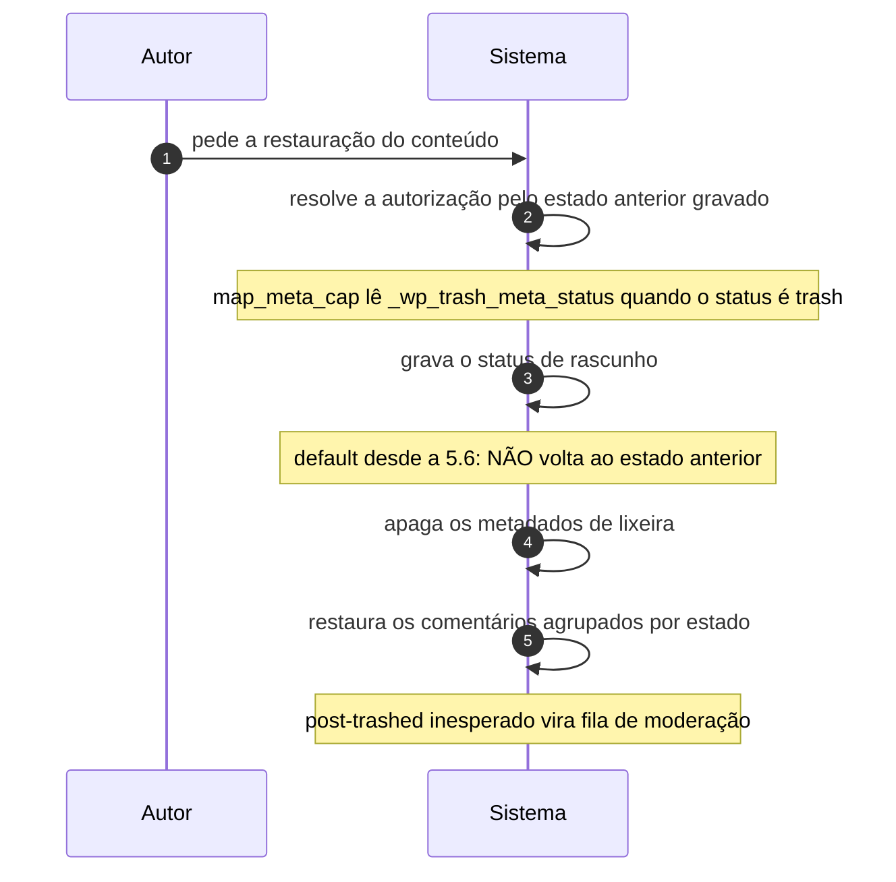

# UC-10 · Restaurar conteúdo da lixeira

> Grupo: **Conteúdo** · Confiança: 🟢 `confirmado`
> Índice: [`use-cases.md`](use-cases.md)

## Identificação

| Campo | Valor |
|---|---|
| **Objetivo** | recuperar um conteúdo descartado antes que a coleta o apague |
| **Ator principal** | Autor (`autor`, `human`) |
| **Atores secundários** | — nenhum |
| **Gatilho** | o autor pede a restauração na lista de itens da lixeira |
| **Autorização** | `delete_post` do registro — restaurar usa a mesma capacidade de descartar, resolvida pelo **estado anterior** lido dos metadados |
| **Relações UML** | — nenhuma |

## Pré-condições

- o registro está em `trash`
- a coleta agendada ainda não o apagou

## Fluxo principal

1. Autor pede a restauração do conteúdo
2. Sistema resolve a autorização pelo estado anterior gravado na lixeira
3. Sistema grava o status de rascunho, não o estado anterior
4. Sistema apaga os metadados de lixeira
5. Sistema restaura os comentários em lote, agrupados pelo estado que tinham

## Sequência

O mesmo fluxo principal com remetente e destinatário explícitos. `self` é decisão interna do sistema.

| # | De | Para | Mensagem | Tipo | Condição ou regra |
|---|---|---|---|---|---|
| 1 | Autor | Sistema | pede a restauração do conteúdo | `sync` | — |
| 2 | Sistema | Sistema | resolve a autorização pelo estado anterior gravado | `self` | map_meta_cap lê _wp_trash_meta_status quando o status é trash |
| 3 | Sistema | Sistema | grava o status de rascunho | `self` | default desde a 5.6: NÃO volta ao estado anterior |
| 4 | Sistema | Sistema | apaga os metadados de lixeira | `self` | — |
| 5 | Sistema | Sistema | restaura os comentários agrupados por estado | `self` | post-trashed inesperado vira fila de moderação |

## Fluxos alternativos

### Voltar ao estado anterior em lugar de rascunho

1. O estado anterior está gravado e é acessível por filtro
2. Mas o default desde a 5.6 é rascunho, e a mudança foi deliberada

### O conteúdo é um anexo

1. A restauração devolve `inherit`, não rascunho
2. A visibilidade do arquivo volta a ser a do conteúdo pai

## Exceções

| O que dá errado | Como o sistema reage |
|---|---|
| O estado anterior não está gravado | o comentário restaurado volta para a fila de moderação; o código comenta "Confidence check. This shouldn't happen." |
| O registro não está mais em `trash` | a coleta agendada tolera a inconsistência: apaga só o metadado e segue, sem apagar o registro |

## Pós-condições

- o registro está em `draft`, e não no estado em que estava antes do descarte
- os metadados de lixeira foram apagados
- o conteúdo precisa ser publicado de novo para voltar ao ar

## Regras de negócio aplicadas

- R2 — restaurar da lixeira devolve como rascunho, não ao estado anterior (domain.md §2.4)
- R6 — a coleta tolera estado inconsistente (domain.md §2.4)
- A autorização sobre conteúdo na lixeira é decidida pelo estado anterior (permissions.md §5.1)

## Implementado em

- `wp-admin/post.php:287`
- `wp-includes/post.php:4168`
- `wp-includes/post.php:4209`
- `wp-includes/post.php:4355`
- `wp-includes/comment.php:1755`
- `wp-includes/capabilities.php:149`

## O que um porte precisa saber

- 🟢 **Restaurar não desfaz.** O sistema guarda o estado anterior, sabe qual era, e ainda assim devolve o conteúdo como rascunho. A informação existe para a autorização e para um filtro, não para a restauração. Um conteúdo publicado que passou pela lixeira volta invisível.
- 🟢 **Os comentários voltam melhor do que o conteúdo.** A restauração de comentários lê o estado guardado e o recoloca; a do conteúdo não. Duas decisões opostas sobre a mesma memória, no mesmo fluxo.
