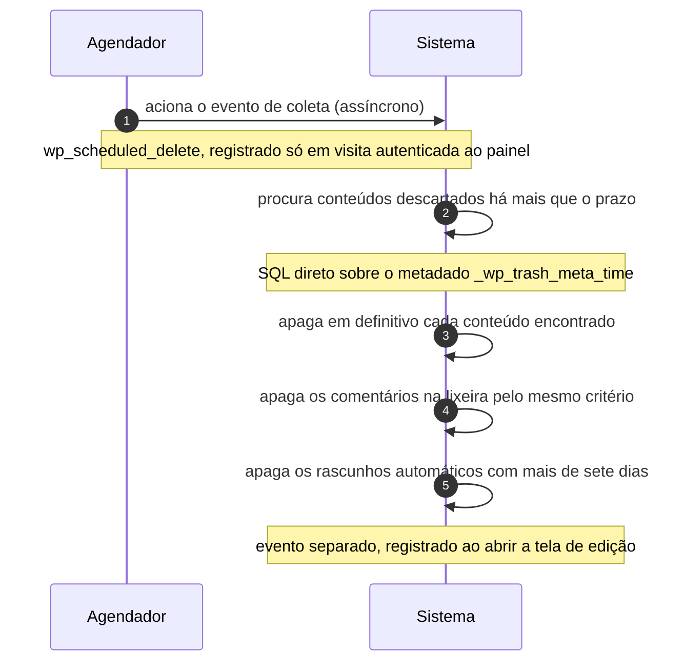

# UC-11 · Apagar conteúdo vencido da lixeira

> Grupo: **Conteúdo** · Confiança: 🟢 `confirmado`
> Índice: [`use-cases.md`](use-cases.md)

## Identificação

| Campo | Valor |
|---|---|
| **Objetivo** | liberar o armazenamento do que passou do prazo de retenção, sem ninguém pedir |
| **Ator principal** | Agendador (`agendador`, `time`) |
| **Atores secundários** | — nenhum |
| **Gatilho** | o evento `wp_scheduled_delete` vence e alguma requisição HTTP faz a fila avançar |
| **Autorização** | nenhuma. A coleta roda sem usuário autenticado e sem verificação de capacidade: o prazo é a autorização |
| **Relações UML** | estende [UC-39 — Processar a fila agendada](UC-39-processar-a-fila-agendada.md) |

## Pré-condições

- o evento está registrado na fila — o que só acontece por visita **autenticada** ao painel
- existe registro em `trash` com metadado de instante mais velho que `EMPTY_TRASH_DAYS`

## Fluxo principal

1. Agendador aciona o evento de coleta
2. Sistema procura conteúdos com instante de descarte mais velho que o prazo
3. Sistema apaga em definitivo cada conteúdo encontrado
4. Sistema procura comentários na lixeira pelo mesmo critério e os apaga
5. Sistema apaga os rascunhos automáticos com mais de sete dias

## Sequência

O mesmo fluxo principal com remetente e destinatário explícitos. `self` é decisão interna do sistema.

| # | De | Para | Mensagem | Tipo | Condição ou regra |
|---|---|---|---|---|---|
| 1 | Agendador | Sistema | aciona o evento de coleta | `async` | wp_scheduled_delete, registrado só em visita autenticada ao painel |
| 2 | Sistema | Sistema | procura conteúdos descartados há mais que o prazo | `self` | SQL direto sobre o metadado _wp_trash_meta_time |
| 3 | Sistema | Sistema | apaga em definitivo cada conteúdo encontrado | `self` | — |
| 4 | Sistema | Sistema | apaga os comentários na lixeira pelo mesmo critério | `self` | — |
| 5 | Sistema | Sistema | apaga os rascunhos automáticos com mais de sete dias | `self` | evento separado, registrado ao abrir a tela de edição |

## Fluxos alternativos

### O registro não está mais na lixeira

1. A rotina apaga só o metadado e segue
2. O registro não é apagado: a coleta tolera o estado inconsistente

### O site não tem administrador ativo

1. O evento nunca é registrado, porque o registro está depois de `auth_redirect()`
2. A lixeira cresce indefinidamente e nada avisa

## Exceções

| O que dá errado | Como o sistema reage |
|---|---|
| Outra requisição já tomou a trava da fila | a execução é abandonada no meio; a trava é um transiente de 60 segundos, descartado se passar de 10 minutos |
| `EMPTY_TRASH_DAYS` é zero | nada chega à lixeira para coletar: a exclusão já foi definitiva em UC-09 |

## Pós-condições

- os conteúdos e comentários vencidos não existem mais
- os rascunhos automáticos com mais de sete dias não existem mais
- nenhum registro do que foi apagado foi guardado

## Regras de negócio aplicadas

- R4 — auto-draft expira em sete dias, por SQL direto sobre `post_date` (domain.md §2.4)
- R5 — a coleta da lixeira só é agendada por visita autenticada ao painel (domain.md §2.4)
- R6 — a coleta tolera estado inconsistente (domain.md §2.4)
- [ADR 0006](../adrs/0006-retencao-agendada-por-visita-ao-painel.md) — retenção agendada por visita ao painel

## Implementado em

- `wp-admin/admin.php:104`
- `wp-includes/functions.php:6977`
- `wp-includes/functions.php:6989`
- `wp-includes/functions.php:6997`
- `wp-includes/post.php:8373`
- `wp-admin/includes/post.php:798`

## O que um porte precisa saber

- 🟢 **O achado deste caso é a precondição.** O evento de coleta é registrado em `wp-admin/admin.php`, **depois** de `auth_redirect()`. Um site que ninguém administra nunca agenda a própria limpeza — e a retenção de 30 dias, que parece uma garantia, é na verdade condicional a alguém fazer login.
- 🔴 **Não foi possível determinar se o evento existe nesta instalação.** A fila vive em `wp_options` e não há banco nesta árvore. O que está descrito é o registro do evento, não a sua presença.
