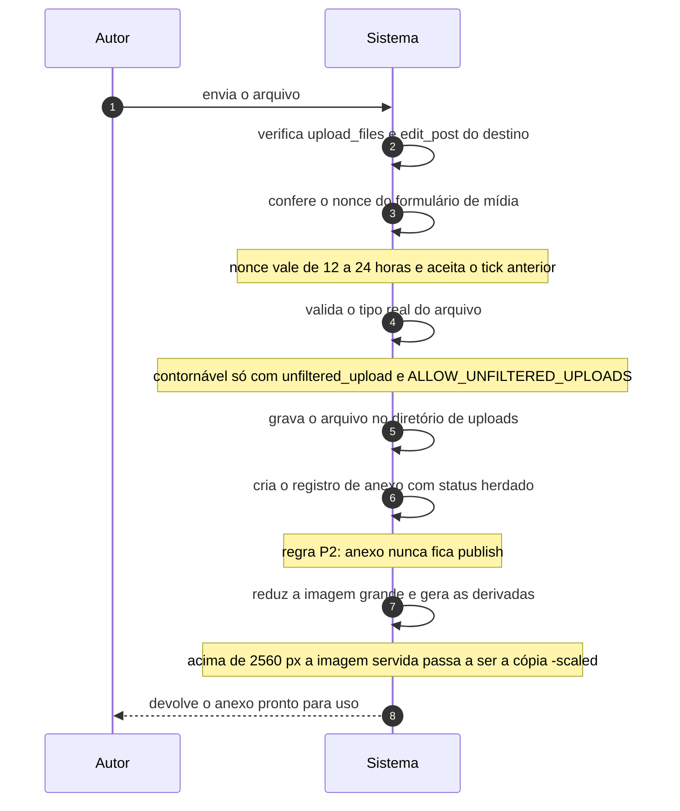

# UC-12 · Enviar arquivo de mídia

> Grupo: **Mídia** · Confiança: 🟢 `confirmado`
> Índice: [`use-cases.md`](use-cases.md)

## Identificação

| Campo | Valor |
|---|---|
| **Objetivo** | colocar um arquivo no site para usá-lo no conteúdo |
| **Ator principal** | Autor (`autor`, `human`) |
| **Atores secundários** | — nenhum |
| **Gatilho** | o autor escolhe um arquivo na biblioteca de mídia ou no editor |
| **Autorização** | `upload_files`, que o colaborador não tem. Quando o envio é vinculado a um conteúdo, soma-se `edit_post` daquele conteúdo |
| **Relações UML** | — nenhuma |

## Pré-condições

- o ator tem `upload_files`
- o diretório de uploads é gravável pelo processo PHP

## Fluxo principal

1. Autor envia o arquivo
2. Sistema verifica a capacidade de enviar arquivo e, se houver conteúdo de destino, a de editá-lo
3. Sistema confere o nonce do formulário de mídia
4. Sistema valida o tipo real do arquivo contra a lista de tipos permitidos
5. Sistema grava o arquivo no diretório de uploads, renomeando em caso de colisão
6. Sistema cria o registro de anexo com status herdado
7. Sistema reduz a imagem se ela passar do limite e gera as derivadas de cada tamanho registrado
8. Sistema devolve o anexo pronto para uso

## Sequência

O mesmo fluxo principal com remetente e destinatário explícitos. `self` é decisão interna do sistema.

| # | De | Para | Mensagem | Tipo | Condição ou regra |
|---|---|---|---|---|---|
| 1 | Autor | Sistema | envia o arquivo | `sync` | — |
| 2 | Sistema | Sistema | verifica upload_files e edit_post do destino | `self` | — |
| 3 | Sistema | Sistema | confere o nonce do formulário de mídia | `self` | nonce vale de 12 a 24 horas e aceita o tick anterior |
| 4 | Sistema | Sistema | valida o tipo real do arquivo | `self` | contornável só com unfiltered_upload e ALLOW_UNFILTERED_UPLOADS |
| 5 | Sistema | Sistema | grava o arquivo no diretório de uploads | `self` | — |
| 6 | Sistema | Sistema | cria o registro de anexo com status herdado | `self` | regra P2: anexo nunca fica publish |
| 7 | Sistema | Sistema | reduz a imagem grande e gera as derivadas | `self` | acima de 2560 px a imagem servida passa a ser a cópia -scaled |
| 8 | Sistema | Autor | devolve o anexo pronto para uso | `return` | — |

## Fluxos alternativos

### Envio assíncrono pelo editor

1. O envio chega em `wp-admin/async-upload.php`, que repete as duas verificações de capacidade
2. A resposta é o fragmento de interface do item, não a página inteira

### Arquivo sem conteúdo de destino

1. O anexo é criado sem pai
2. Sua visibilidade deixa de ser herdada e passa a ser a do próprio registro

### Imagem acima de 2560 px

1. Sistema guarda o original e passa a servir uma cópia com sufixo `-scaled`
2. Os tamanhos derivados são gerados a partir da cópia, não do original

## Exceções

| O que dá errado | Como o sistema reage |
|---|---|
| Tipo de arquivo não permitido | o envio é recusado. `unfiltered_upload` contorna o filtro, mas é sempre `do_not_allow` a menos que `ALLOW_UNFILTERED_UPLOADS` esteja definida — é a única capacidade cuja concessão depende de uma constante existir |
| Falha ao gerar uma derivada da imagem | **silenciosa**. Cinco pontos do processamento carregam `// TODO: Log errors.` e nenhum registra nada; o anexo fica criado com metadado incompleto |
| Diretório de uploads não gravável | `wp_handle_upload()` devolve erro com a mensagem do sistema de arquivos |

## Pós-condições

- existe um registro de anexo em `inherit` apontando para o arquivo
- existem os arquivos derivados de cada tamanho que pôde ser gerado
- o original de uma imagem grande continua no disco, ao lado da cópia servida

## Regras de negócio aplicadas

- P2 — anexo nunca é "publicado": qualquer status fora de `inherit`, `private`, `trash`, `auto-draft` é reescrito (domain.md §2.1)
- M1 — imagem acima de 2560 px é reduzida na ingestão e o original fica guardado (domain.md §2.7)
- M2 — quatro tamanhos nascem com o site, mais dois registrados em código para telas de alta densidade (domain.md §2.7)
- M4 — falha ao gerar derivada de imagem é silenciosa (domain.md §2.7)
- `ALLOW_UNFILTERED_UPLOADS` é o inverso das outras constantes: sem ela, `unfiltered_upload` é sempre negada (permissions.md §6)

## Implementado em

- `wp-admin/media-new.php:15`
- `wp-admin/media-new.php:33`
- `wp-admin/async-upload.php:34`
- `wp-admin/async-upload.php:103`
- `wp-admin/async-upload.php:113`
- `wp-admin/includes/media.php:296`
- `wp-admin/includes/file.php:1105`
- `wp-admin/includes/image.php:285`
- `wp-admin/includes/image.php:336`
- `wp-admin/includes/image.php:579`
- `wp-includes/post.php:4705`
- `wp-includes/capabilities.php:587`

## O que um porte precisa saber

- 🟢 **O arquivo que o ator enviou pode não ser o que o site serve.** Acima de 2560 px, o original é guardado e a cópia `-scaled` passa a ser a imagem do conteúdo. Quem migrar copiando só os arquivos referenciados deixa os originais para trás.
- 🟢 **A geração de derivadas falha em silêncio por omissão declarada.** Os cinco `// TODO: Log errors.` são a prova escrita de que o comportamento é conhecido e não tratado. O anexo existe, a tela não acusa nada, e os tamanhos faltam.
- 🟡 **A capacidade que contorna a validação de tipo está desligada por fora.** `unfiltered_upload` é concedida a administrador na matriz, e negada a todos pelo mapeamento a menos que uma constante a libere. Quem migrar só a matriz libera o que o legado bloqueia.
