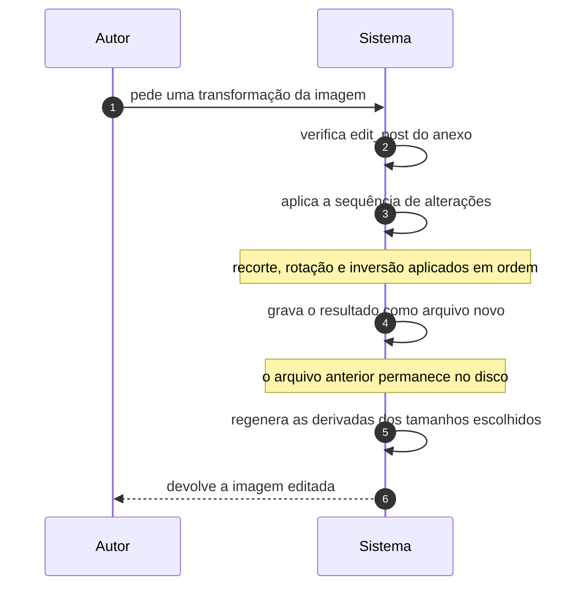

# UC-13 · Editar imagem enviada

> Grupo: **Mídia** · Confiança: 🟢 `confirmado`
> Índice: [`use-cases.md`](use-cases.md)

## Identificação

| Campo | Valor |
|---|---|
| **Objetivo** | recortar, girar ou inverter uma imagem já no site, sem enviá-la de novo |
| **Ator principal** | Autor (`autor`, `human`) |
| **Atores secundários** | — nenhum |
| **Gatilho** | o autor abre o editor de imagem de um anexo na biblioteca de mídia |
| **Autorização** | `edit_post` do anexo. Como o anexo é um registro de conteúdo, vale a mesma resolução por autoria e estado dos demais conteúdos |
| **Relações UML** | — nenhuma |

## Pré-condições

- o anexo é uma imagem que a biblioteca de imagens do servidor sabe abrir
- o ator pode editar aquele anexo

## Fluxo principal

1. Autor pede uma transformação da imagem
2. Sistema verifica a capacidade de editar aquele anexo
3. Sistema aplica a sequência de alterações sobre a imagem carregada
4. Sistema grava o resultado como arquivo novo e atualiza o metadado do anexo
5. Sistema regenera as derivadas dos tamanhos escolhidos
6. Sistema devolve a imagem editada

## Sequência

O mesmo fluxo principal com remetente e destinatário explícitos. `self` é decisão interna do sistema.

| # | De | Para | Mensagem | Tipo | Condição ou regra |
|---|---|---|---|---|---|
| 1 | Autor | Sistema | pede uma transformação da imagem | `sync` | — |
| 2 | Sistema | Sistema | verifica edit_post do anexo | `self` | — |
| 3 | Sistema | Sistema | aplica a sequência de alterações | `self` | recorte, rotação e inversão aplicados em ordem |
| 4 | Sistema | Sistema | grava o resultado como arquivo novo | `self` | o arquivo anterior permanece no disco |
| 5 | Sistema | Sistema | regenera as derivadas dos tamanhos escolhidos | `self` | — |
| 6 | Sistema | Autor | devolve a imagem editada | `return` | — |

## Fluxos alternativos

### Restaurar o original

1. Sistema lê o metadado de backup e recoloca o arquivo original como arquivo do anexo
2. As derivadas são regeneradas a partir dele

### Aplicar só às miniaturas

1. O ator escolhe se a edição vale para a imagem inteira, só para a miniatura, ou para tudo menos a miniatura
2. Os três caminhos produzem conjuntos diferentes de arquivo no disco

## Exceções

| O que dá errado | Como o sistema reage |
|---|---|
| Nenhuma biblioteca de imagem disponível no servidor | o editor não abre; a dependência é de extensão do PHP, não do produto |
| Falha ao gravar o arquivo editado | sem registro em log. O mesmo `// TODO: Log errors.` que afeta UC-12 vale aqui |

## Pós-condições

- o anexo aponta para o arquivo editado
- o arquivo anterior continua no disco, referenciado pelo metadado de backup
- as derivadas escolhidas foram regeneradas

## Regras de negócio aplicadas

- M2 — os tamanhos registrados definem quais derivadas são regeneradas (domain.md §2.7)
- M4 — falha ao gerar derivada de imagem é silenciosa (domain.md §2.7)
- `// @todo Uploaded files are not removed here.` — trocar imagem de fundo deixa o arquivo anterior órfão; o mesmo padrão de acúmulo aparece aqui (domain.md §4)

## Implementado em

- `wp-admin/includes/image-edit.php:18`
- `wp-admin/includes/image-edit.php:640`
- `wp-admin/includes/image-edit.php:815`
- `wp-admin/includes/image-edit.php:920`
- `wp-admin/includes/image-edit.php:435`
- `wp-admin/includes/image.php:25`

## O que um porte precisa saber

- 🟢 **Editar imagem acumula arquivo.** Cada edição grava um arquivo novo e mantém o anterior, para que a restauração seja possível. O disco cresce a cada recorte e nenhuma rotina limpa o que ficou atrás.
- 🔴 **Não foi possível determinar o que o ator vê quando a transformação falha.** O caminho de erro não registra nada e a tela depende de JavaScript que não está nesta árvore.
