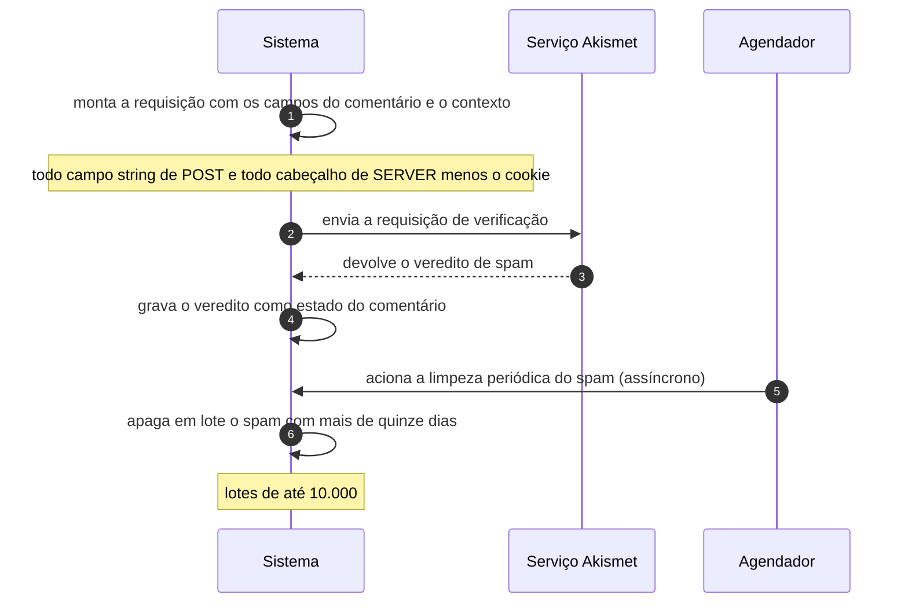

# UC-15 · Classificar comentário por serviço externo

> Grupo: **Interação pública** · Confiança: 🟢 `confirmado`
> Índice: [`use-cases.md`](use-cases.md)

## Identificação

| Campo | Valor |
|---|---|
| **Objetivo** | obter de um serviço de reputação o veredito sobre se um comentário é spam |
| **Ator principal** | Serviço Akismet (`akismet`, `system`) |
| **Atores secundários** | Agendador (`agendador`) |
| **Gatilho** | um comentário é submetido, ou o evento de limpeza do plugin vence |
| **Autorização** | uma chave de API do serviço, guardada na opção `wordpress_api_key` ou na constante `WPCOM_API_KEY` |
| **Relações UML** | estende [UC-14 — Comentar em conteúdo publicado](UC-14-comentar-em-conteudo-publicado.md) |

## Pré-condições

- o plugin de filtragem está ativo e tem chave válida
- há conectividade de saída para o serviço

## Fluxo principal

1. Sistema monta a requisição com os campos do comentário e o contexto da requisição
2. Sistema envia a requisição ao serviço de reputação
3. Serviço devolve o veredito de spam
4. Sistema grava o veredito como estado do comentário e guarda o histórico em metadado
5. Agendador aciona a limpeza periódica do que foi marcado como spam
6. Sistema apaga em lote o spam com mais de quinze dias

## Sequência

O mesmo fluxo principal com remetente e destinatário explícitos. `self` é decisão interna do sistema.

| # | De | Para | Mensagem | Tipo | Condição ou regra |
|---|---|---|---|---|---|
| 1 | Sistema | Sistema | monta a requisição com os campos do comentário e o contexto | `self` | todo campo string de POST e todo cabeçalho de SERVER menos o cookie |
| 2 | Sistema | Serviço Akismet | envia a requisição de verificação | `sync` | — |
| 3 | Serviço Akismet | Sistema | devolve o veredito de spam | `return` | — |
| 4 | Sistema | Sistema | grava o veredito como estado do comentário | `self` | — |
| 5 | Agendador | Sistema | aciona a limpeza periódica do spam | `async` | — |
| 6 | Sistema | Sistema | apaga em lote o spam com mais de quinze dias | `self` | lotes de até 10.000 |

## Fluxos alternativos

### Falha de TLS na chamada

1. O plugin passa a chamar o serviço em HTTP puro por 24 horas
2. A chave de API e todo o conteúdo do comentário trafegam sem cifra nesse período

### O serviço não respondeu

1. O comentário fica marcado para reconsulta
2. A reconsulta se repete até o comentário completar 15 dias, e então é desistida

### Consulta pela Abilities API

1. A ability `akismet/comment-check` expõe a mesma verificação a um agente de IA
2. A permissão exigida é `moderate_comments` — ver UC-46

## Exceções

| O que dá errado | Como o sistema reage |
|---|---|
| Sem chave de API | a verificação não acontece e a decisão volta inteira para as regras locais de moderação |
| Veredito contrário ao de um moderador humano | o estado gravado pelo humano prevalece, e o plugin envia a correção ao serviço como aprendizado |

## Pós-condições

- o comentário está em spam ou liberado para as regras locais
- o histórico do veredito está em metadado do comentário
- o spam com mais de quinze dias não existe mais

## Regras de negócio aplicadas

- C13 — com Akismet, spam tem prazo de 15 dias e é apagado em lotes de até 10.000; comentário cuja consulta falhou é reconsultado até ficar com 15 dias (domain.md §2.2)
- I3 — o Akismet é registrado como conector de filtragem de spam, com `wordpress_api_key` como opção e `WPCOM_API_KEY` como constante (domain.md §2.9)
- Glossário — spam é estado de comentário, não exclusão; com Akismet instalado, o julgamento é de serviço externo (domain.md §1.4)

## Implementado em

- `wp-content/plugins/akismet/class.akismet.php:492`
- `wp-content/plugins/akismet/class.akismet.php:866`
- `wp-content/plugins/akismet/class.akismet.php:1451`
- `wp-includes/connectors.php:239`

## O que um porte precisa saber

- 🟢 **O julgamento de spam não é do sistema.** Ele sai da árvore por padrão de distribuição: o Akismet vem empacotado. Num porte, isso é uma dependência externa com contrato próprio, não uma regra a reimplementar.
- 🟢 **Uma falha de TLS rebaixa o canal por 24 horas.** Depois dela, chave de API e conteúdo de comentário trafegam em HTTP puro. O rebaixamento é por tempo, não por tentativa.
- 🟡 **Este caso é de um plugin, não do núcleo.** Está na lista porque o plugin é empacotado na distribuição, logo o comportamento de fábrica do produto o inclui. Um porte que não o leve tem um sistema sem filtragem de spam.
