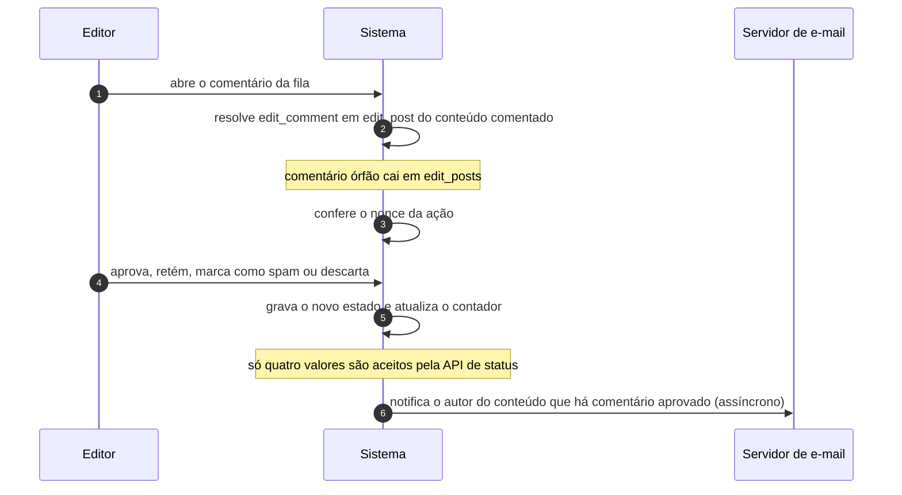

# UC-16 · Moderar a fila de comentários

> Grupo: **Interação pública** · Confiança: 🟢 `confirmado`
> Índice: [`use-cases.md`](use-cases.md)

## Identificação

| Campo | Valor |
|---|---|
| **Objetivo** | decidir, um a um, o que entra na conversa pública do site |
| **Ator principal** | Editor (`editor`, `human`) |
| **Atores secundários** | Servidor de e-mail (`servidor-de-e-mail`) |
| **Gatilho** | o editor abre a tela de comentários do painel, ou clica num link de ação do e-mail de moderação |
| **Autorização** | `edit_comment` do comentário, que `map_meta_cap()` resolve em `edit_post` do conteúdo comentado. Comentário órfão — cujo conteúdo não existe mais — cai em `edit_posts` |
| **Relações UML** | — nenhuma |

## Pré-condições

- o comentário existe
- o ator pode editar o conteúdo comentado

## Fluxo principal

1. Editor abre o comentário da fila
2. Sistema resolve a autorização pelo conteúdo comentado
3. Sistema confere o nonce da ação
4. Editor aprova, retém, marca como spam ou descarta o comentário
5. Sistema grava o novo estado e atualiza o contador do conteúdo
6. Sistema notifica o autor do conteúdo quando a ação é aprovar

## Sequência

O mesmo fluxo principal com remetente e destinatário explícitos. `self` é decisão interna do sistema.

| # | De | Para | Mensagem | Tipo | Condição ou regra |
|---|---|---|---|---|---|
| 1 | Editor | Sistema | abre o comentário da fila | `sync` | — |
| 2 | Sistema | Sistema | resolve edit_comment em edit_post do conteúdo comentado | `self` | comentário órfão cai em edit_posts |
| 3 | Sistema | Sistema | confere o nonce da ação | `self` | — |
| 4 | Editor | Sistema | aprova, retém, marca como spam ou descarta | `sync` | — |
| 5 | Sistema | Sistema | grava o novo estado e atualiza o contador | `self` | só quatro valores são aceitos pela API de status |
| 6 | Sistema | Servidor de e-mail | notifica o autor do conteúdo que há comentário aprovado | `async` | — |

## Fluxos alternativos

### Descartar para a lixeira

1. Sistema grava o estado anterior e o instante do descarte em metadados
2. A restauração lê o estado guardado; se estiver vazio, o comentário volta para a fila de moderação

### Editar o texto do comentário

1. É edição, não transição: o estado não muda
2. Se o ator tem `unfiltered_html`, o texto não é sanitizado

### Ação em lote

1. O mesmo portão de capacidade é verificado comentário a comentário
2. Um item sem permissão não interrompe o lote

## Exceções

| O que dá errado | Como o sistema reage |
|---|---|
| Estado pedido fora dos quatro aceitos | `wp_set_comment_status()` devolve falso. `post-trashed` só é gravado pela cascata de lixeira do conteúdo, nunca pela interface |
| O conteúdo comentado não existe mais | a autorização cai em `edit_posts`: o comentário órfão passa a ser moderável por quem escreve, não por quem edita aquele conteúdo |
| Nonce vencido | a ação é recusada. O nonce vale de 12 a 24 horas e aceita o tick anterior, logo o link do e-mail de moderação tem prazo |

## Pós-condições

- o comentário está no estado escolhido
- o contador do conteúdo reflete os comentários aprovados que contam
- o autor do conteúdo foi notificado se a ação foi aprovar

## Regras de negócio aplicadas

- Moderação é transição de estado, não edição: "aprovar" move o estado (domain.md §1.4)
- Dois estados não são alcançáveis pela API de status (state-machines.md §2)
- Nota editorial usa capacidade de conteúdo, não de moderação (permissions.md §10, pegadinha 6)
- Editar um comentário cujo conteúdo não existe mais cai em `edit_posts` (permissions.md §5.2)

## Implementado em

- `wp-admin/comment.php:84`
- `wp-admin/comment.php:284`
- `wp-admin/comment.php:345`
- `wp-admin/comment.php:349`
- `wp-admin/comment.php:361`
- `wp-includes/comment.php:2799`
- `wp-includes/comment.php:2814`
- `wp-includes/comment.php:1691`
- `wp-includes/comment.php:1755`
- `wp-includes/capabilities.php:575`

## O que um porte precisa saber

- 🟢 **Moderar comentário é poder de conteúdo disfarçado.** `edit_comment` resolve em `edit_post` do conteúdo comentado: quem pode editar o texto modera a conversa dele. Não há papel de moderador independente do papel editorial.
- 🟢 **A fila não tem prazo.** Nada expira um comentário retido: ele fica em moderação indefinidamente. Só o spam e a lixeira têm coleta.
