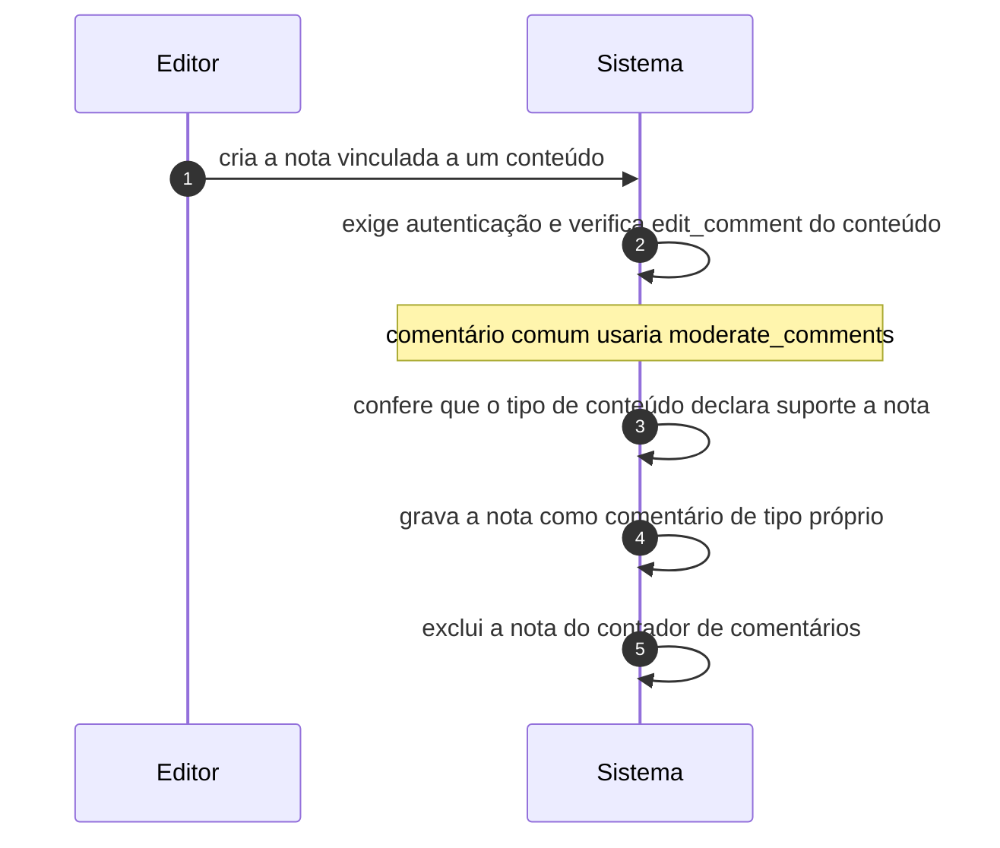

# UC-18 · Registrar nota editorial interna

> Grupo: **Interação pública** · Confiança: 🟢 `confirmado`
> Índice: [`use-cases.md`](use-cases.md)

## Identificação

| Campo | Valor |
|---|---|
| **Objetivo** | deixar um recado sobre um conteúdo visível só para a equipe, não para o público |
| **Ator principal** | Editor (`editor`, `human`) |
| **Atores secundários** | — nenhum |
| **Gatilho** | o editor cria uma nota num conteúdo pela API REST de comentários |
| **Autorização** | `edit_comment` do conteúdo, **não** `moderate_comments`. É a única interação pública cuja autorização é editorial |
| **Relações UML** | — nenhuma |

## Pré-condições

- o ator está autenticado
- o tipo de conteúdo declara suporte a nota editorial

## Fluxo principal

1. Editor cria a nota vinculada a um conteúdo
2. Sistema exige autenticação e verifica a capacidade de editar aquele conteúdo
3. Sistema confere que o tipo de conteúdo declara suporte a nota
4. Sistema grava a nota como comentário de tipo próprio
5. Sistema exclui a nota do contador de comentários do conteúdo

## Sequência

O mesmo fluxo principal com remetente e destinatário explícitos. `self` é decisão interna do sistema.

| # | De | Para | Mensagem | Tipo | Condição ou regra |
|---|---|---|---|---|---|
| 1 | Editor | Sistema | cria a nota vinculada a um conteúdo | `sync` | — |
| 2 | Sistema | Sistema | exige autenticação e verifica edit_comment do conteúdo | `self` | comentário comum usaria moderate_comments |
| 3 | Sistema | Sistema | confere que o tipo de conteúdo declara suporte a nota | `self` | — |
| 4 | Sistema | Sistema | grava a nota como comentário de tipo próprio | `self` | — |
| 5 | Sistema | Sistema | exclui a nota do contador de comentários | `self` | — |

## Fluxos alternativos

### Responder a uma nota

1. A resposta é outra nota, filha da primeira
2. Apagar ou lixeirar a nota raiz **arrasta as respostas**

## Exceções

| O que dá errado | Como o sistema reage |
|---|---|
| Visitante anônimo tenta criar nota | recusado: a nota exige login, ao contrário do comentário comum |
| Tipo de conteúdo sem suporte declarado | recusado antes de gravar |

## Pós-condições

- existe um comentário do tipo nota, fora do contador público do conteúdo
- as respostas da nota, se houver, estão vinculadas a ela e caem junto quando ela cai

## Regras de negócio aplicadas

- C12 — nota editorial não é comentário público: exige login, é excluída do contador, usa `edit_comment` em vez de `moderate_comments`, só aceita tipos de conteúdo que declarem suporte, e apagar a nota raiz arrasta as respostas (domain.md §2.2)
- Glossário — Note é nota editorial interna, nova nesta geração (domain.md §1.4)
- Nota editorial usa capacidade de conteúdo, não de moderação (permissions.md §10, pegadinha 6)

## Implementado em

- `wp-includes/comment.php:1652`
- `wp-includes/comment.php:1705`
- `wp-includes/comment.php:3138`
- `wp-includes/rest-api/endpoints/class-wp-rest-comments-controller.php:149`
- `wp-includes/rest-api/endpoints/class-wp-rest-comments-controller.php:441`
- `wp-includes/rest-api/endpoints/class-wp-rest-comments-controller.php:500`
- `wp-includes/rest-api/endpoints/class-wp-rest-comments-controller.php:662`

## O que um porte precisa saber

- 🟢 **A tabela de comentários ganhou um uso que não é comentário.** A nota editorial mora na mesma tabela, com o mesmo ciclo de estado, e é governada por outra capacidade. Quem migrar modelando "comentário" como interação pública perde esta funcionalidade inteira.
- 🔴 **Não foi possível determinar como a nota aparece na interface.** O consumidor é o editor de blocos, cujo lado JavaScript não está nesta árvore.
