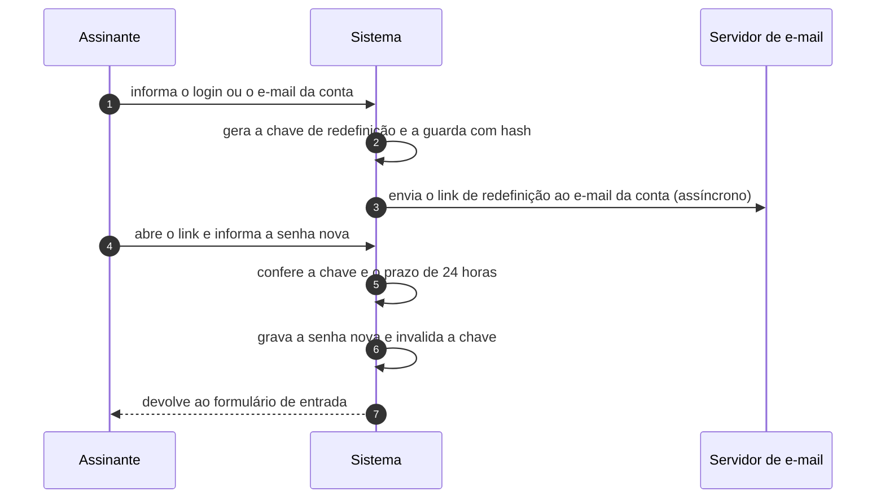

# UC-20 · Recuperar a senha de acesso

> Grupo: **Identidade e acesso** · Confiança: 🟢 `confirmado`
> Índice: [`use-cases.md`](use-cases.md)

## Identificação

| Campo | Valor |
|---|---|
| **Objetivo** | voltar a entrar no sistema depois de perder a senha |
| **Ator principal** | Assinante (`assinante`, `human`) |
| **Atores secundários** | Servidor de e-mail (`servidor-de-e-mail`) |
| **Gatilho** | o assinante pede a redefinição em `wp-login.php?action=lostpassword` |
| **Autorização** | uma chave de uso temporário enviada ao e-mail da conta. A posse do e-mail é a autorização — não há capacidade envolvida |
| **Relações UML** | — nenhuma |

## Pré-condições

- a conta existe e tem endereço de e-mail
- o site consegue enviar e-mail

## Fluxo principal

1. Assinante informa o login ou o e-mail da conta
2. Sistema gera uma chave de redefinição e a guarda com hash na conta
3. Sistema envia ao e-mail da conta o link com a chave
4. Assinante abre o link e informa a senha nova
5. Sistema confere a chave e o prazo de 24 horas
6. Sistema grava a senha nova e invalida a chave
7. Sistema devolve o assinante ao formulário de entrada

## Sequência

O mesmo fluxo principal com remetente e destinatário explícitos. `self` é decisão interna do sistema.

| # | De | Para | Mensagem | Tipo | Condição ou regra |
|---|---|---|---|---|---|
| 1 | Assinante | Sistema | informa o login ou o e-mail da conta | `sync` | — |
| 2 | Sistema | Sistema | gera a chave de redefinição e a guarda com hash | `self` | — |
| 3 | Sistema | Servidor de e-mail | envia o link de redefinição ao e-mail da conta | `async` | — |
| 4 | Assinante | Sistema | abre o link e informa a senha nova | `sync` | — |
| 5 | Sistema | Sistema | confere a chave e o prazo de 24 horas | `self` | — |
| 6 | Sistema | Sistema | grava a senha nova e invalida a chave | `self` | — |
| 7 | Sistema | Assinante | devolve ao formulário de entrada | `return` | — |

## Fluxos alternativos

### O assinante lembra a senha e entra normalmente

1. O primeiro login bem-sucedido apaga a chave pendente
2. O link do e-mail deixa de funcionar sem que ninguém o cancele

### Pedido repetido antes do prazo

1. Uma chave nova é gerada e substitui a anterior
2. O link antigo deixa de valer

## Exceções

| O que dá errado | Como o sistema reage |
|---|---|
| Chave vencida | a tela informa que o link expirou e oferece pedir outro. O prazo é de 24 horas |
| O e-mail não saiu | o assinante não tem como saber: nenhum estado registra a falha de envio neste fluxo, ao contrário do que acontece na solicitação de dados pessoais |
| A conta não existe | o formulário informa o erro, o que revela quais logins existem |

## Pós-condições

- a senha da conta é a nova
- nenhuma chave de redefinição continua válida para aquela conta
- as sessões abertas antes da troca **não** são encerradas por este fluxo

## Regras de negócio aplicadas

- U4 — a chave de reset de senha vale 24 horas e é apagada no primeiro login bem-sucedido (domain.md §2.3)
- A chave de redefinição é um dos cinco mecanismos de autorização que não consultam capacidade (permissions.md §9)

## Implementado em

- `wp-login.php:830`
- `wp-login.php:932`
- `wp-includes/user.php:3262`
- `wp-includes/user.php:3511`
- `wp-includes/user.php:3204`
- `wp-includes/user.php:117`

## O que um porte precisa saber

- 🟢 **Entrar com a senha antiga cancela o pedido.** A chave pendente é apagada no primeiro login bem-sucedido. É uma proteção real e pouco óbvia: um link interceptado morre no instante em que o dono entra.
- 🟡 **A troca de senha não derruba as sessões.** Quem já estava autenticado continua autenticado. Para quem usa a redefinição como resposta a comprometimento, isso é o oposto do esperado.
