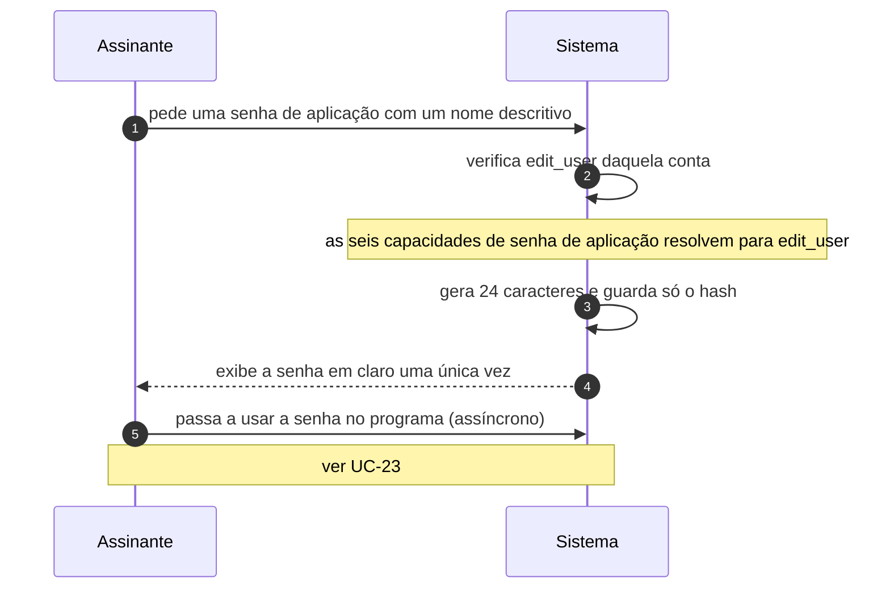

# UC-22 · Gerenciar senha de aplicação

> Grupo: **Identidade e acesso** · Confiança: 🟢 `confirmado`
> Índice: [`use-cases.md`](use-cases.md)

## Identificação

| Campo | Valor |
|---|---|
| **Objetivo** | emitir e revogar credenciais para programas agirem em meu nome, sem entregar minha senha |
| **Ator principal** | Assinante (`assinante`, `human`) |
| **Atores secundários** | — nenhum |
| **Gatilho** | o assinante cria ou revoga uma senha de aplicação no próprio perfil, ou pela API REST |
| **Autorização** | `edit_user` daquele usuário. As seis capacidades de senha de aplicação resolvem todas para isso: quem pode editar a conta administra as credenciais dela |
| **Relações UML** | — nenhuma |

## Pré-condições

- o ator está autenticado
- a conexão é segura, ou a instalação dispensou o requisito

## Fluxo principal

1. Assinante pede uma senha de aplicação com um nome descritivo
2. Sistema verifica a capacidade de editar aquela conta
3. Sistema gera 24 caracteres e guarda apenas o hash no metadado da conta
4. Sistema exibe a senha em claro **uma única vez**
5. Assinante guarda a senha no programa que vai usá-la

## Sequência

O mesmo fluxo principal com remetente e destinatário explícitos. `self` é decisão interna do sistema.

| # | De | Para | Mensagem | Tipo | Condição ou regra |
|---|---|---|---|---|---|
| 1 | Assinante | Sistema | pede uma senha de aplicação com um nome descritivo | `sync` | — |
| 2 | Sistema | Sistema | verifica edit_user daquela conta | `self` | as seis capacidades de senha de aplicação resolvem para edit_user |
| 3 | Sistema | Sistema | gera 24 caracteres e guarda só o hash | `self` | — |
| 4 | Sistema | Assinante | exibe a senha em claro uma única vez | `return` | — |
| 5 | Assinante | Sistema | passa a usar a senha no programa | `async` | ver UC-23 |

## Fluxos alternativos

### Revogar uma senha

1. Sistema apaga o item do metadado
2. As chamadas em curso que a usavam param de autenticar na requisição seguinte

### Administrador gerencia a senha de outro

1. A capacidade exigida continua sendo `edit_user` daquele usuário
2. Em multisite, editar um super administrador sem ser super administrador é `do_not_allow`

### Gerenciar pela API REST

1. O controlador de senhas de aplicação expõe listar, criar, ler, editar e apagar
2. Cada rota tem seu `permission_callback`

## Exceções

| O que dá errado | Como o sistema reage |
|---|---|
| Usuário inexistente | `do_not_allow` — e o comentário no código é explícito: *"not even themselves"* |
| Senha perdida depois da exibição | não há recuperação: só o hash foi guardado. A única saída é revogar e emitir outra |

## Pós-condições

- existe um item no metadado da conta com o hash, o nome e o instante de criação
- a senha em claro não existe em lugar algum do sistema

## Regras de negócio aplicadas

- U6 — senha de aplicação é credencial de segunda classe por desenho: 24 caracteres, hash em metadado, e sua administração reusa a permissão de editar aquele usuário (domain.md §2.3)
- Autenticar com ela não reduz as capacidades do usuário: é só outra forma de provar quem é (permissions.md §8.2)
- `edit_user` sobre si mesmo devolve lista vazia, e lista vazia significa permitido (permissions.md §10, pegadinha 2)

## Implementado em

- `wp-includes/class-wp-application-passwords.php:24`
- `wp-includes/class-wp-application-passwords.php:42`
- `wp-includes/class-wp-application-passwords.php:98`
- `wp-includes/capabilities.php:800`
- `wp-includes/capabilities.php:63`
- `wp-includes/rest-api/endpoints/class-wp-rest-application-passwords-controller.php:42`
- `wp-includes/rest-api/endpoints/class-wp-rest-application-passwords-controller.php:48`
- `wp-includes/rest-api/endpoints/class-wp-rest-application-passwords-controller.php:209`

## O que um porte precisa saber

- 🟢 **A senha de aplicação vale exatamente o que a conta vale.** Não tem escopo, não tem prazo e não reduz capacidade alguma. Um programa com a senha de aplicação de um administrador é um administrador.
- 🟢 **Quem porta o sistema tem aqui a chance de dar escopo.** O modelo atual trata a credencial como outra forma de provar identidade, não como delegação limitada. Replicar o modelo é herdar uma credencial total de longa duração.
