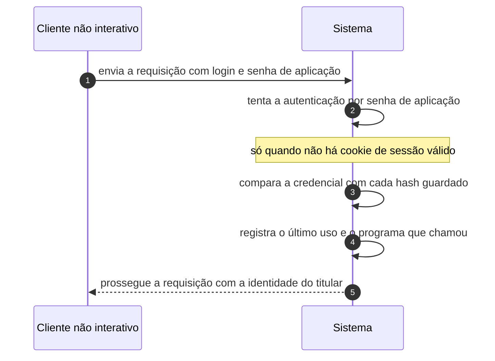

# UC-23 · Autenticar chamada não interativa

> Grupo: **Identidade e acesso** · Confiança: 🟡 `inferido`
> Índice: [`use-cases.md`](use-cases.md)

## Identificação

| Campo | Valor |
|---|---|
| **Objetivo** | provar a identidade de um programa que chama a API, sem navegador e sem cookie |
| **Ator principal** | Cliente não interativo (`cliente-rest`, `system`) |
| **Atores secundários** | — nenhum |
| **Gatilho** | uma requisição chega com cabeçalho de autenticação básica, ou com credencial no corpo da chamada XML-RPC |
| **Autorização** | a senha de aplicação, conferida contra os hashes guardados na conta. Depois disso, o programa tem **todas** as capacidades do titular |
| **Relações UML** | incluído por [UC-44 — Consumir a API REST](UC-44-consumir-a-api-rest.md) · incluído por [UC-45 — Consumir a API XML-RPC](UC-45-consumir-a-api-xml-rpc.md) |

## Pré-condições

- existe ao menos uma senha de aplicação ativa para a conta
- a autenticação por senha de aplicação está disponível na instalação

## Fluxo principal

1. Cliente envia a requisição com login e senha de aplicação
2. Sistema reconhece que não há cookie de sessão e tenta a autenticação por senha de aplicação
3. Sistema localiza a conta e compara a credencial com cada hash guardado
4. Sistema registra o instante do último uso e o programa que chamou
5. Sistema prossegue a requisição com a identidade e todas as capacidades do titular

## Sequência

O mesmo fluxo principal com remetente e destinatário explícitos. `self` é decisão interna do sistema.

| # | De | Para | Mensagem | Tipo | Condição ou regra |
|---|---|---|---|---|---|
| 1 | Cliente não interativo | Sistema | envia a requisição com login e senha de aplicação | `sync` | — |
| 2 | Sistema | Sistema | tenta a autenticação por senha de aplicação | `self` | só quando não há cookie de sessão válido |
| 3 | Sistema | Sistema | compara a credencial com cada hash guardado | `self` | — |
| 4 | Sistema | Sistema | registra o último uso e o programa que chamou | `self` | — |
| 5 | Sistema | Cliente não interativo | prossegue a requisição com a identidade do titular | `return` | — |

## Fluxos alternativos

### Autenticação por cookie

1. O cliente reusa o cookie de uma sessão de navegador
2. Nesse caminho o nonce da API passa a ser exigido, porque a requisição é falsificável

### Credencial no corpo da chamada XML-RPC

1. Cada método recebe login e senha como argumento e chama a verificação
2. Não há cabeçalho de autenticação: a credencial viaja no payload

### Erro antecipado por filtro

1. O filtro de autenticação da API antecede todo o despacho
2. Um plugin pode exigir autenticação para a API inteira, ou liberá-la

## Exceções

| O que dá errado | Como o sistema reage |
|---|---|
| Credencial inválida | a requisição segue como visitante anônimo, e só então o `permission_callback` da rota recusa. Falhar a autenticação não é, por si, um erro de resposta |
| Nenhuma senha de aplicação na conta | a tentativa é abandonada e a requisição continua anônima |

## Pós-condições

- a requisição corre com a identidade do titular da credencial
- o metadado da senha de aplicação registra o último uso
- nenhuma redução de capacidade foi aplicada por se tratar de chamada não interativa

## Regras de negócio aplicadas

- U6 — senha de aplicação é credencial de segunda classe por desenho (domain.md §2.3)
- Autenticar com senha de aplicação não reduz as capacidades do usuário (permissions.md §8.2)
- O filtro `rest_authentication_errors` antecede todo o despacho da API (permissions.md §8)

## Implementado em

- `wp-includes/user.php:372`
- `wp-includes/class-wp-application-passwords.php:98`
- `wp-includes/rest-api/class-wp-rest-server.php:197`
- `wp-includes/class-wp-xmlrpc-server.php:344`

## O que um porte precisa saber

- 🟢 **Falhar a autenticação não produz erro.** A requisição continua como anônima e a recusa, se vier, vem do portão da rota. Um cliente mal configurado recebe 401 de rota protegida, e 200 de rota pública — o que esconde o problema.
- 🟢 **A credencial não tem escopo.** Nada distingue, do lado do servidor, o que um programa pode fazer do que o titular pode fazer. Toda restrição precisa ser imposta pela rota, e as rotas não a impõem por cliente.
- 🟡 **Por que este caso é `inferido` e não `confirmado`.** O fluxo está no código, mas a afirmação central — autenticar por senha de aplicação **não reduz** capacidade alguma — é inferência: nenhuma restrição de escopo foi encontrada no mapeamento, e ausência de código não é prova de ausência de comportamento. Herda a marca 🟡 de [`permissions.md`](../permissions.md) §8.2.
