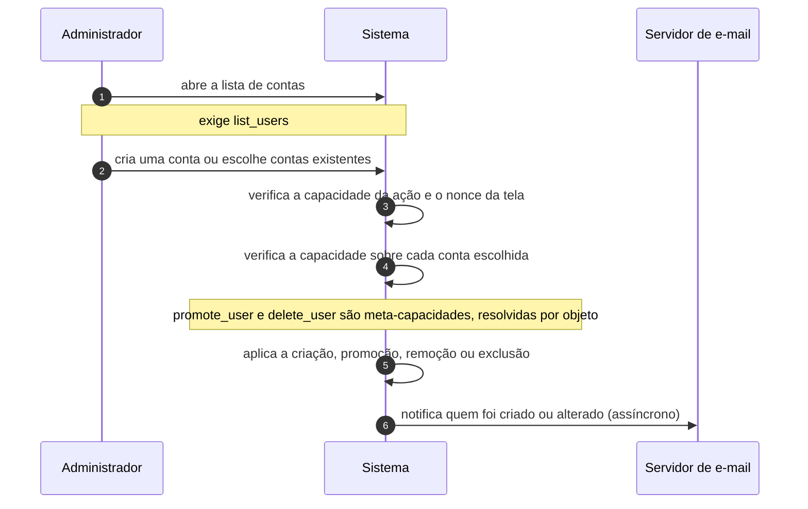

# UC-24 · Administrar contas e papéis

> Grupo: **Identidade e acesso** · Confiança: 🟢 `confirmado`
> Índice: [`use-cases.md`](use-cases.md)

## Identificação

| Campo | Valor |
|---|---|
| **Objetivo** | criar, promover e remover as pessoas que têm acesso ao site |
| **Ator principal** | Administrador (`administrador`, `human`) |
| **Atores secundários** | Servidor de e-mail (`servidor-de-e-mail`) |
| **Gatilho** | o administrador usa as telas de usuários do painel |
| **Autorização** | `list_users` para ver, `create_users` para criar, `edit_users` para alterar, `promote_users` para mudar papel, `delete_users` para apagar e `remove_users` para desvincular do site |
| **Relações UML** | — nenhuma |

## Pré-condições

- o ator tem a capacidade correspondente à ação
- fora de multisite, `delete_users` é também o que define "super admin"

## Fluxo principal

1. Administrador abre a lista de contas
2. Administrador cria uma conta, ou escolhe contas existentes
3. Sistema verifica a capacidade da ação e o nonce da tela
4. Sistema verifica a capacidade sobre **aquela** conta, uma a uma
5. Sistema aplica a criação, a promoção, a remoção ou a exclusão
6. Sistema notifica por e-mail quem foi criado ou teve a conta alterada

## Sequência

O mesmo fluxo principal com remetente e destinatário explícitos. `self` é decisão interna do sistema.

| # | De | Para | Mensagem | Tipo | Condição ou regra |
|---|---|---|---|---|---|
| 1 | Administrador | Sistema | abre a lista de contas | `sync` | exige list_users |
| 2 | Administrador | Sistema | cria uma conta ou escolhe contas existentes | `sync` | — |
| 3 | Sistema | Sistema | verifica a capacidade da ação e o nonce da tela | `self` | — |
| 4 | Sistema | Sistema | verifica a capacidade sobre cada conta escolhida | `self` | promote_user e delete_user são meta-capacidades, resolvidas por objeto |
| 5 | Sistema | Sistema | aplica a criação, promoção, remoção ou exclusão | `self` | — |
| 6 | Sistema | Servidor de e-mail | notifica quem foi criado ou alterado | `async` | — |

## Fluxos alternativos

### Apagar uma conta que tem conteúdo

1. A tela oferece reatribuir o conteúdo a outra conta
2. Sem reatribuição, o conteúdo é apagado junto

### Em multisite, adicionar uma pessoa que já existe na rede

1. A identidade é global: a conta não é criada, é vinculada a este site com um papel
2. `create_users` só passa para quem não é super administrador se a opção de rede `add_new_users` estiver ligada

### Editar o próprio perfil

1. `edit_user` sobre si mesmo devolve lista vazia de capacidades exigidas, e lista vazia significa permitido
2. Qualquer conta edita o próprio perfil, inclusive um assinante

## Exceções

| O que dá errado | Como o sistema reage |
|---|---|
| O administrador tenta se rebaixar | a troca é recusada se o papel novo não tiver `promote_users`. O código diz o motivo em comentário: o papel novo do próprio usuário precisa manter o poder de promover — é a trava que evita um site sem ninguém capaz de administrar |
| O administrador tenta remover o próprio papel | recusa explícita: *"Sorry, you cannot remove your own role"* |
| Em multisite, editar ou apagar um super administrador | `do_not_allow` para quem não é super administrador. Apagar identidade é poder de rede, porque a identidade é global |
| Remover a si mesmo do site, em multisite, sem ser super administrador | `do_not_allow` |

## Pós-condições

- a lista de contas e os papéis refletem as alterações
- continua havendo ao menos uma conta capaz de promover outras
- o conteúdo das contas apagadas foi reatribuído ou apagado

## Regras de negócio aplicadas

- U1 — o papel de quem se registra é `subscriber` (domain.md §2.3)
- N6 — criar usuário na rede é permissão de rede, salvo opção explícita (domain.md §2.8)
- Pegadinha 3 — a definição de papel é um retrato tirado na instalação; depois disso a opção `{prefixo}user_roles` é a verdade (permissions.md §10)
- Pegadinha 5 — nenhuma consulta SQL responde "quem é administrador" (permissions.md §10)
- [ADR 0001](../adrs/0001-papeis-como-dado-mutavel-nao-como-codigo.md) — papéis como dado mutável, não como código

## Implementado em

- `wp-admin/users.php:13`
- `wp-admin/users.php:113`
- `wp-admin/users.php:142`
- `wp-admin/users.php:146`
- `wp-admin/users.php:199`
- `wp-admin/users.php:207`
- `wp-admin/user-new.php:13`
- `wp-admin/user-new.php:192`
- `wp-admin/user-edit.php:133`
- `wp-admin/user-edit.php:135`
- `wp-includes/capabilities.php:49`
- `wp-includes/capabilities.php:57`
- `wp-includes/capabilities.php:70`
- `wp-includes/capabilities.php:74`
- `wp-includes/capabilities.php:682`

## O que um porte precisa saber

- 🟢 **A única trava contra travar o site é um comentário de uma linha.** `wp-admin/users.php:146` explica, em comentário, que o papel novo do próprio usuário precisa conservar `promote_users`. A regra está na tela, não no modelo de autorização: outra entrada que chame a troca de papel direto não a aplica.
- 🟢 **Não existe consulta que responda quem administra o site.** As capacidades estão serializadas em metadado por site, logo a única busca possível é texto aproximado. Num porte, isso é uma das primeiras coisas a corrigir — e corrigi-la muda o modelo de dados.
- 🟡 **Promover alguém não deixa rastro.** Nenhuma trilha registra quem mudou o papel de quem, nem quando.
