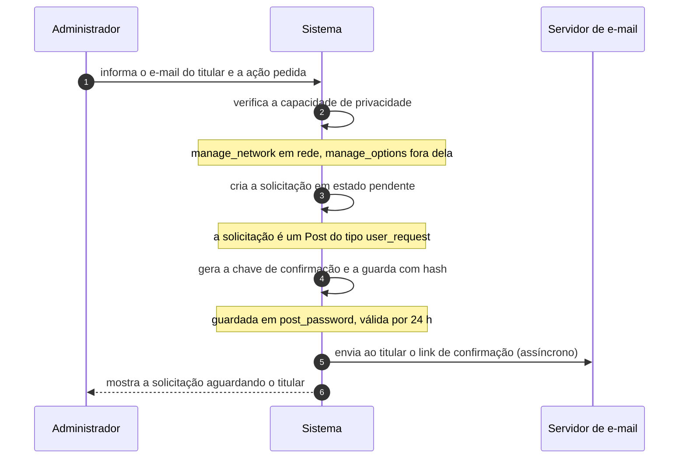

# UC-25 · Abrir solicitação de dados pessoais

> Grupo: **Privacidade** · Confiança: 🟢 `confirmado`
> Índice: [`use-cases.md`](use-cases.md)

## Identificação

| Campo | Valor |
|---|---|
| **Objetivo** | iniciar formalmente a exportação ou o apagamento dos dados pessoais de alguém |
| **Ator principal** | Administrador (`administrador`, `human`) |
| **Atores secundários** | Servidor de e-mail (`servidor-de-e-mail`) · Titular de dados pessoais (`titular-de-dados`) |
| **Gatilho** | o administrador informa um endereço de e-mail na tela de exportação ou de apagamento de dados pessoais |
| **Autorização** | `export_others_personal_data` para exportar e `erase_others_personal_data` mais `delete_users` para apagar. As duas mapeiam para `manage_network` em rede e `manage_options` fora dela: é poder de rede, não de site |
| **Relações UML** | — nenhuma |

## Pré-condições

- o ator tem a capacidade de privacidade correspondente
- o site consegue enviar e-mail

## Fluxo principal

1. Administrador informa o e-mail do titular e a ação pedida
2. Sistema verifica a capacidade de privacidade da ação
3. Sistema cria a solicitação como um registro de conteúdo de tipo próprio, em estado pendente
4. Sistema gera a chave de confirmação e a guarda com hash no campo de senha do registro
5. Sistema envia ao titular o e-mail com o link de confirmação
6. Sistema mostra a solicitação na lista, aguardando o titular

## Sequência

O mesmo fluxo principal com remetente e destinatário explícitos. `self` é decisão interna do sistema.

| # | De | Para | Mensagem | Tipo | Condição ou regra |
|---|---|---|---|---|---|
| 1 | Administrador | Sistema | informa o e-mail do titular e a ação pedida | `sync` | — |
| 2 | Sistema | Sistema | verifica a capacidade de privacidade | `self` | manage_network em rede, manage_options fora dela |
| 3 | Sistema | Sistema | cria a solicitação em estado pendente | `self` | a solicitação é um Post do tipo user_request |
| 4 | Sistema | Sistema | gera a chave de confirmação e a guarda com hash | `self` | guardada em post_password, válida por 24 h |
| 5 | Sistema | Servidor de e-mail | envia ao titular o link de confirmação | `async` | — |
| 6 | Sistema | Administrador | mostra a solicitação aguardando o titular | `return` | — |

## Fluxos alternativos

### Reenviar a solicitação

1. Uma chave nova é gerada e o estado volta a pendente
2. É por isso que o estado de falha precisa aceitar validação de chave

### O titular não tem conta no site

1. A solicitação é criada do mesmo jeito: o identificador é o e-mail, não a conta
2. Os exportadores registrados varrem comentários e demais dados por e-mail

## Exceções

| O que dá errado | Como o sistema reage |
|---|---|
| Falha ao enviar o e-mail | a solicitação vai para o estado de falha. Falha de envio é **estado**, não exceção, e é por isso que ela pode ser reenviada |
| Ator sem a capacidade | a tela nem abre: a verificação é a primeira linha de `export-personal-data.php` e de `erase-personal-data.php` |

## Pós-condições

- existe um registro de solicitação em estado pendente ou de falha
- a chave de confirmação com hash está no registro e vale 24 horas
- nada foi exportado nem apagado

## Regras de negócio aplicadas

- D1 — a solicitação é um Post, com quatro status dedicados (domain.md §2.5)
- D2 — nada acontece sem confirmação do titular (domain.md §2.5)
- D3 — falha de envio de e-mail é estado, não exceção (domain.md §2.5)
- D4 — exportar ou apagar dados de terceiro é poder de rede (domain.md §2.5)

## Implementado em

- `wp-admin/export-personal-data.php:12`
- `wp-admin/erase-personal-data.php:12`
- `wp-includes/user.php:4804`
- `wp-includes/user.php:4901`
- `wp-includes/user.php:5058`
- `wp-admin/includes/privacy-tools.php:18`
- `wp-admin/includes/privacy-tools.php:73`
- `wp-admin/includes/privacy-tools.php:226`
- `wp-includes/post.php:767`
- `wp-includes/capabilities.php:795`

## O que um porte precisa saber

- 🟢 **A solicitação de privacidade é conteúdo.** Vive na tabela de posts, com status próprios e a chave de confirmação guardada no campo de senha do post. Quem migrar modelando "pedido de LGPD" como entidade nova vai descobrir que o legado a trata como conteúdo interno — com todas as consequências: lixeira, revisão, consultas.
- 🟢 **Dois atores, duas autorizações incompatíveis.** O administrador abre por capacidade; o titular confirma por chave. É o único fluxo do sistema que exige as duas coisas em sequência.
