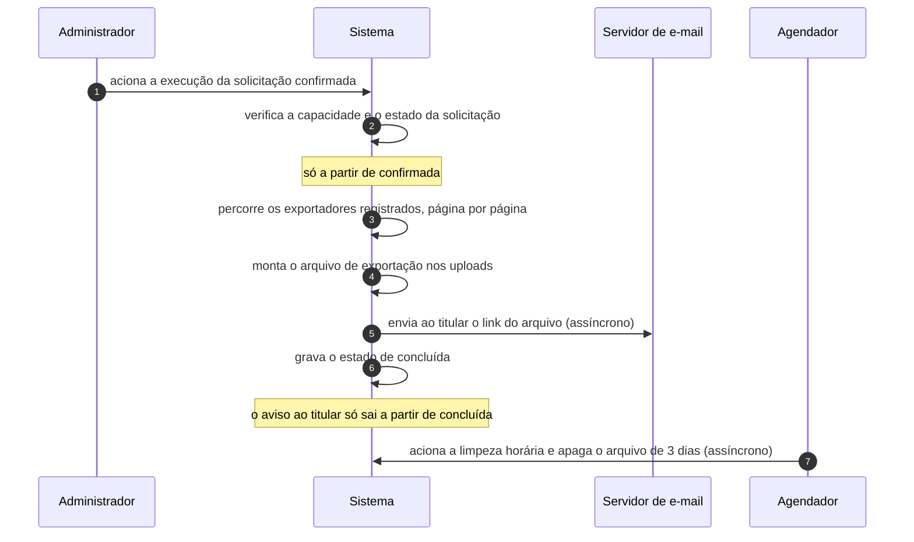

# UC-27 · Executar solicitação de dados pessoais

> Grupo: **Privacidade** · Confiança: 🟢 `confirmado`
> Índice: [`use-cases.md`](use-cases.md)

## Identificação

| Campo | Valor |
|---|---|
| **Objetivo** | entregar ao titular os dados pedidos, ou apagá-los, encerrando a solicitação |
| **Ator principal** | Administrador (`administrador`, `human`) |
| **Atores secundários** | Titular de dados pessoais (`titular-de-dados`) · Servidor de e-mail (`servidor-de-e-mail`) · Agendador (`agendador`) |
| **Gatilho** | o administrador aciona a execução numa solicitação confirmada |
| **Autorização** | a mesma capacidade de privacidade de UC-25, somada à exigência de que a solicitação esteja **confirmada** |
| **Relações UML** | — nenhuma |

## Pré-condições

- a solicitação está em estado confirmada
- os exportadores ou apagadores registrados respondem

## Fluxo principal

1. Administrador aciona a execução da solicitação confirmada
2. Sistema verifica a capacidade e o estado da solicitação
3. Sistema percorre os exportadores ou apagadores registrados, página por página
4. Sistema monta o arquivo de exportação e o guarda nos uploads
5. Sistema envia ao titular o link do arquivo
6. Sistema grava o estado de concluída e avisa o titular
7. Agendador apaga o arquivo três dias depois, por varredura horária

## Sequência

O mesmo fluxo principal com remetente e destinatário explícitos. `self` é decisão interna do sistema.

| # | De | Para | Mensagem | Tipo | Condição ou regra |
|---|---|---|---|---|---|
| 1 | Administrador | Sistema | aciona a execução da solicitação confirmada | `sync` | — |
| 2 | Sistema | Sistema | verifica a capacidade e o estado da solicitação | `self` | só a partir de confirmada |
| 3 | Sistema | Sistema | percorre os exportadores registrados, página por página | `self` | — |
| 4 | Sistema | Sistema | monta o arquivo de exportação nos uploads | `self` | — |
| 5 | Sistema | Servidor de e-mail | envia ao titular o link do arquivo | `async` | — |
| 6 | Sistema | Sistema | grava o estado de concluída | `self` | o aviso ao titular só sai a partir de concluída |
| 7 | Agendador | Sistema | aciona a limpeza horária e apaga o arquivo de 3 dias | `async` | — |

## Fluxos alternativos

### Apagamento em lugar de exportação

1. Sistema percorre os apagadores registrados e informa quantos itens foram removidos e quantos não puderam ser
2. Não há arquivo a entregar

### Execução em várias passagens

1. Os exportadores respondem por página e declaram se terminaram
2. A interface repete a chamada até todos declararem conclusão

## Exceções

| O que dá errado | Como o sistema reage |
|---|---|
| A solicitação não está confirmada | a execução é recusada: só o estado confirmada a autoriza |
| Um exportador falha | a falha é reportada na tela e o processo continua com os demais |
| O arquivo de exportação fica acessível por URL | o arquivo vive nos uploads por três dias; a proteção é a imprevisibilidade do nome, não uma verificação de identidade |

## Pós-condições

- a solicitação está concluída
- o arquivo de exportação existe nos uploads por três dias
- o registro da solicitação concluída permanece indefinidamente

## Regras de negócio aplicadas

- D1, D2, D4 — a solicitação é um Post, só executa a partir de confirmada, e a capacidade é de rede (domain.md §2.5)
- R7 — o arquivo de exportação vale três dias e a varredura é horária; este evento é registrado em `init`, logo existe mesmo num site que ninguém administra (domain.md §2.4)
- O registro da solicitação concluída não tem política de retenção (state-machines.md §4)

## Implementado em

- `wp-admin/includes/privacy-tools.php:46`
- `wp-admin/includes/privacy-tools.php:316`
- `wp-admin/includes/privacy-tools.php:594`
- `wp-admin/includes/privacy-tools.php:610`
- `wp-admin/includes/privacy-tools.php:775`
- `wp-admin/includes/privacy-tools.php:921`
- `wp-includes/user.php:4278`
- `wp-includes/user.php:4490`
- `wp-includes/functions.php:8550`
- `wp-includes/default-filters.php:459`

## O que um porte precisa saber

- 🟢 **O arquivo expira; o registro não.** O arquivo de exportação é apagado em três dias por varredura horária. A solicitação concluída — com o e-mail do titular e a ação pedida — permanece indefinidamente. Para um sistema cujo propósito é apagar dados pessoais, essa assimetria é o achado.
- 🟢 **A varredura do arquivo é o único evento de retenção que não depende de login.** Ela é registrada em `init`, não no painel, ao contrário da coleta da lixeira. Alguém notou a diferença e corrigiu só aqui.
