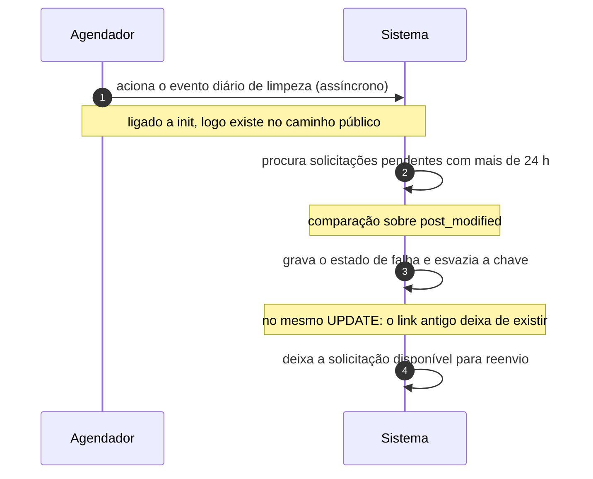

# UC-28 · Expirar solicitação não confirmada

> Grupo: **Privacidade** · Confiança: 🟢 `confirmado`
> Índice: [`use-cases.md`](use-cases.md)

## Identificação

| Campo | Valor |
|---|---|
| **Objetivo** | encerrar o prazo de uma solicitação que o titular nunca confirmou, sem deixar o link vivo |
| **Ator principal** | Agendador (`agendador`, `time`) |
| **Atores secundários** | — nenhum |
| **Gatilho** | o evento diário de limpeza de solicitações vence, ou alguém abre a tela de exportação ou de apagamento |
| **Autorização** | nenhuma. A rotina roda sem usuário e sem verificação de capacidade: o prazo é a autorização |
| **Relações UML** | estende [UC-39 — Processar a fila agendada](UC-39-processar-a-fila-agendada.md) |

## Pré-condições

- existe solicitação em estado pendente com mais de 24 horas desde a última alteração

## Fluxo principal

1. Agendador aciona o evento diário de limpeza
2. Sistema procura solicitações pendentes alteradas há mais de 24 horas
3. Sistema grava o estado de falha e esvazia a chave com hash, no mesmo comando
4. Sistema deixa a solicitação disponível para reenvio

## Sequência

O mesmo fluxo principal com remetente e destinatário explícitos. `self` é decisão interna do sistema.

| # | De | Para | Mensagem | Tipo | Condição ou regra |
|---|---|---|---|---|---|
| 1 | Agendador | Sistema | aciona o evento diário de limpeza | `async` | ligado a init, logo existe no caminho público |
| 2 | Sistema | Sistema | procura solicitações pendentes com mais de 24 h | `self` | comparação sobre post_modified |
| 3 | Sistema | Sistema | grava o estado de falha e esvazia a chave | `self` | no mesmo UPDATE: o link antigo deixa de existir |
| 4 | Sistema | Sistema | deixa a solicitação disponível para reenvio | `self` | — |

## Fluxos alternativos

### Expiração por visita à tela

1. Até a 7.1.0 era o único caminho: a limpeza rodava ao abrir a tela de exportação ou de apagamento
2. A 7.1.0 acrescentou o evento diário e o ligou a `init`, o que coloca o registro no caminho público

## Exceções

| O que dá errado | Como o sistema reage |
|---|---|
| A solicitação já estava em estado de falha | não é tocada: a varredura só procura pendentes |
| Nenhuma requisição HTTP chega | o evento não roda. Como todo evento deste sistema, a fila só avança quando chega visita |

## Pós-condições

- a solicitação está em estado de falha
- a chave de confirmação não existe mais no registro
- o link que o titular recebeu deixou de funcionar

## Regras de negócio aplicadas

- D3b — solicitação não confirmada em 24 horas expira para o estado de falha, e a chave é apagada no mesmo comando; virou cron diário na 7.1.0 (domain.md §2.5)
- A9 — a fila só avança quando chega requisição HTTP (domain.md §2.6)
- [ADR 0006](../adrs/0006-retencao-agendada-por-visita-ao-painel.md) — retenção agendada por visita ao painel: este caso é a correção parcial dele

## Implementado em

- `wp-admin/includes/privacy-tools.php:195`
- `wp-admin/includes/privacy-tools.php:222`
- `wp-admin/export-personal-data.php:73`
- `wp-admin/erase-personal-data.php:73`
- `wp-includes/functions.php:8568`
- `wp-includes/default-filters.php:461`

## O que um porte precisa saber

- 🟢 **Expirar aqui significa destruir a chave, não só vencê-la.** O comando que muda o estado apaga o hash da chave. O link antigo deixa de existir, e isso é mais forte do que uma comparação de prazo — porque não depende de o código do prazo ser executado.
- 🟢 **Esta é a única retenção do sistema que foi corrigida.** Até a 7.1.0 dependia de alguém abrir uma tela do painel, exatamente como a coleta da lixeira ainda depende. Alguém notou o problema e o resolveu aqui, e não lá.
