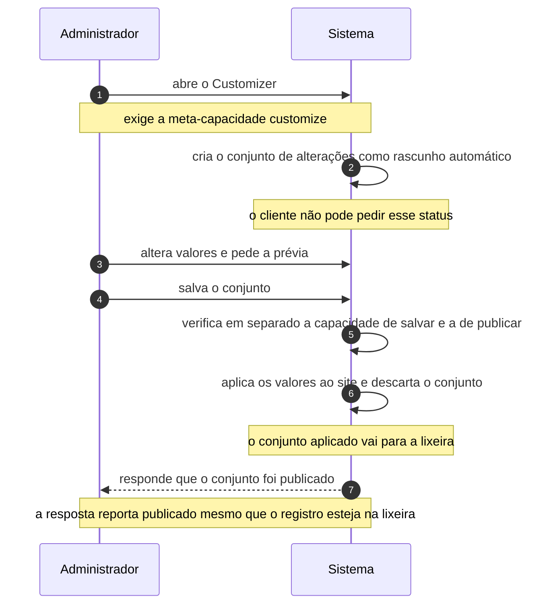

# UC-29 · Personalizar a aparência pelo Customizer

> Grupo: **Apresentação** · Confiança: 🟢 `confirmado`
> Índice: [`use-cases.md`](use-cases.md)

## Identificação

| Campo | Valor |
|---|---|
| **Objetivo** | ver e aprovar mudanças de aparência antes de elas chegarem ao visitante |
| **Ator principal** | Administrador (`administrador`, `human`) |
| **Atores secundários** | — nenhum |
| **Gatilho** | o administrador abre o Customizer |
| **Autorização** | a meta-capacidade `customize`, que resolve para `edit_theme_options`. Publicar ou agendar o conjunto de alterações exige, **em separado**, a capacidade de publicar o tipo de conteúdo do conjunto |
| **Relações UML** | — nenhuma |

## Pré-condições

- o ator tem `edit_theme_options`
- o tema ativo expõe ao menos um controle

## Fluxo principal

1. Administrador abre o Customizer
2. Sistema cria um conjunto de alterações como rascunho automático
3. Administrador altera valores e vê a prévia com as alterações aplicadas
4. Administrador salva o conjunto
5. Sistema verifica, em separado, a capacidade de salvar e a de publicar
6. Sistema aplica os valores ao site e move o conjunto para a lixeira
7. Sistema responde ao administrador que o conjunto foi publicado

## Sequência

O mesmo fluxo principal com remetente e destinatário explícitos. `self` é decisão interna do sistema.

| # | De | Para | Mensagem | Tipo | Condição ou regra |
|---|---|---|---|---|---|
| 1 | Administrador | Sistema | abre o Customizer | `sync` | exige a meta-capacidade customize |
| 2 | Sistema | Sistema | cria o conjunto de alterações como rascunho automático | `self` | o cliente não pode pedir esse status |
| 3 | Administrador | Sistema | altera valores e pede a prévia | `sync` | — |
| 4 | Administrador | Sistema | salva o conjunto | `sync` | — |
| 5 | Sistema | Sistema | verifica em separado a capacidade de salvar e a de publicar | `self` | — |
| 6 | Sistema | Sistema | aplica os valores ao site e descarta o conjunto | `self` | o conjunto aplicado vai para a lixeira |
| 7 | Sistema | Administrador | responde que o conjunto foi publicado | `return` | a resposta reporta publicado mesmo que o registro esteja na lixeira |

## Fluxos alternativos

### Salvar como rascunho e voltar depois

1. O conjunto fica guardado como conteúdo e pode ser retomado
2. O Customizer opera linearmente: só um conjunto salvo existe por vez

### Agendar a aparência

1. O conjunto recebe data futura e aguarda, como qualquer conteúdo agendado
2. O evento agendado o publica, sujeito a chegar requisição HTTP depois da data

### Enviar imagem dentro do Customizer

1. O anexo é criado como rascunho automático, para ser coletado se o conjunto for abandonado
2. É o único uso de rascunho automático em anexo no sistema

## Exceções

| O que dá errado | Como o sistema reage |
|---|---|
| Status pedido fora dos quatro aceitos | a gravação é recusada; o rascunho automático não pode ser pedido pelo cliente |
| Ator pode salvar mas não publicar | o conjunto fica guardado e aguarda quem possa publicar — as duas capacidades são verificadas em pontos diferentes |
| O ator não tem a capacidade de editar o conjunto | o Customizer a **concede por filtro**, traduzindo `edit_post` do conjunto para as capacidades do tipo. Quem migrar pela matriz de papéis produz um sistema em que ninguém salva |

## Pós-condições

- os valores de aparência estão aplicados ao site
- o conjunto de alterações aplicado está na lixeira, não publicado
- a resposta ao ator diz "publicado" — e não é o que está gravado

## Regras de negócio aplicadas

- Glossário — Changeset é o conjunto de alterações do Customizer guardado como conteúdo, com status próprio (domain.md §1.5)
- A escrita só aceita quatro status; publicar ou agendar exige verificação separada (state-machines.md §5)
- Depois de aplicado, o conjunto vai para a lixeira e a resposta reporta publicado (state-machines.md §5)
- `customize` resolve para `edit_theme_options` (permissions.md §5.4)

## Implementado em

- `wp-admin/customize.php:15`
- `wp-includes/class-wp-customize-manager.php:1041`
- `wp-includes/class-wp-customize-manager.php:1397`
- `wp-includes/class-wp-customize-manager.php:2433`
- `wp-includes/class-wp-customize-manager.php:2479`
- `wp-includes/class-wp-customize-manager.php:2483`
- `wp-includes/class-wp-customize-manager.php:2578`
- `wp-includes/class-wp-customize-manager.php:2642`
- `wp-includes/class-wp-customize-manager.php:3239`

## O que um porte precisa saber

- 🟢 **A resposta mente por conveniência.** Depois de aplicado, o conjunto vai para a lixeira, e a resposta ao cliente troca esse status por "publicado" porque é o que o ator pediu. Um porte que leia a resposta como verdade sobre o armazenamento se engana.
- 🟢 **A capacidade de editar o conjunto é concedida em tempo de execução.** `grant_edit_post_capability_for_changeset()` é um filtro: a autorização não está em papel algum. É o mesmo padrão das quatro capacidades por filtro de `permissions.md` §4, e tem a mesma consequência num porte.
- 🔴 **Não foi possível determinar o comportamento da prévia.** O lado cliente do Customizer não está nesta árvore.
