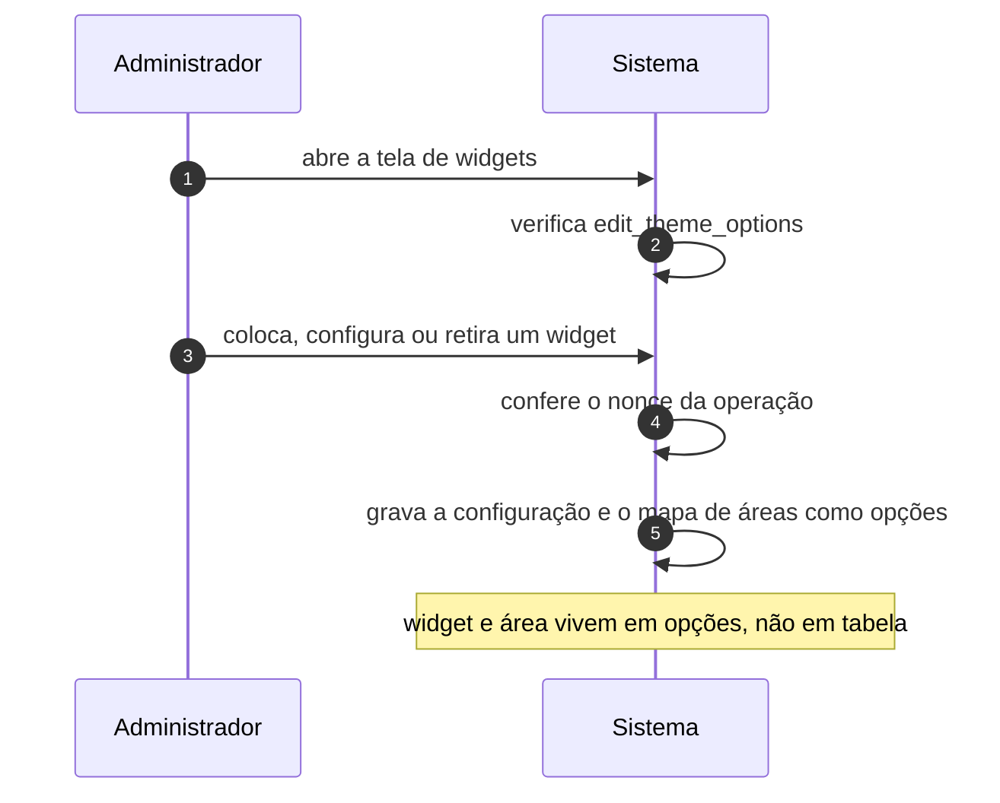

# UC-31 · Organizar widgets em área do tema

> Grupo: **Apresentação** · Confiança: 🟢 `confirmado`
> Índice: [`use-cases.md`](use-cases.md)

## Identificação

| Campo | Valor |
|---|---|
| **Objetivo** | escolher o que aparece nas áreas laterais e nos rodapés que o tema oferece |
| **Ator principal** | Administrador (`administrador`, `human`) |
| **Atores secundários** | — nenhum |
| **Gatilho** | o administrador abre a tela de widgets do painel |
| **Autorização** | `edit_theme_options` |
| **Relações UML** | — nenhuma |

## Pré-condições

- o ator tem `edit_theme_options`
- o tema registra ao menos uma área de widget

## Fluxo principal

1. Administrador abre a tela de widgets
2. Sistema verifica `edit_theme_options`
3. Administrador coloca, configura ou retira um widget de uma área
4. Sistema confere o nonce da operação do widget
5. Sistema grava a configuração do widget e o mapa de áreas como opções

## Sequência

O mesmo fluxo principal com remetente e destinatário explícitos. `self` é decisão interna do sistema.

| # | De | Para | Mensagem | Tipo | Condição ou regra |
|---|---|---|---|---|---|
| 1 | Administrador | Sistema | abre a tela de widgets | `sync` | — |
| 2 | Sistema | Sistema | verifica edit_theme_options | `self` | — |
| 3 | Administrador | Sistema | coloca, configura ou retira um widget | `sync` | — |
| 4 | Sistema | Sistema | confere o nonce da operação | `self` | — |
| 5 | Sistema | Sistema | grava a configuração e o mapa de áreas como opções | `self` | widget e área vivem em opções, não em tabela |

## Fluxos alternativos

### Limpar os widgets inativos

1. A tela oferece remover de uma vez tudo que ficou na área de inativos
2. Essa área guarda o que sobrou de temas anteriores

### Organizar pelo Customizer

1. A mesma estrutura é editada dentro do conjunto de alterações
2. A tela de widgets oferece o atalho quando o ator tem `customize`

### Pela API REST

1. Os controladores de widgets e de áreas expõem a mesma estrutura
2. Cada rota tem seu `permission_callback`

## Exceções

| O que dá errado | Como o sistema reage |
|---|---|
| Trocar de tema | as áreas do tema anterior desaparecem e seus widgets vão para a área de inativos. Nada é apagado, e nada volta sozinho se o tema anterior voltar |
| Nonce vencido | a operação é recusada |

## Pós-condições

- a configuração de cada widget e o mapa de áreas estão gravados em opções
- os widgets de áreas que deixaram de existir estão na área de inativos

## Regras de negócio aplicadas

- Glossário — widget e área vivem em opções, não em tabela (domain.md §1.5)
- `edit_theme_options` libera menus, widgets e Customizer (permissions.md §3.4)

## Implementado em

- `wp-admin/widgets.php:15`
- `wp-admin/widgets-form.php:126`
- `wp-admin/widgets-form.php:199`
- `wp-admin/widgets-form.php:206`
- `wp-includes/widgets.php:1094`

## O que um porte precisa saber

- 🟢 **A apresentação do site vive em opções carregadas em toda requisição.** Widget, área, tema ativo e menu são todos opções. A consequência é de desempenho: a aparência do site faz parte do que é lido antes de qualquer consulta de conteúdo.
- 🟡 **A área de inativos é um depósito sem retenção.** Guarda o que sobrou de todo tema já usado, indefinidamente, e só uma ação manual a limpa.
