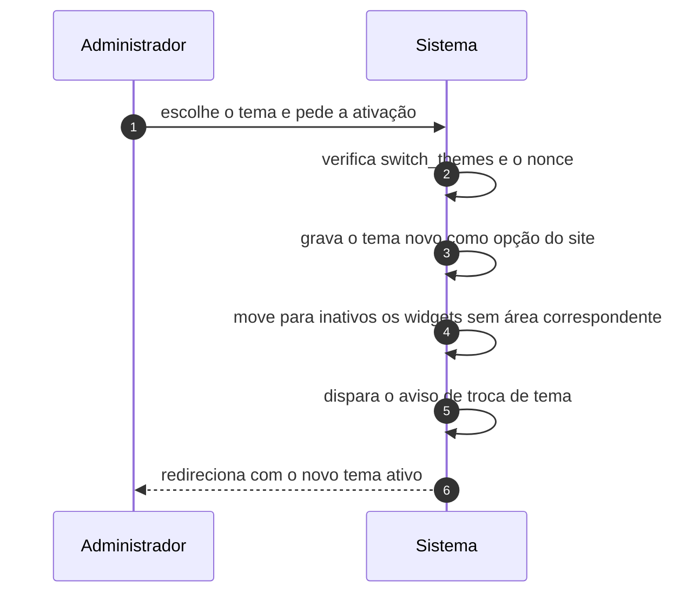

# UC-32 · Trocar o tema ativo

> Grupo: **Apresentação** · Confiança: 🟢 `confirmado`
> Índice: [`use-cases.md`](use-cases.md)

## Identificação

| Campo | Valor |
|---|---|
| **Objetivo** | mudar a aparência de todo o site de uma vez |
| **Ator principal** | Administrador (`administrador`, `human`) |
| **Atores secundários** | — nenhum |
| **Gatilho** | o administrador ativa outro tema na tela de temas |
| **Autorização** | `switch_themes`, exclusiva de administrador. Em multisite, negada a quem não é super administrador: o ciclo de vida do software é da rede |
| **Relações UML** | — nenhuma |

## Pré-condições

- o tema está instalado e é válido
- o ator tem `switch_themes`

## Fluxo principal

1. Administrador escolhe o tema e pede a ativação
2. Sistema verifica `switch_themes` e o nonce da ação
3. Sistema grava o tema novo como opção do site
4. Sistema migra o que é migrável e deixa na área de inativos os widgets sem área correspondente
5. Sistema dispara o aviso de troca de tema para quem escuta
6. Sistema redireciona para a tela de temas com o novo tema ativo

## Sequência

O mesmo fluxo principal com remetente e destinatário explícitos. `self` é decisão interna do sistema.

| # | De | Para | Mensagem | Tipo | Condição ou regra |
|---|---|---|---|---|---|
| 1 | Administrador | Sistema | escolhe o tema e pede a ativação | `sync` | — |
| 2 | Sistema | Sistema | verifica switch_themes e o nonce | `self` | — |
| 3 | Sistema | Sistema | grava o tema novo como opção do site | `self` | — |
| 4 | Sistema | Sistema | move para inativos os widgets sem área correspondente | `self` | — |
| 5 | Sistema | Sistema | dispara o aviso de troca de tema | `self` | — |
| 6 | Sistema | Administrador | redireciona com o novo tema ativo | `return` | — |

## Fluxos alternativos

### Retomar um tema pausado

1. A tela oferece a retomada quando há tema pausado pelo modo de recuperação
2. A capacidade `resume_themes` **não está em papel algum**: é concedida por filtro a quem tem `switch_themes`

### Apagar um tema

1. Exige `delete_themes`, outra capacidade
2. O tema ativo não pode ser apagado

### Tema de recuperação

1. Se o tema ativo quebrar, o sistema recorre ao tema padrão declarado em constante
2. O valor de fábrica é `twentytwentyfive`

## Exceções

| O que dá errado | Como o sistema reage |
|---|---|
| Em multisite, o ator não é super administrador | `do_not_allow`. Instalar, atualizar, apagar e trocar extensão é poder de rede |
| `DISALLOW_FILE_MODS` definida | todas as capacidades de instalar, atualizar e apagar extensão viram `do_not_allow`, inclusive para administrador e super administrador |
| O tema é inválido | a ativação é recusada e o tema anterior continua |

## Pós-condições

- a opção de tema ativo aponta para o tema novo
- os widgets sem área correspondente estão na área de inativos
- a configuração do tema anterior permanece nas opções, não apagada

## Regras de negócio aplicadas

- Glossário — o tema ativo é uma opção, e a identidade do tema também é uma taxonomia (domain.md §1.5)
- As capacidades de instalação são exclusivas de administrador, e em rede são negadas a quem não é super administrador (permissions.md §3.4, §7)
- `resume_themes` é concedida por filtro a quem tem `switch_themes`, e não está em papel algum (permissions.md §4)
- `WP_DEFAULT_THEME` define a aparência inicial e o fallback de recuperação (domain.md §3)

## Implementado em

- `wp-admin/themes.php:12`
- `wp-admin/themes.php:20`
- `wp-admin/themes.php:22`
- `wp-admin/themes.php:33`
- `wp-admin/themes.php:37`
- `wp-admin/themes.php:40`
- `wp-admin/themes.php:60`
- `wp-includes/theme.php:757`
- `wp-includes/capabilities.php:632`
- `wp-includes/capabilities.php:634`
- `wp-includes/default-constants.php:437`

## O que um porte precisa saber

- 🟢 **Trocar o tema não apaga nada.** A configuração do tema anterior fica nas opções, os widgets vão para o depósito de inativos e os menus continuam como termos. Voltar ao tema antigo recupera parte, não tudo — e nada diz ao ator o que foi perdido.
- 🟢 **Quem retoma um tema pausado não aparece em papel algum.** `resume_themes` entra por filtro de prioridade 1. É a prova de que a matriz de papéis, lida sozinha, descreve um sistema mais fechado do que o real.
