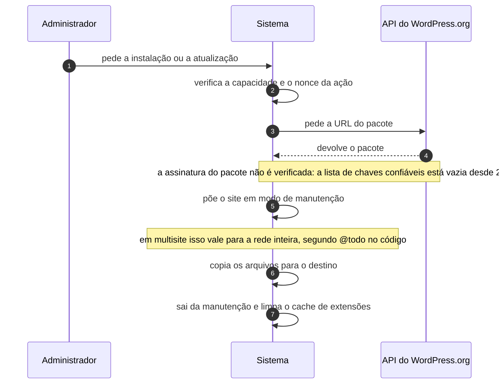

# UC-33 · Instalar e atualizar extensão

> Grupo: **Operação do software** · Confiança: 🟢 `confirmado`
> Índice: [`use-cases.md`](use-cases.md)

## Identificação

| Campo | Valor |
|---|---|
| **Objetivo** | acrescentar ou renovar um plugin ou tema do site |
| **Ator principal** | Administrador (`administrador`, `human`) |
| **Atores secundários** | API do WordPress.org (`api-wordpress-org`) |
| **Gatilho** | o administrador pede a instalação ou a atualização numa tela do painel |
| **Autorização** | `install_plugins`, `update_plugins`, `install_themes` ou `update_themes` conforme a ação, cada uma com seu nonce. `upload_plugins` e `upload_themes` resolvem para as de instalar |
| **Relações UML** | — nenhuma |

## Pré-condições

- o ator tem a capacidade da ação e `DISALLOW_FILE_MODS` não está definida
- o diretório de destino é gravável, ou há credenciais de sistema de arquivos

## Fluxo principal

1. Administrador pede a instalação ou a atualização
2. Sistema verifica a capacidade e o nonce da ação
3. Sistema consulta o serviço de distribuição e obtém a URL do pacote
4. Sistema baixa o pacote e o descompacta num diretório temporário
5. Sistema põe o site em modo de manutenção
6. Sistema copia os arquivos para o destino, substituindo a versão anterior
7. Sistema tira o site do modo de manutenção e limpa o cache de extensões

## Sequência

O mesmo fluxo principal com remetente e destinatário explícitos. `self` é decisão interna do sistema.

| # | De | Para | Mensagem | Tipo | Condição ou regra |
|---|---|---|---|---|---|
| 1 | Administrador | Sistema | pede a instalação ou a atualização | `sync` | — |
| 2 | Sistema | Sistema | verifica a capacidade e o nonce da ação | `self` | — |
| 3 | Sistema | API do WordPress.org | pede a URL do pacote | `sync` | — |
| 4 | API do WordPress.org | Sistema | devolve o pacote | `return` | a assinatura do pacote não é verificada: a lista de chaves confiáveis está vazia desde 2021-04-01 |
| 5 | Sistema | Sistema | põe o site em modo de manutenção | `self` | em multisite isso vale para a rede inteira, segundo @todo no código |
| 6 | Sistema | Sistema | copia os arquivos para o destino | `self` | — |
| 7 | Sistema | Sistema | sai da manutenção e limpa o cache de extensões | `self` | — |

## Fluxos alternativos

### Enviar o pacote de um arquivo local

1. A capacidade exigida passa a ser `upload_plugins` ou `upload_themes`, que resolvem para as de instalar
2. Não há consulta ao serviço de distribuição

### Atualização em lote

1. A capacidade é verificada uma vez para o lote
2. Cada item tem seu próprio resultado, e um que falha não interrompe os demais

### Ativar o plugin logo depois de instalar

1. Exige `activate_plugins`, uma capacidade diferente
2. Em rede, soma-se `manage_network_plugins` se o menu de plugins não foi liberado por site

## Exceções

| O que dá errado | Como o sistema reage |
|---|---|
| O pacote não pôde ser baixado ou é inválido | a operação é abortada e o diretório temporário é limpo; a versão anterior continua no lugar |
| Em multisite, o ator não é super administrador | `do_not_allow`: o ciclo de vida do software é da rede |
| `DISALLOW_FILE_MODS` definida | todas as capacidades de instalar, atualizar e apagar extensão e núcleo viram `do_not_allow`, para todos |
| O ambiente não atende ao `requires_php` da extensão | a atualização é recusada antes de baixar |

## Pós-condições

- os arquivos da extensão no destino são os da versão nova
- o site não está em modo de manutenção
- nenhuma verificação de autenticidade do pacote foi feita

## Regras de negócio aplicadas

- A4 — não se atualiza para versão que o ambiente não suporta; plugin e tema declaram `requires_php` (domain.md §2.6)
- A8 — a assinatura do pacote não é verificada (domain.md §2.6)
- `@todo For multisite, maintenance mode should only kick in for individual sites` — atualizar um plugin coloca a rede inteira em manutenção (domain.md §4)
- [ADR 0010](../adrs/0010-tolerar-pacote-sem-assinatura-verificada.md) — tolerar pacote sem assinatura verificada

## Implementado em

- `wp-admin/update.php:28`
- `wp-admin/update.php:32`
- `wp-admin/update.php:50`
- `wp-admin/update.php:106`
- `wp-admin/update.php:112`
- `wp-admin/update.php:151`
- `wp-admin/includes/class-plugin-upgrader.php:118`
- `wp-admin/includes/class-plugin-upgrader.php:190`
- `wp-admin/includes/class-plugin-upgrader.php:285`
- `wp-admin/includes/class-plugin-upgrader.php:316`
- `wp-admin/includes/class-theme-upgrader.php:230`
- `wp-admin/includes/class-theme-upgrader.php:295`
- `wp-admin/includes/file.php:1548`
- `wp-includes/capabilities.php:636`
- `wp-includes/capabilities.php:654`

## O que um porte precisa saber

- 🟢 **O pacote chega sem prova de autenticidade.** `wp_trusted_keys()` devolve lista vazia desde 1º de abril de 2021, o `// TODO: Add key #2 with longer expiration.` está escrito ao lado, nenhum chamador exige verificação e a falha é rebaixada a aviso. Este caso de uso instala código arbitrário com a confiança que o canal de rede oferecer.
- 🟢 **Atualizar um plugin derruba a rede inteira.** O `@todo` no código diz que a manutenção deveria valer por site e não vale. Num porte multissite, isso é um requisito a corrigir, não a replicar.
