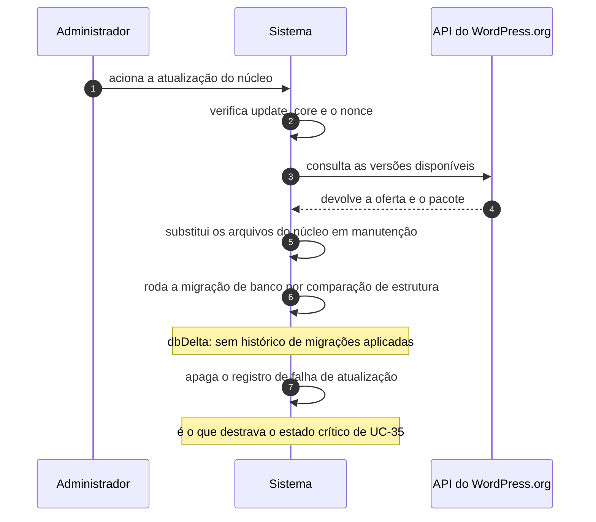

# UC-34 · Atualizar o núcleo manualmente

> Grupo: **Operação do software** · Confiança: 🟢 `confirmado`
> Índice: [`use-cases.md`](use-cases.md)

## Identificação

| Campo | Valor |
|---|---|
| **Objetivo** | levar o próprio sistema a uma versão nova por decisão explícita |
| **Ator principal** | Administrador (`administrador`, `human`) |
| **Atores secundários** | API do WordPress.org (`api-wordpress-org`) |
| **Gatilho** | o administrador aciona a atualização na tela de atualizações |
| **Autorização** | `update_core`. Em multisite, negada a quem não é super administrador |
| **Relações UML** | — nenhuma |

## Pré-condições

- o ator tem `update_core`
- o webroot é gravável, ou há credenciais de sistema de arquivos
- PHP e banco do servidor atendem ao mínimo da versão oferecida

## Fluxo principal

1. Administrador aciona a atualização do núcleo
2. Sistema verifica `update_core` e o nonce da tela
3. Sistema consulta o serviço de versões e escolhe a oferta aplicável
4. Sistema baixa e descompacta o pacote
5. Sistema põe o site em manutenção e substitui os arquivos do núcleo
6. Sistema roda a migração de banco por comparação de estrutura
7. Sistema apaga o registro de falha de atualização e sai da manutenção

## Sequência

O mesmo fluxo principal com remetente e destinatário explícitos. `self` é decisão interna do sistema.

| # | De | Para | Mensagem | Tipo | Condição ou regra |
|---|---|---|---|---|---|
| 1 | Administrador | Sistema | aciona a atualização do núcleo | `sync` | — |
| 2 | Sistema | Sistema | verifica update_core e o nonce | `self` | — |
| 3 | Sistema | API do WordPress.org | consulta as versões disponíveis | `sync` | — |
| 4 | API do WordPress.org | Sistema | devolve a oferta e o pacote | `return` | — |
| 5 | Sistema | Sistema | substitui os arquivos do núcleo em manutenção | `self` | — |
| 6 | Sistema | Sistema | roda a migração de banco por comparação de estrutura | `self` | dbDelta: sem histórico de migrações aplicadas |
| 7 | Sistema | Sistema | apaga o registro de falha de atualização | `self` | é o que destrava o estado crítico de UC-35 |

## Fluxos alternativos

### Reinstalar a mesma versão

1. A tela oferece a reinstalação
2. O caminho é o mesmo e termina na mesma limpeza do registro de falha

### Destravar uma falha crítica

1. Com falha crítica registrada, a atualização automática recusa tudo
2. Só esta atualização manual alcança a linha que apaga o registro — é o único caminho de volta

## Exceções

| O que dá errado | Como o sistema reage |
|---|---|
| O ambiente não atende ao mínimo da versão | a oferta é descartada. Na automática, isso acontece **em silêncio**; aqui a tela informa e oferece atualizar o PHP, se o ator tiver `update_php` |
| O webroot não é gravável | o sistema pede as credenciais de sistema de arquivos; sem elas, cancela |
| Em multisite, o ator não é super administrador | `do_not_allow` |

## Pós-condições

- os arquivos do núcleo são os da versão nova e o schema foi migrado
- o registro de falha de atualização automática não existe mais
- os papéis foram repovoados a partir do código, se a migração o exigiu

## Regras de negócio aplicadas

- A4 — não se atualiza para versão que o ambiente não suporta (domain.md §2.6)
- A8 — a assinatura do pacote não é verificada (domain.md §2.6)
- Glossário — `dbDelta()` é migração por comparação de estrutura, sem histórico de migrações aplicadas (domain.md §1.6)
- Pegadinha 4 — `RESET_CAPS` repõe papéis e capacidades de todos os usuários numa atualização, e está marcado como código temporário desde 2005 (permissions.md §10)
- [ADR 0008](../adrs/0008-falha-critica-de-atualizacao-exige-intervencao-humana.md) — falha crítica de atualização exige intervenção humana

## Implementado em

- `wp-admin/update-core.php:22`
- `wp-admin/update-core.php:548`
- `wp-admin/update-core.php:845`
- `wp-admin/update-core.php:1062`
- `wp-admin/includes/update-core.php:1922`
- `wp-admin/includes/class-core-upgrader.php:66`
- `wp-admin/includes/upgrade.php:80`
- `wp-admin/includes/upgrade.php:1203`
- `wp-includes/update.php:226`

## O que um porte precisa saber

- 🟢 **Este é o único caminho de volta de uma falha crítica — e nada no código liga as duas pontas.** A limpeza do registro de falha está no caminho comum da atualização, e só a manual o alcança porque a automática é recusada antes. A invariante não é declarada em lugar algum e nenhum teste a protege.
- 🟢 **A migração de banco não tem histórico.** `dbDelta()` compara a estrutura atual com a desejada e emite o que falta. Não há tabela de migrações aplicadas, logo não há como saber por quais versões este banco passou.
- 🟡 **`RESET_CAPS` ainda pode repor todos os papéis.** É código marcado como temporário desde 2005, acionado por constante, numa rotina de atualização. Num porte, é uma bomba a desarmar antes de copiar o comportamento.
