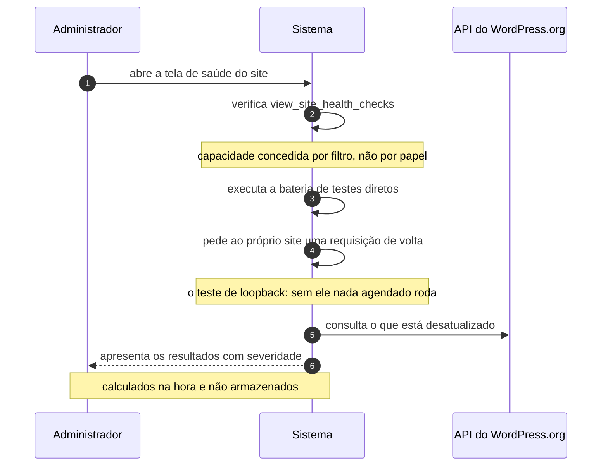

# UC-37 · Diagnosticar a saúde do site

> Grupo: **Operação do software** · Confiança: 🟢 `confirmado`
> Índice: [`use-cases.md`](use-cases.md)

## Identificação

| Campo | Valor |
|---|---|
| **Objetivo** | saber se o ambiente do site está em condições de funcionar |
| **Ator principal** | Administrador (`administrador`, `human`) |
| **Atores secundários** | API do WordPress.org (`api-wordpress-org`) |
| **Gatilho** | o administrador abre a tela de saúde do site |
| **Autorização** | `view_site_health_checks`, que **não está em papel algum**: é concedida por filtro a quem tem `install_plugins`, e em multisite só a super administrador |
| **Relações UML** | — nenhuma |

## Pré-condições

- o ator tem `install_plugins` — e, em rede, é super administrador

## Fluxo principal

1. Administrador abre a tela de saúde do site
2. Sistema verifica a capacidade de ver os diagnósticos
3. Sistema executa a bateria de testes diretos
4. Sistema pede ao próprio site uma requisição de volta, para saber se os eventos agendados podem rodar
5. Sistema consulta o serviço de versões sobre o que está desatualizado
6. Sistema apresenta os resultados com severidade, calculados na hora

## Sequência

O mesmo fluxo principal com remetente e destinatário explícitos. `self` é decisão interna do sistema.

| # | De | Para | Mensagem | Tipo | Condição ou regra |
|---|---|---|---|---|---|
| 1 | Administrador | Sistema | abre a tela de saúde do site | `sync` | — |
| 2 | Sistema | Sistema | verifica view_site_health_checks | `self` | capacidade concedida por filtro, não por papel |
| 3 | Sistema | Sistema | executa a bateria de testes diretos | `self` | — |
| 4 | Sistema | Sistema | pede ao próprio site uma requisição de volta | `self` | o teste de loopback: sem ele nada agendado roda |
| 5 | Sistema | API do WordPress.org | consulta o que está desatualizado | `sync` | — |
| 6 | Sistema | Administrador | apresenta os resultados com severidade | `return` | calculados na hora e não armazenados |

## Fluxos alternativos

### Testes assíncronos

1. Parte dos testes é executada pelo lado cliente, uma chamada por teste
2. Esse lado não está nesta árvore

### Aba de informações do sistema

1. Apresenta o inventário do ambiente, sem veredito
2. Também não é armazenado

## Exceções

| O que dá errado | Como o sistema reage |
|---|---|
| O loopback falha | o diagnóstico reporta, e é a informação mais importante da tela: sem requisição de volta, nenhum evento agendado roda |
| Ator sem a capacidade | a tela não abre. Em multisite, administrador de site não a abre nunca |

## Pós-condições

- nada foi armazenado: o diagnóstico é calculado a cada visita
- o site fez requisições de saída, inclusive para si mesmo

## Regras de negócio aplicadas

- `view_site_health_checks` é concedida por filtro a quem tem `install_plugins`, e em multisite só a super admin (permissions.md §4, §7)
- A tela de Saúde do Site calcula na hora e não armazena (domain.md §5)
- Glossário — loopback é o site pedindo a própria página de volta (domain.md §1.6)

## Implementado em

- `wp-admin/site-health.php:47`
- `wp-admin/site-health.php:61`
- `wp-admin/includes/class-wp-site-health.php:182`
- `wp-admin/includes/class-wp-site-health.php:736`
- `wp-admin/includes/class-wp-site-health.php:1740`
- `wp-admin/includes/class-wp-site-health.php:2079`
- `wp-admin/includes/class-wp-site-health.php:2852`
- `wp-includes/capabilities.php:1356`

## O que um porte precisa saber

- 🟢 **O diagnóstico não tem memória.** Tudo é recalculado a cada visita e nada é gravado. Não há como saber se um problema é novo, recorrente ou antigo — e esse é o tipo de pergunta que a tela parece responder.
- 🟢 **A integração mais crítica do sistema é com ele mesmo.** O teste de loopback mede se o site consegue pedir a própria página. Sem isso nada agendado roda, e a falha é silenciosa por projeto, porque a requisição real do agendador é não bloqueante.
- 🟡 **O protocolo de loopback está implementado quatro vezes na árvore**, com a duplicação admitida em comentário no próprio arquivo de diagnóstico.
