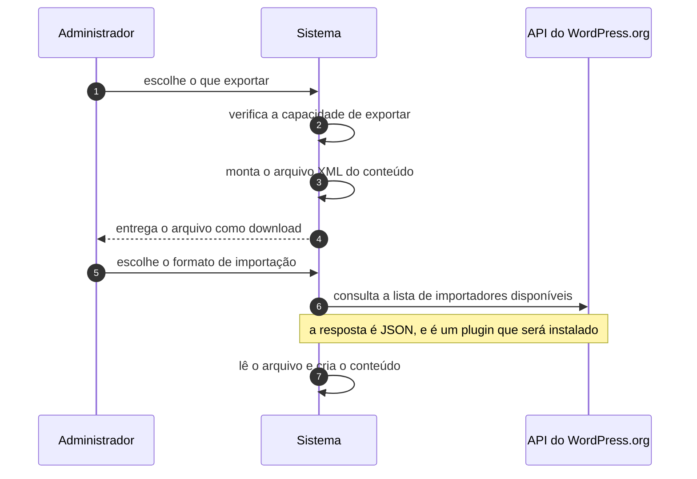

# UC-38 · Exportar e importar conteúdo

> Grupo: **Operação do software** · Confiança: 🟢 `confirmado`
> Índice: [`use-cases.md`](use-cases.md)

## Identificação

| Campo | Valor |
|---|---|
| **Objetivo** | levar o conteúdo do site para fora, ou trazê-lo de outro |
| **Ator principal** | Administrador (`administrador`, `human`) |
| **Atores secundários** | API do WordPress.org (`api-wordpress-org`) |
| **Gatilho** | o administrador usa a tela de exportação ou a de importação |
| **Autorização** | `export` para exportar e `import` para importar, as duas exclusivas de administrador |
| **Relações UML** | — nenhuma |

## Pré-condições

- o ator tem a capacidade da ação
- para importar de um formato específico, o importador correspondente está instalado

## Fluxo principal

1. Administrador escolhe o que exportar
2. Sistema verifica `export`
3. Sistema monta um arquivo XML com conteúdo, termos, autores e metadados
4. Sistema entrega o arquivo como download e encerra a requisição
5. Para importar, o administrador escolhe o formato na lista de importadores
6. Sistema instala o importador se ele não estiver presente e o ator puder instalar
7. Importador lê o arquivo e cria o conteúdo

## Sequência

O mesmo fluxo principal com remetente e destinatário explícitos. `self` é decisão interna do sistema.

| # | De | Para | Mensagem | Tipo | Condição ou regra |
|---|---|---|---|---|---|
| 1 | Administrador | Sistema | escolhe o que exportar | `sync` | — |
| 2 | Sistema | Sistema | verifica a capacidade de exportar | `self` | — |
| 3 | Sistema | Sistema | monta o arquivo XML do conteúdo | `self` | — |
| 4 | Sistema | Administrador | entrega o arquivo como download | `return` | — |
| 5 | Administrador | Sistema | escolhe o formato de importação | `sync` | — |
| 6 | Sistema | API do WordPress.org | consulta a lista de importadores disponíveis | `sync` | a resposta é JSON, e é um plugin que será instalado |
| 7 | Sistema | Sistema | lê o arquivo e cria o conteúdo | `self` | — |

## Fluxos alternativos

### Exportar um recorte

1. A tela oferece filtrar por tipo de conteúdo, autor, data e status
2. Os argumentos passam por filtro antes de chegar ao exportador

### Ator sem `install_plugins`

1. A lista de importadores populares vem vazia
2. Só os importadores já instalados aparecem

## Exceções

| O que dá errado | Como o sistema reage |
|---|---|
| O importador não está instalado e o ator não pode instalar plugin | o formato não é oferecido |
| O arquivo exportado não inclui os arquivos de mídia | o XML referencia as URLs; a importação precisa baixá-las do site de origem, que tem de continuar de pé |

## Pós-condições

- existe um arquivo XML com o recorte pedido, fora do site
- na importação, existe conteúdo novo com autores mapeados ou criados

## Regras de negócio aplicadas

- `import` e `export` são exclusivas de administrador (permissions.md §3.4)
- A resposta do serviço de importadores é JSON, corrigindo o que artefatos anteriores descreviam como serializado (integrations.md, correção a `c4-context.md:118`)

## Implementado em

- `wp-admin/export.php:12`
- `wp-admin/export.php:123`
- `wp-admin/import.php:14`
- `wp-admin/import.php:36`
- `wp-admin/includes/export.php:57`
- `wp-admin/includes/import.php:158`

## O que um porte precisa saber

- 🟢 **A exportação não é um backup.** Não leva arquivo de mídia, não leva opção, não leva usuário com senha e não leva plugin. É um transporte de conteúdo, e tratá-la como cópia de segurança é o erro mais comum com este sistema.
- 🟡 **Importar de um formato exige instalar um plugin da internet.** A lista de importadores vem do serviço de distribuição, e a instalação percorre UC-33 — inclusive a parte em que a assinatura do pacote não é verificada.
