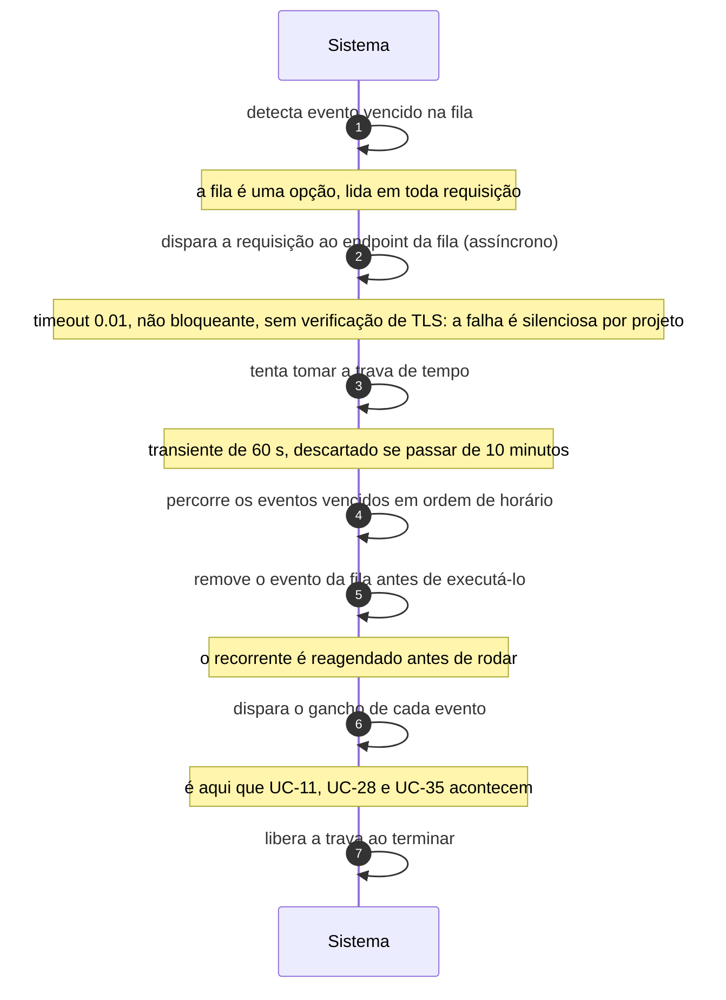

# UC-39 · Processar a fila agendada

> Grupo: **Operação do software** · Confiança: 🟢 `confirmado`
> Índice: [`use-cases.md`](use-cases.md)

## Identificação

| Campo | Valor |
|---|---|
| **Objetivo** | fazer avançar tudo que deveria acontecer sozinho no site |
| **Ator principal** | Agendador (`agendador`, `time`) |
| **Atores secundários** | — nenhum |
| **Gatilho** | uma requisição HTTP chega e dispara, de forma não bloqueante, uma requisição do site para si mesmo |
| **Autorização** | nenhuma. O endpoint da fila é público e não autenticado; o único freio é uma trava de tempo de 60 segundos |
| **Relações UML** | estendido por [UC-11 — Apagar conteúdo vencido da lixeira](UC-11-apagar-conteudo-vencido-da-lixeira.md) · estendido por [UC-28 — Expirar solicitação não confirmada](UC-28-expirar-solicitacao-nao-confirmada.md) · estendido por [UC-35 — Atualizar o núcleo automaticamente](UC-35-atualizar-o-nucleo-automaticamente.md) |

## Pré-condições

- a fila existe na tabela de opções e tem evento vencido
- o site consegue fazer requisição para si mesmo
- `DISABLE_WP_CRON` não está definida

## Fluxo principal

1. Uma requisição qualquer ao site detecta evento vencido na fila
2. Sistema dispara, sem esperar resposta, uma requisição ao endpoint da fila
3. Endpoint tenta tomar a trava de tempo e desiste se outra execução a tem
4. Sistema percorre os eventos vencidos em ordem de horário
5. Sistema remove o evento da fila **antes** de executá-lo e reagenda o recorrente
6. Sistema dispara o gancho de cada evento
7. Sistema libera a trava ao terminar

## Sequência

O mesmo fluxo principal com remetente e destinatário explícitos. `self` é decisão interna do sistema.

| # | De | Para | Mensagem | Tipo | Condição ou regra |
|---|---|---|---|---|---|
| 1 | Sistema | Sistema | detecta evento vencido na fila | `self` | a fila é uma opção, lida em toda requisição |
| 2 | Sistema | Sistema | dispara a requisição ao endpoint da fila | `async` | timeout 0.01, não bloqueante, sem verificação de TLS: a falha é silenciosa por projeto |
| 3 | Sistema | Sistema | tenta tomar a trava de tempo | `self` | transiente de 60 s, descartado se passar de 10 minutos |
| 4 | Sistema | Sistema | percorre os eventos vencidos em ordem de horário | `self` | — |
| 5 | Sistema | Sistema | remove o evento da fila antes de executá-lo | `self` | o recorrente é reagendado antes de rodar |
| 6 | Sistema | Sistema | dispara o gancho de cada evento | `self` | é aqui que UC-11, UC-28 e UC-35 acontecem |
| 7 | Sistema | Sistema | libera a trava ao terminar | `self` | — |

## Fluxos alternativos

### Disparo externo

1. Um agendador de sistema operacional pode requisitar o endpoint direto
2. Nesse caminho o endpoint tenta tomar a trava por conta própria

### `ALTERNATE_WP_CRON`

1. O disparo passa a ser um redirecionamento do próprio visitante
2. Troca a requisição de volta por um salto no navegador de quem está lendo o site

### `DISABLE_WP_CRON` definida

1. O disparo automático é desligado
2. A fila continua existindo e acumulando: desligar o gatilho não desliga a fila

## Exceções

| O que dá errado | Como o sistema reage |
|---|---|
| Outra execução tomou a trava no meio | a execução é abandonada onde está. Os eventos já removidos da fila não voltam |
| O site não consegue fazer requisição para si mesmo | **nada acontece e nada é registrado**. A requisição é não bloqueante por projeto, logo a falha é invisível |
| Um gancho demora mais que a trava | a execução verifica a trava a cada evento e sai se ela mudou de dono |

## Pós-condições

- os eventos vencidos foram removidos da fila e seus ganchos disparados
- os eventos recorrentes estão reagendados
- nenhum registro do que rodou foi guardado

## Regras de negócio aplicadas

- A9 — cron não é cron: a fila só avança quando chega requisição HTTP; a trava é um transiente de 60 segundos, descartado se passar de 10 minutos; `DISABLE_WP_CRON` desliga o disparo sem desligar a fila (domain.md §2.6)
- Glossário — cron é agendador disparado por requisição HTTP, não pelo sistema operacional (domain.md §1.6)
- Nenhuma superfície de entrada tem limite de taxa; os dois únicos freios são travas de tempo (integrations.md)

## Implementado em

- `wp-cron.php:64`
- `wp-cron.php:97`
- `wp-cron.php:156`
- `wp-cron.php:191`
- `wp-cron.php:194`
- `wp-cron.php:201`
- `wp-includes/cron.php:915`
- `wp-includes/cron.php:1051`
- `wp-includes/default-constants.php:399`

## O que um porte precisa saber

- 🟢 **Não existe mensageria a migrar: existe uma a construir.** A fila é uma opção em `wp_options`, executada por uma requisição HTTP do site para si mesmo. Num porte, isso significa que o agendamento inteiro é desenho novo.
- 🟢 **O evento é removido da fila antes de rodar.** Se a execução falhar, o evento não volta. Não há repetição automática, não há fila de mortos, não há registro de falha.
- 🟢 **O endpoint da fila é público.** Qualquer um pode requisitá-lo. A única proteção é a trava de 60 segundos, que é de concorrência e não de abuso.
