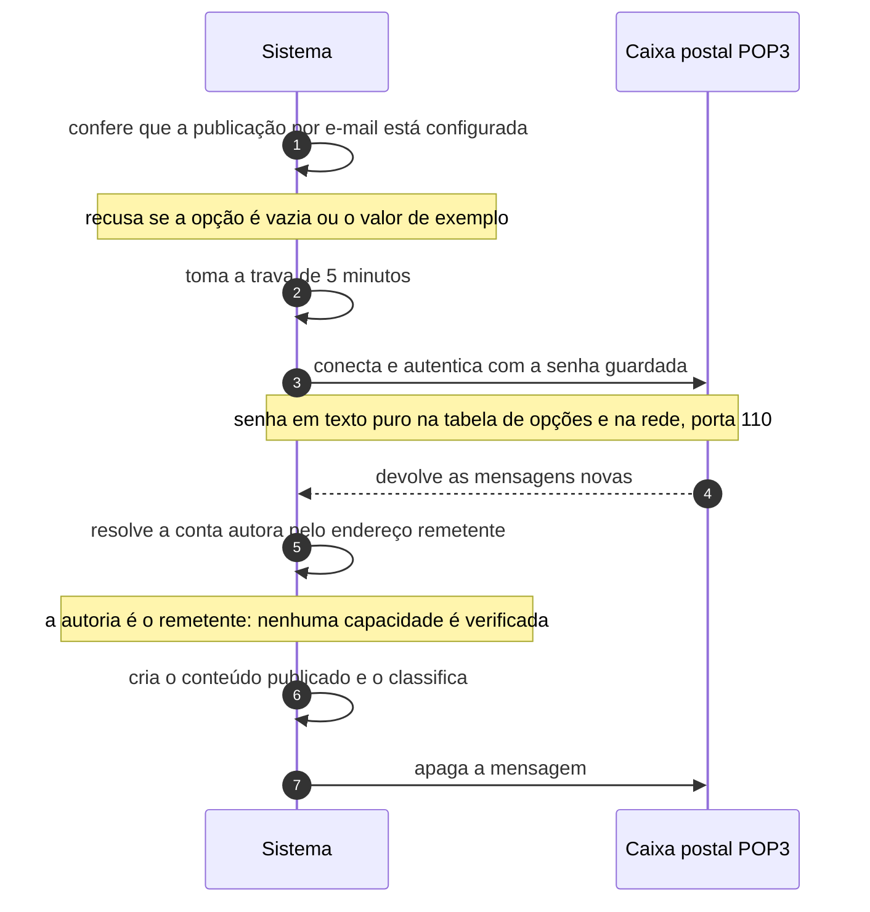

# UC-40 · Publicar conteúdo por e-mail

> Grupo: **Operação do software** · Confiança: 🟡 `inferido`
> Índice: [`use-cases.md`](use-cases.md)

## Identificação

| Campo | Valor |
|---|---|
| **Objetivo** | publicar no site enviando uma mensagem para um endereço de e-mail |
| **Ator principal** | Autor (`autor`, `human`) |
| **Atores secundários** | Caixa postal POP3 (`caixa-postal`) |
| **Gatilho** | alguém requisita `wp-mail.php`; o núcleo não agenda nenhum evento que o faça |
| **Autorização** | a posse da caixa postal, e a autoria é resolvida pelo endereço remetente contra os e-mails das contas do site. Nenhuma capacidade é verificada |
| **Relações UML** | — nenhuma |

## Pré-condições

- a opção de servidor de e-mail está configurada e diferente do valor de exemplo
- a caixa postal aceita POP3 e tem mensagem nova
- passaram-se 5 minutos desde a última verificação

## Fluxo principal

1. Sistema confere que a publicação por e-mail está configurada
2. Sistema toma a trava de 5 minutos para não verificar a caixa em paralelo
3. Sistema conecta na caixa postal e autentica com a senha guardada
4. Sistema lê cada mensagem nova e extrai assunto, corpo, data e remetente
5. Sistema resolve a conta autora pelo endereço remetente
6. Sistema cria o conteúdo publicado e o classifica
7. Sistema apaga a mensagem da caixa postal

## Sequência

O mesmo fluxo principal com remetente e destinatário explícitos. `self` é decisão interna do sistema.

| # | De | Para | Mensagem | Tipo | Condição ou regra |
|---|---|---|---|---|---|
| 1 | Sistema | Sistema | confere que a publicação por e-mail está configurada | `self` | recusa se a opção é vazia ou o valor de exemplo |
| 2 | Sistema | Sistema | toma a trava de 5 minutos | `self` | — |
| 3 | Sistema | Caixa postal POP3 | conecta e autentica com a senha guardada | `sync` | senha em texto puro na tabela de opções e na rede, porta 110 |
| 4 | Caixa postal POP3 | Sistema | devolve as mensagens novas | `return` | — |
| 5 | Sistema | Sistema | resolve a conta autora pelo endereço remetente | `self` | a autoria é o remetente: nenhuma capacidade é verificada |
| 6 | Sistema | Sistema | cria o conteúdo publicado e o classifica | `self` | — |
| 7 | Sistema | Caixa postal POP3 | apaga a mensagem | `sync` | — |

## Fluxos alternativos

### Delimitador no assunto ou no corpo

1. O texto antes do delimitador no assunto é o título; o texto depois dele no corpo é descartado
2. É um recurso de cliente de e-mail de telefone antigo, preservado

### Remetente sem conta no site

1. A autoria recai sobre a conta padrão da configuração
2. O conteúdo é publicado de todo jeito

## Exceções

| O que dá errado | Como o sistema reage |
|---|---|
| A publicação por e-mail não está configurada | HTTP 403 com "This action has been disabled by the administrator" |
| A trava de 5 minutos está ativa | a requisição é encerrada sem verificar a caixa |
| Erro de conexão ou de autenticação | a requisição morre com a mensagem de erro do protocolo, exibida ao requisitante |
| Nenhuma mensagem nova | "There does not seem to be any new mail" |

## Pós-condições

- existe conteúdo publicado a partir da mensagem
- a mensagem não está mais na caixa postal
- a senha da caixa postal continua em texto puro na tabela de opções

## Regras de negócio aplicadas

- P1 — publicar é ato explícito; aqui o ato explícito é enviar o e-mail (domain.md §2.1)
- A senha POP3 fica em texto puro em `wp_options` e trafega em claro na porta 110 (integrations.md, achado de segurança)
- `WP_MAIL_INTERVAL` define a trava de 5 minutos entre verificações

## Implementado em

- `wp-mail.php:14`
- `wp-mail.php:18`
- `wp-mail.php:20`
- `wp-mail.php:39`
- `wp-mail.php:53`
- `wp-mail.php:59`
- `wp-mail.php:61`
- `wp-mail.php:65`
- `wp-mail.php:132`
- `wp-mail.php:237`

## O que um porte precisa saber

- 🟢 **A autoria é o remetente, e o remetente é falsificável.** Nenhuma capacidade é verificada: quem consegue entregar uma mensagem na caixa postal com o endereço de um autor publica como esse autor. É a superfície de entrada mais permissiva do sistema.
- 🟢 **A senha da caixa postal é guardada e transmitida em claro.** Fica em texto puro na tabela de opções e vai pela rede na porta 110. Num porte, é um dos dois pontos em que uma credencial de terceiro é armazenada sem cifra.
- 🔴 **Não foi possível determinar se este caso de uso está ligado.** Nenhum evento agendado do núcleo requisita `wp-mail.php`, e nenhum valor de opção é conhecido nesta árvore. É uma superfície de entrada sem gatilho conhecido.
- 🟡 **Por que este caso é `inferido` e não `confirmado`.** Cada passo do fluxo está no código, mas o gatilho não tem chamador conhecido: nenhum evento agendado do núcleo requisita `wp-mail.php`, e nenhum valor de opção é conhecido nesta árvore. É uma superfície de entrada confirmada com acionamento indeterminado.
