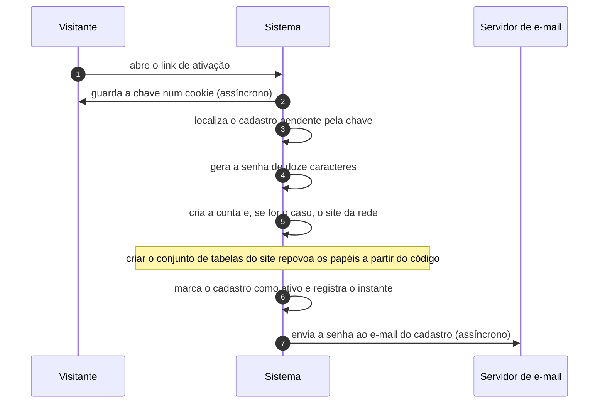

# UC-42 · Ativar cadastro em rede

> Grupo: **Rede** · Confiança: 🟢 `confirmado`
> Índice: [`use-cases.md`](use-cases.md)

## Identificação

| Campo | Valor |
|---|---|
| **Objetivo** | transformar o cadastro pendente numa conta real, e no site pedido |
| **Ator principal** | Visitante (`visitante`, `human`) |
| **Atores secundários** | Servidor de e-mail (`servidor-de-e-mail`) |
| **Gatilho** | o visitante abre o link de ativação, que chega em `wp-activate.php` |
| **Autorização** | a chave de ativação. Não há conta, não há capacidade e não há prazo: a chave vale até alguém usá-la |
| **Relações UML** | — nenhuma |

## Pré-condições

- existe cadastro pendente com aquela chave
- o cadastro ainda não foi ativado

## Fluxo principal

1. Visitante abre o link de ativação
2. Sistema guarda a chave num cookie, para sobreviver a um recarregamento
3. Sistema localiza o cadastro pendente pela chave
4. Sistema gera uma senha de doze caracteres
5. Sistema cria a conta e, se o cadastro era de site, cria o site com seu conjunto de tabelas
6. Sistema marca o cadastro como ativo e registra o instante
7. Sistema envia a senha ao e-mail do cadastro e mostra os dados de acesso

## Sequência

O mesmo fluxo principal com remetente e destinatário explícitos. `self` é decisão interna do sistema.

| # | De | Para | Mensagem | Tipo | Condição ou regra |
|---|---|---|---|---|---|
| 1 | Visitante | Sistema | abre o link de ativação | `sync` | — |
| 2 | Sistema | Visitante | guarda a chave num cookie | `async` | — |
| 3 | Sistema | Sistema | localiza o cadastro pendente pela chave | `self` | — |
| 4 | Sistema | Sistema | gera a senha de doze caracteres | `self` | — |
| 5 | Sistema | Sistema | cria a conta e, se for o caso, o site da rede | `self` | criar o conjunto de tabelas do site repovoa os papéis a partir do código |
| 6 | Sistema | Sistema | marca o cadastro como ativo e registra o instante | `self` | — |
| 7 | Sistema | Servidor de e-mail | envia a senha ao e-mail do cadastro | `async` | — |

## Fluxos alternativos

### Reabrir o link já usado

1. Devolve "já ativo", sem efeito
2. A chave não é consumida nem invalidada

### Site criado pela rede com ativação pendente

1. O site nasce com o campo de exclusão valendo **2**, que significa "ainda não ativado"
2. O visitante recebe HTTP 410 com "ainda não foi ativado" até a ativação

## Exceções

| O que dá errado | Como o sistema reage |
|---|---|
| Chave ausente ou divergente entre a URL e o formulário | HTTP 400 com "A key value mismatch has been detected" |
| O login já existe como usuário | a função **marca o cadastro como ativo** e só então devolve o erro. O estado avança mesmo no caminho de erro |
| Chave inexistente | erro de ativação inválida; nenhum contador de tentativa existe |

## Pós-condições

- existe uma conta na rede, e o site, se o cadastro era de site
- o cadastro está marcado como ativo, com o instante registrado
- a linha de cadastro permanece na tabela indefinidamente

## Regras de negócio aplicadas

- U9 — ativar cadastro gera senha de 12 caracteres e, se o login já existir, devolve erro específico mas marca o cadastro como ativo de todo jeito (domain.md §2.3)
- N2 — o campo de exclusão tem três valores: `'2'` significa "ainda não ativado" (domain.md §2.8)
- N7 — criar o conjunto de tabelas de um site novo repovoa os papéis a partir do código (domain.md §2.8)

## Implementado em

- `wp-activate.php:26`
- `wp-activate.php:30`
- `wp-activate.php:41`
- `wp-activate.php:45`
- `wp-activate.php:51`
- `wp-includes/ms-functions.php:1205`
- `wp-includes/ms-functions.php:1212`
- `wp-includes/ms-functions.php:1232`
- `wp-includes/ms-functions.php:1248`
- `wp-includes/ms-site.php:743`
- `wp-includes/ms-load.php:95`

## O que um porte precisa saber

- 🟢 **O estado avança no caminho de erro.** Se o login já existe como usuário, a ativação marca o cadastro como ativo e **depois** devolve o erro. O cadastro fica inutilizável e marcado como concluído ao mesmo tempo.
- 🟢 **A chave de ativação não vence.** Ao contrário da chave de redefinição de senha, da de recuperação e da de confirmação de privacidade, esta não tem prazo. É a mais duradoura credencial de uso único do sistema — e não é de uso único, porque reabrir o link não a invalida.
- 🟢 **Este é o único momento, fora da instalação e da atualização, em que a definição de papel é reescrita a partir do código.** Criar o conjunto de tabelas de um site novo repovoa os papéis.
