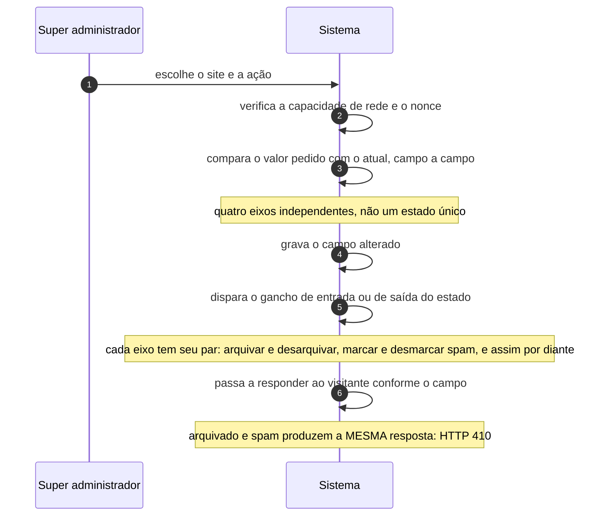

# UC-43 · Supervisionar site da rede

> Grupo: **Rede** · Confiança: 🟢 `confirmado`
> Índice: [`use-cases.md`](use-cases.md)

## Identificação

| Campo | Valor |
|---|---|
| **Objetivo** | arquivar, suspender, sinalizar ou encerrar um site da rede |
| **Ator principal** | Super administrador (`super-administrador`, `human`) |
| **Atores secundários** | — nenhum |
| **Gatilho** | o super administrador age sobre um site na tela de sites da rede |
| **Autorização** | `manage_sites` para ver e alterar, `delete_sites` para apagar e a meta-capacidade de apagar aquele site. As nove capacidades de rede mapeiam para si mesmas e não são concedidas a papel algum |
| **Relações UML** | — nenhuma |

## Pré-condições

- a instalação é multisite
- o ator é super administrador, ou tem a capacidade de rede correspondente
- o site não é o site principal da rede, no caso de exclusão

## Fluxo principal

1. Super administrador escolhe o site e a ação
2. Sistema verifica a capacidade de rede e o nonce da ação
3. Sistema compara o valor pedido com o valor atual, campo a campo
4. Sistema grava o campo alterado
5. Sistema dispara o gancho de entrada ou de saída daquele estado
6. Sistema passa a responder ao visitante do site conforme o campo

## Sequência

O mesmo fluxo principal com remetente e destinatário explícitos. `self` é decisão interna do sistema.

| # | De | Para | Mensagem | Tipo | Condição ou regra |
|---|---|---|---|---|---|
| 1 | Super administrador | Sistema | escolhe o site e a ação | `sync` | — |
| 2 | Sistema | Sistema | verifica a capacidade de rede e o nonce | `self` | — |
| 3 | Sistema | Sistema | compara o valor pedido com o atual, campo a campo | `self` | quatro eixos independentes, não um estado único |
| 4 | Sistema | Sistema | grava o campo alterado | `self` | — |
| 5 | Sistema | Sistema | dispara o gancho de entrada ou de saída do estado | `self` | cada eixo tem seu par: arquivar e desarquivar, marcar e desmarcar spam, e assim por diante |
| 6 | Sistema | Sistema | passa a responder ao visitante conforme o campo | `self` | arquivado e spam produzem a MESMA resposta: HTTP 410 |

## Fluxos alternativos

### Encerrar o site

1. O campo de exclusão recebe `'1'` e o visitante passa a receber HTTP 410 com "não está mais disponível"
2. Apagar de fato remove o conjunto de tabelas do site

### Reativar um site criado e não ativado

1. O campo de exclusão volta de `'2'` para `'0'`
2. O terceiro valor é o achado desta máquina: quem migrar a coluna para booleano perde um estado do produto

### Sinalizar conteúdo adulto

1. O campo correspondente é gravado e **não tem efeito algum** no núcleo
2. É sinalização para quem administra a rede, e uma migração precisa decidir se a mantém

### Um arquivo substituto responde pelo site bloqueado

1. Cada resposta de bloqueio pode ser substituída por um arquivo em `wp-content/`
2. São três arquivos possíveis, um por motivo

## Exceções

| O que dá errado | Como o sistema reage |
|---|---|
| O ator é super administrador e o site está bloqueado | a verificação de rede **o libera antes de qualquer teste**: o super administrador ignora os quatro eixos |
| Um filtro desliga a verificação inteira | a checagem de estado do site pode ser desativada por filtro; nenhuma garantia deste caso sobrevive a isso |
| Apagar o site principal | recusado na tela: o site principal da rede não é apagável |
| Apagar o site fora de multisite | `do_not_allow` — não existe "apagar o site" em site único |

## Pós-condições

- o campo supervisionado reflete a decisão
- o visitante recebe a resposta correspondente, ou o site volta ao normal
- o super administrador continua enxergando o site em qualquer estado

## Regras de negócio aplicadas

- N1 — quatro estados de supervisão governam o acesso ao site, e o super admin os ignora (domain.md §2.8)
- N2 — o campo de exclusão tem três valores, não dois (domain.md §2.8)
- N3 — arquivado e spam produzem a mesma resposta, e são campos distintos (domain.md §2.8)
- N4 — cada estado de site tem gancho de entrada e de saída, e a comparação é campo a campo (domain.md §2.8)
- Nove capacidades são só de rede e não são concedidas a papel algum (permissions.md §7)
- [ADR 0009](../adrs/0009-negacao-explicita-que-vence-o-super-admin.md) — negação explícita que vence o super admin

## Implementado em

- `wp-admin/network/sites.php:13`
- `wp-admin/network/sites.php:151`
- `wp-admin/network/sites.php:161`
- `wp-admin/network/sites.php:248`
- `wp-admin/network/sites.php:281`
- `wp-admin/network/sites.php:285`
- `wp-admin/network/site-info.php:13`
- `wp-admin/network/site-info.php:39`
- `wp-includes/ms-blogs.php:761`
- `wp-includes/ms-site.php:159`
- `wp-includes/ms-site.php:1174`
- `wp-includes/ms-site.php:1198`
- `wp-includes/ms-site.php:1222`
- `wp-includes/ms-load.php:74`
- `wp-includes/ms-load.php:95`
- `wp-includes/ms-load.php:118`
- `wp-includes/capabilities.php:701`
- `wp-includes/capabilities.php:762`

## O que um porte precisa saber

- 🟢 **Não é uma máquina de estado: são quatro eixos ortogonais.** Um site pode estar arquivado **e** marcado como spam ao mesmo tempo, e os dois produzem a mesma resposta ao visitante. A ordem de teste decide qual mensagem aparece, não qual estado vale.
- 🟢 **O terceiro valor do campo de exclusão tem significado de negócio.** `'2'` é "site criado, ainda não ativado". O dicionário de dados descreve a coluna como booleana, e quem a migrar como booleana perde um estado do produto.
- 🟡 **Um dos quatro eixos não faz nada.** O campo de conteúdo adulto não tem efeito algum no núcleo: existe para quem administra a rede. Uma migração precisa decidir se o mantém — e a decisão é de produto, não técnica.
