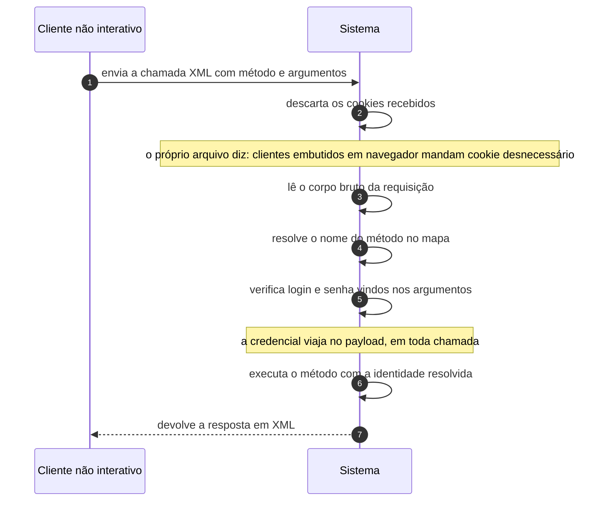

# UC-45 · Consumir a API XML-RPC

> Grupo: **Integração** · Confiança: 🟢 `confirmado`
> Índice: [`use-cases.md`](use-cases.md)

## Identificação

| Campo | Valor |
|---|---|
| **Objetivo** | ler e escrever os dados do site por programa, pela superfície herdada |
| **Ator principal** | Cliente não interativo (`cliente-rest`, `system`) |
| **Atores secundários** | — nenhum |
| **Gatilho** | uma chamada XML chega a `xmlrpc.php` |
| **Autorização** | login e senha **no corpo da chamada**, verificados método a método. Não há cabeçalho de autenticação e não há sessão |
| **Relações UML** | inclui [UC-23 — Autenticar chamada não interativa](UC-23-autenticar-chamada-nao-interativa.md) |

## Pré-condições

- o endpoint não foi desligado por filtro
- a conta informada existe e a credencial é válida

## Fluxo principal

1. Cliente envia a chamada XML com o nome do método e os argumentos
2. Sistema descarta os cookies recebidos
3. Sistema lê o corpo bruto da requisição
4. Sistema resolve o nome do método no mapa de métodos
5. Sistema verifica login e senha vindos nos argumentos
6. Sistema executa o método com a identidade resolvida
7. Sistema devolve a resposta em XML

## Sequência

O mesmo fluxo principal com remetente e destinatário explícitos. `self` é decisão interna do sistema.

| # | De | Para | Mensagem | Tipo | Condição ou regra |
|---|---|---|---|---|---|
| 1 | Cliente não interativo | Sistema | envia a chamada XML com método e argumentos | `sync` | — |
| 2 | Sistema | Sistema | descarta os cookies recebidos | `self` | o próprio arquivo diz: clientes embutidos em navegador mandam cookie desnecessário |
| 3 | Sistema | Sistema | lê o corpo bruto da requisição | `self` | — |
| 4 | Sistema | Sistema | resolve o nome do método no mapa | `self` | — |
| 5 | Sistema | Sistema | verifica login e senha vindos nos argumentos | `self` | a credencial viaja no payload, em toda chamada |
| 6 | Sistema | Sistema | executa o método com a identidade resolvida | `self` | — |
| 7 | Sistema | Cliente não interativo | devolve a resposta em XML | `return` | — |

## Fluxos alternativos

### Métodos de pingback

1. Dois métodos do mapa **não exigem credencial**: receber pingback e listar pingbacks de uma URL
2. São o caminho de UC-17

### Autenticação por senha de aplicação

1. A senha de aplicação serve como senha neste caminho
2. É o uso recomendado, porque a credencial vai em claro no corpo

### Descobrir os sites da conta

1. O método de listagem de sites devolve as instalações a que a conta tem acesso
2. Em rede, isso enumera os sites em que a identidade existe

## Exceções

| O que dá errado | Como o sistema reage |
|---|---|
| Credencial inválida | o método devolve erro de autenticação. Cada método repete a verificação: não há sessão |
| Método inexistente | erro de método desconhecido |
| O endpoint foi desligado por filtro | as chamadas que exigem credencial passam a falhar; os métodos de pingback podem continuar |

## Pós-condições

- o efeito do método foi aplicado, se houver
- a credencial da conta trafegou no corpo da requisição
- nenhum registro da chamada foi guardado

## Regras de negócio aplicadas

- U6 — a senha de aplicação é a credencial de longa duração para chamada não interativa (domain.md §2.3)
- Glossário — trackback e pingback usam este endpoint, e um deles não exige prova (domain.md §1.4)
- Nenhuma superfície de entrada tem limite de taxa (integrations.md)

## Implementado em

- `xmlrpc.php:13`
- `xmlrpc.php:16`
- `xmlrpc.php:21`
- `wp-includes/class-wp-xmlrpc-server.php:158`
- `wp-includes/class-wp-xmlrpc-server.php:247`
- `wp-includes/class-wp-xmlrpc-server.php:344`
- `wp-includes/class-wp-xmlrpc-server.php:717`
- `wp-includes/class-wp-xmlrpc-server.php:1332`
- `wp-includes/class-wp-xmlrpc-server.php:3944`

## O que um porte precisa saber

- 🟢 **A credencial vai no corpo de toda chamada.** Não há sessão, não há token e não há cabeçalho: login e senha são argumentos de cada método. É a razão de a senha de aplicação existir — e a razão de este endpoint ser o alvo preferido de ataque de credencial neste produto.
- 🟢 **Dois métodos do mapa não exigem credencial.** Receber pingback e listar pingbacks são públicos por desenho. Desligar o XML-RPC por capacidade não os desliga.
- 🟡 **Esta superfície duplica a API REST.** Um porte precisa decidir se a mantém; manter significa manter duas implementações da mesma autorização, e nesta árvore elas não compartilham o portão.
