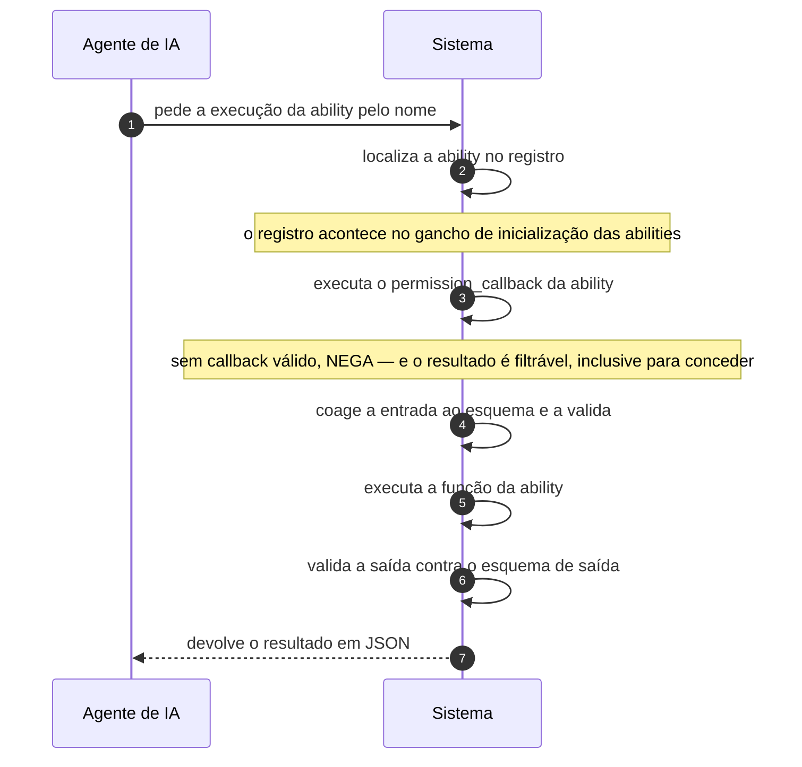

# UC-46 · Executar ability

> Grupo: **Integração** · Confiança: 🟢 `confirmado`
> Índice: [`use-cases.md`](use-cases.md)

## Identificação

| Campo | Valor |
|---|---|
| **Objetivo** | fazer o site executar, como agente de IA, uma operação nomeada e descrita por esquema |
| **Ator principal** | Agente de IA (`agente-de-ia`, `system`) |
| **Atores secundários** | — nenhum |
| **Gatilho** | uma requisição chega à rota de execução de uma ability |
| **Autorização** | o `permission_callback` da própria ability. Esta camada falha **fechada**: callback ausente ou não chamável devolve erro, não liberação. Mas um filtro pode trocar negação por permissão |
| **Relações UML** | — nenhuma |

## Pré-condições

- a ability está registrada no momento da requisição
- o cliente está autenticado, se a ability exigir

## Fluxo principal

1. Agente pede a execução da ability pelo nome
2. Sistema localiza a ability no registro
3. Sistema executa o `permission_callback` da ability
4. Sistema coage a entrada ao esquema declarado e a valida
5. Sistema executa a função da ability
6. Sistema valida a saída contra o esquema de saída
7. Sistema devolve o resultado em JSON

## Sequência

O mesmo fluxo principal com remetente e destinatário explícitos. `self` é decisão interna do sistema.

| # | De | Para | Mensagem | Tipo | Condição ou regra |
|---|---|---|---|---|---|
| 1 | Agente de IA | Sistema | pede a execução da ability pelo nome | `sync` | — |
| 2 | Sistema | Sistema | localiza a ability no registro | `self` | o registro acontece no gancho de inicialização das abilities |
| 3 | Sistema | Sistema | executa o permission_callback da ability | `self` | sem callback válido, NEGA — e o resultado é filtrável, inclusive para conceder |
| 4 | Sistema | Sistema | coage a entrada ao esquema e a valida | `self` | — |
| 5 | Sistema | Sistema | executa a função da ability | `self` | — |
| 6 | Sistema | Sistema | valida a saída contra o esquema de saída | `self` | — |
| 7 | Sistema | Agente de IA | devolve o resultado em JSON | `return` | — |

## Fluxos alternativos

### Listar as abilities disponíveis

1. Há rotas próprias para listar abilities e categorias
2. O agente descobre a superfície antes de usá-la

### Curto-circuito antes de tudo

1. Um filtro pode contornar normalização de entrada, validação, verificação de permissão, execução e validação de saída
2. O docblock avisa que, nesse caminho, a integridade da entrada passa a ser de quem curto-circuitou

### Elevação temporária de permissão

1. O filtro de resultado de permissão pode trocar negação por permissão
2. O docblock cita "elevação temporária de permissão para contextos confiáveis" como caso de uso declarado

## Exceções

| O que dá errado | Como o sistema reage |
|---|---|
| Ability inexistente | erro: a rota é registrada para qualquer nome, porque na hora de registrar rotas as abilities ainda não existem — há um `TODO` no código sobre isso |
| `permission_callback` ausente ou não chamável | erro, não liberação. É a única das três camadas de autorização que falha fechada |
| Retorno de permissão que não é booleano nem erro | é coagido a negação |
| Entrada fora do esquema | erro com o campo e o motivo, antes de executar |

## Pós-condições

- o resultado da ability foi devolvido, validado contra o esquema de saída
- nenhum registro da execução foi guardado

## Regras de negócio aplicadas

- I4 — toda ability exige retorno de permissão, e a falta de callback é erro, não liberação (domain.md §2.9)
- I5 — a autorização de ability é filtrável, inclusive para conceder (domain.md §2.9)
- I6 — a execução de ability pode ser curto-circuitada antes de qualquer validação (domain.md §2.9)
- Glossário — Ability é operação nomeada e descrita por esquema, feita para ser invocada por agente de IA (domain.md §1.8)
- [ADR 0011](../adrs/0011-autorizacao-propria-para-agente-de-ia.md) — autorização própria para agente de IA

## Implementado em

- `wp-includes/abilities.php:17`
- `wp-includes/abilities.php:42`
- `wp-includes/abilities.php:90`
- `wp-includes/abilities.php:131`
- `wp-includes/abilities.php:207`
- `wp-includes/abilities.php:255`
- `wp-includes/abilities.php:294`
- `wp-includes/abilities.php:341`
- `wp-includes/default-filters.php:553`
- `wp-includes/abilities-api/class-wp-ability.php:623`
- `wp-includes/abilities-api/class-wp-ability.php:652`
- `wp-includes/abilities-api/class-wp-ability.php:769`
- `wp-includes/abilities-api/class-wp-ability.php:809`
- `wp-includes/rest-api/endpoints/class-wp-rest-abilities-v1-run-controller.php:44`
- `wp-includes/rest-api/endpoints/class-wp-rest-abilities-v1-run-controller.php:66`
- `wp-includes/rest-api/endpoints/class-wp-rest-abilities-v1-run-controller.php:82`
- `wp-includes/rest-api/endpoints/class-wp-rest-abilities-v1-run-controller.php:143`
- `wp-content/plugins/akismet/abilities/class-akismet-ability-comment-check.php:24`
- `wp-content/plugins/akismet/abilities/class-akismet-ability-get-stats.php:24`
- `wp-content/plugins/akismet/abilities/class-akismet-ability.php:58`

## O que um porte precisa saber

- 🟢 **CORREÇÃO a `permissions.md` §8.1 e à lacuna P7.** Aquele artefato afirma que nenhuma ability foi encontrada registrada nesta árvore. São **cinco**: `core/get-site-info`, `core/get-user-info` e `core/get-environment-info`, registradas pelo núcleo e ligadas em `wp-includes/default-filters.php:553`, mais `akismet/comment-check` e `akismet/get-stats`, do plugin empacotado. Todas têm `permission_callback`: três exigem `manage_options` ou login, duas exigem `moderate_comments`. Este caso de uso tem âncora de código e não é suposição.
- 🟢 **A superfície declarada é maior do que a protegida.** A rota aceita qualquer nome de ability e qualquer método HTTP, porque na hora de registrar rotas as abilities ainda não existem. O `TODO` no código explica a ordem de carregamento e admite a limitação.
- 🔴 **Não foi possível determinar o que esta camada autoriza de fato.** Dois filtros a contornam: um troca negação por permissão, outro dispensa validação, permissão e execução inteiras. Sem a lista de plugins ativos, o portão é indeterminado.
