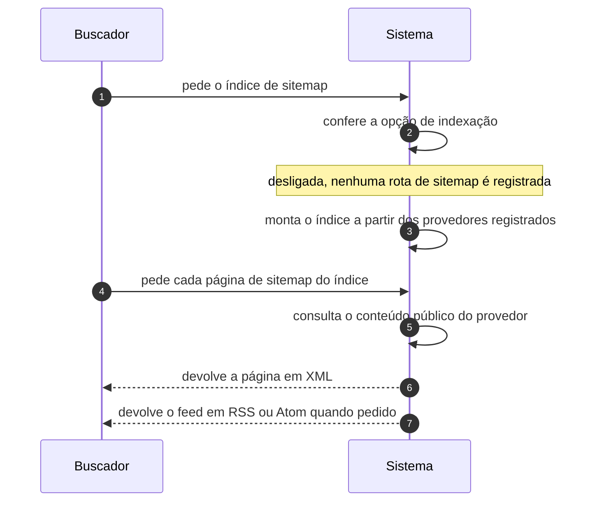

# UC-47 · Servir sitemap e feed a buscador

> Grupo: **Integração** · Confiança: 🟢 `confirmado`
> Índice: [`use-cases.md`](use-cases.md)

## Identificação

| Campo | Valor |
|---|---|
| **Objetivo** | entregar a um rastreador a lista do que o site publicou, em formato de máquina |
| **Ator principal** | Buscador (`buscador`, `system`) |
| **Atores secundários** | — nenhum |
| **Gatilho** | o rastreador pede o índice de sitemap, uma página de sitemap, um feed ou o robots.txt |
| **Autorização** | nenhuma, e um único portão: a opção que diz se o site pede para ser indexado. Desligada, o sitemap deixa de existir |
| **Relações UML** | — nenhuma |

## Pré-condições

- a opção de indexação está ligada
- as regras de reescrita incluem as rotas de sitemap

## Fluxo principal

1. Buscador pede o índice de sitemap
2. Sistema confere a opção de indexação
3. Sistema monta o índice a partir dos provedores registrados
4. Buscador pede cada página de sitemap listada no índice
5. Sistema consulta o conteúdo público daquele provedor
6. Sistema devolve a página em XML
7. Sistema devolve o feed em RSS ou Atom quando o rastreador o pede, pela mesma consulta pública

## Sequência

O mesmo fluxo principal com remetente e destinatário explícitos. `self` é decisão interna do sistema.

| # | De | Para | Mensagem | Tipo | Condição ou regra |
|---|---|---|---|---|---|
| 1 | Buscador | Sistema | pede o índice de sitemap | `sync` | — |
| 2 | Sistema | Sistema | confere a opção de indexação | `self` | desligada, nenhuma rota de sitemap é registrada |
| 3 | Sistema | Sistema | monta o índice a partir dos provedores registrados | `self` | — |
| 4 | Buscador | Sistema | pede cada página de sitemap do índice | `sync` | — |
| 5 | Sistema | Sistema | consulta o conteúdo público do provedor | `self` | — |
| 6 | Sistema | Buscador | devolve a página em XML | `return` | — |
| 7 | Sistema | Buscador | devolve o feed em RSS ou Atom quando pedido | `return` | — |

## Fluxos alternativos

### robots.txt virtual

1. O sistema acrescenta a linha de sitemap ao robots.txt que ele mesmo gera
2. Com a indexação desligada, o robots.txt passa a pedir que ninguém indexe

### Feed de comentários

1. Além dos feeds de conteúdo, há feed de comentários, global e por conteúdo
2. A mesma consulta pública decide o que entra

### Índice de links em OPML

1. O gerenciador de links expõe um índice próprio
2. O gerenciador é desligado quando a tabela de links está vazia

## Exceções

| O que dá errado | Como o sistema reage |
|---|---|
| A opção de indexação está desligada | as rotas de sitemap não são registradas e o pedido cai em 404. Não é uma recusa: é uma ausência |
| Conteúdo protegido por senha | entra no sitemap, porque está publicado; o corpo é que exige a senha — ver UC-02 |
| Volume muito grande | o índice pagina os provedores; não há limite de taxa para o rastreador |

## Pós-condições

- o rastreador recebeu a lista do conteúdo público
- nada mudou no armazenamento e nada foi registrado

## Regras de negócio aplicadas

- `blog_public` nasce em `'1'`: o site pede para ser indexado (domain.md §3)
- O gerenciador de links é desligado quando a tabela está vazia (state-machines.md §10)
- Nenhuma superfície de entrada tem limite de taxa (integrations.md)

## Implementado em

- `wp-includes/sitemaps.php:22`
- `wp-includes/sitemaps/class-wp-sitemaps.php:65`
- `wp-includes/sitemaps/class-wp-sitemaps.php:89`
- `wp-includes/sitemaps/class-wp-sitemaps.php:112`
- `wp-includes/sitemaps/class-wp-sitemaps.php:130`
- `wp-includes/sitemaps/class-wp-sitemaps.php:161`
- `wp-includes/sitemaps/class-wp-sitemaps.php:295`
- `wp-includes/functions.php:1612`
- `wp-links-opml.php:17`
- `wp-links-opml.php:72`

## O que um porte precisa saber

- 🟢 **Uma opção apaga uma superfície inteira.** Com a indexação desligada, as rotas de sitemap não são registradas e o endpoint simplesmente não existe. Não há 403: há 404. Num porte, isso é a diferença entre "proibido" e "inexistente", e muda o que um monitor externo vê.
- 🟡 **O conteúdo protegido por senha aparece no sitemap.** Ele está publicado; só o corpo é que exige senha. Para quem usa senha de post como privacidade, essa é uma surpresa.
