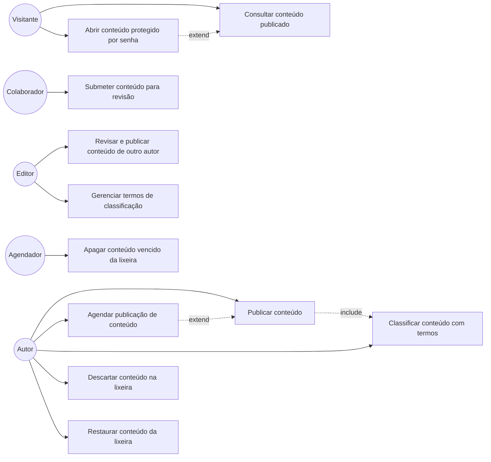
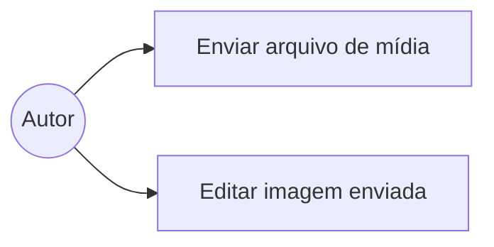
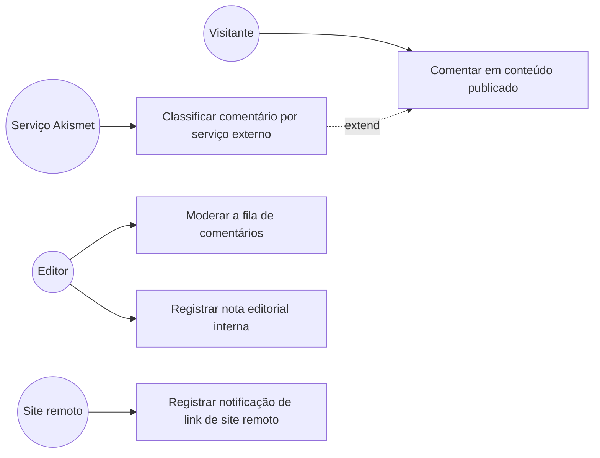
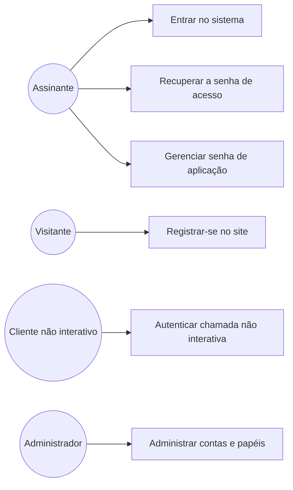
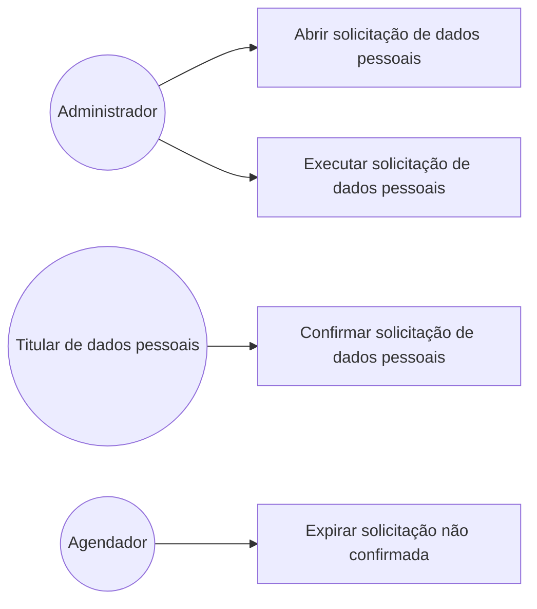
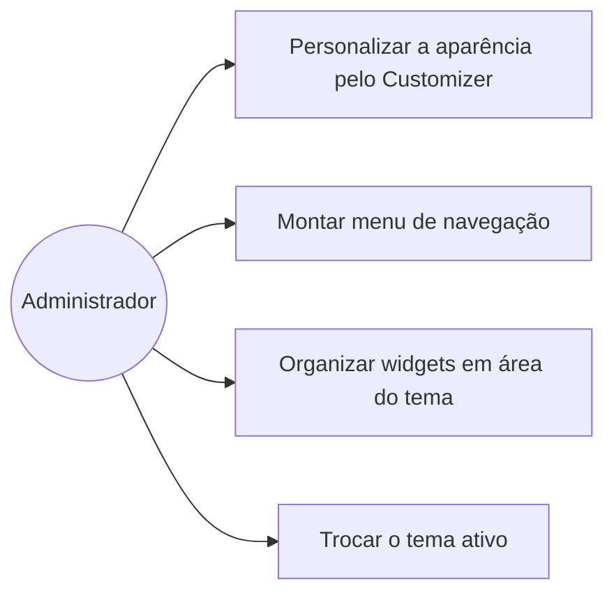
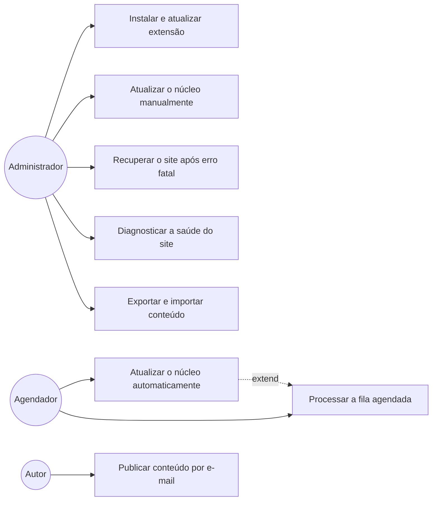
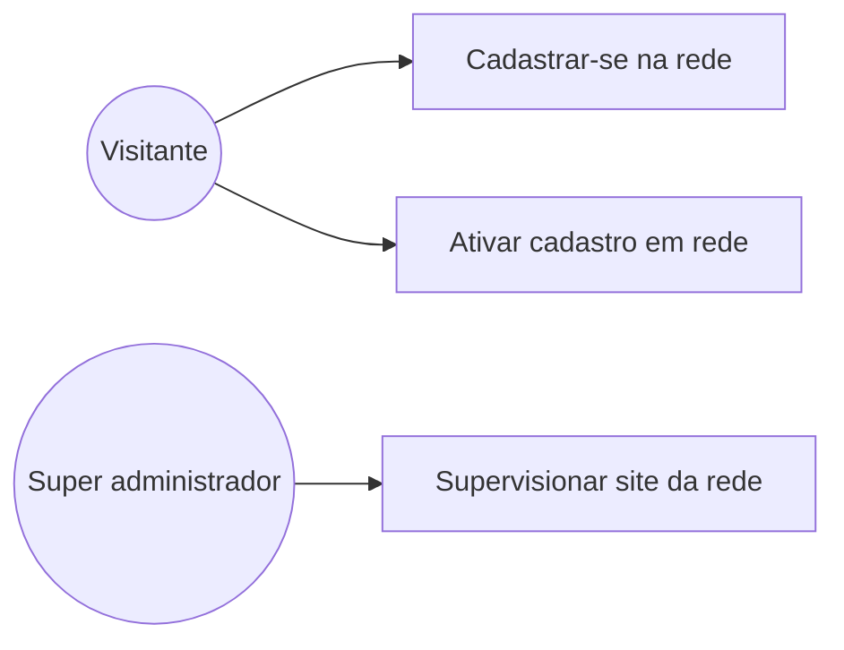
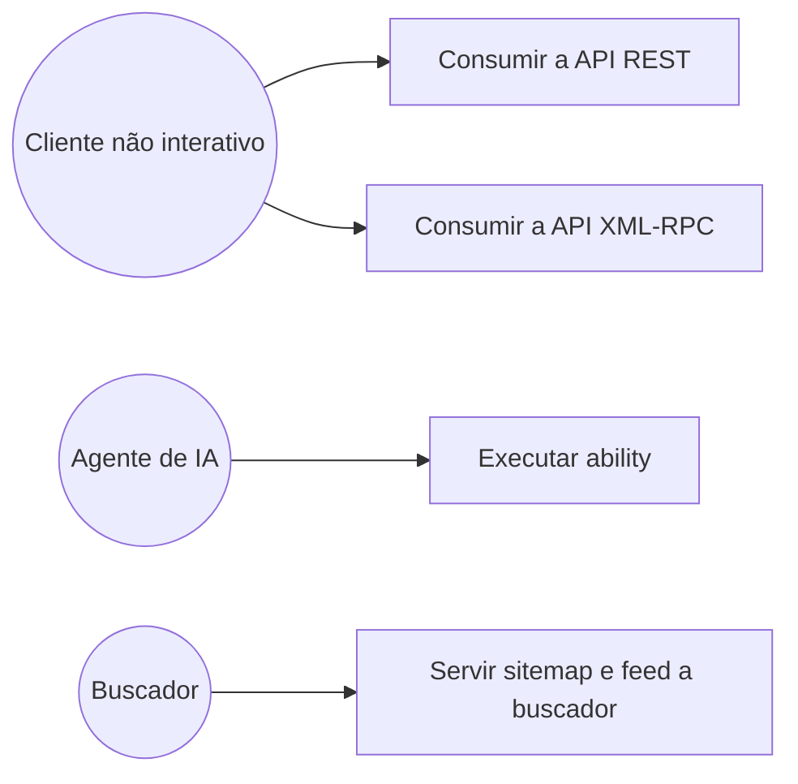

# Casos de uso — wordpress 7.1.2

> Fase de **geração** do Reversa · Gerado pelo agente de casos de uso
> `doc_level`: `detalhado` · Idioma dos artefatos: Português
> Gerado em 2026-10-06T11:54:48-03:00
>
> Quem usa o sistema, para conseguir o quê, e por quais caminhos. O **o quê** de cada unidade está nos artefatos do Redator; aqui está o percurso que atravessa as unidades.

| Escala de confiança | Significado |
|---|---|
| 🟢 `confirmado` | o fluxo foi lido no código, com arquivo e linha |
| 🟡 `inferido` | deduzido de docblock, nome ou comportamento observável |
| 🔴 `suposto` | não determinável a partir desta árvore |

**O que não é o sistema analisado:** `.claude/` e `.reversa/` são o ferramental deste processo. Não entraram em contagem alguma.

---

## 1. Números

| Medida | Valor |
|---|---|
| Atores | **18** — 8 pessoa, 9 sistema externo, 1 agendador |
| Casos de uso | **47** |
| Passos de fluxo principal | 289 |
| Fluxos alternativos | 120 |
| Exceções catalogadas | 135 |
| Referências `arquivo:linha` | 415 |
| Relações `include` | 3 |
| Relações `extend` | 6 |
| Casos 🔴 `suposto` | 0 |
| Casos 🟡 `inferido` | 2 |
| Lacunas para validação humana | 11 |

> **Por que nenhum caso é 🔴 `suposto`.** Não é otimismo: é a regra do recorte. Todo caso precisa de pelo menos uma âncora `arquivo:linha`, e o que não tem âncora vai para as lacunas da seção 6, não para a lista. Foi exatamente o que aconteceu com "gerar texto com modelo de linguagem" — o único caso de uso candidato sem caminho verificável nesta árvore. As incertezas **dentro** de um caso confirmado estão marcadas passo a passo, no campo de condição da sequência e na seção final de cada arquivo.

Os 🟡 e o motivo de cada um: **UC-23** Autenticar chamada não interativa · **UC-40** Publicar conteúdo por e-mail. Cada arquivo diz, na última seção, por que o caso não é 🟢.

---

## 2. Atores

Ator é **papel**, não pessoa nem tela. Os papéis vieram de [`permissions.md`](../permissions.md); os portões que não são capacidade, da seção 9 do mesmo artefato; os sistemas externos e o agendador, de [`integrations/integrations.md`](../integrations/integrations.md).

| `id` | Ator | `kind` | O que é, neste domínio | Dispara |
|---|---|---|---|---|
| `visitante` | Visitante | `human` | lê o site sem conta. Não aparece em papel algum porque sua autorização não é capacidade: é a visibilidade do conteúdo, a senha de post e a chave de confirmação (permissions.md §9) | 6 casos: UC-01, UC-02, UC-14, UC-21, UC-41, UC-42 |
| `assinante` | Assinante | `human` | tem conta e só `read`. Existe para ter identidade, não para produzir: entra no sistema, cuida do próprio perfil e gera senha de aplicação | 3 casos: UC-19, UC-20, UC-22 |
| `colaborador` | Colaborador | `human` | escreve e apaga o próprio rascunho. Não publica e não envia arquivo | 1 caso: UC-06 |
| `autor` | Autor | `human` | publica e apaga o próprio conteúdo, e envia arquivo | 8 casos: UC-03, UC-04, UC-05, UC-09, UC-10, UC-12, UC-13, UC-40 |
| `editor` | Editor | `human` | manda em todo o conteúdo, de qualquer autor, e modera comentário. Tem `unfiltered_html` | 4 casos: UC-07, UC-08, UC-16, UC-18 |
| `administrador` | Administrador | `human` | é o dono da instalação: configuração, usuário, tema, plugin, arquivo e atualização do próprio software | 12 casos: UC-24, UC-25, UC-27, UC-29, UC-30, UC-31, UC-32, UC-33, UC-34, UC-36, UC-37, UC-38 |
| `super-administrador` | Super administrador | `human` | só existe em multisite, e por nome de login numa lista de rede. Recebe tudo menos o negado explicitamente | 1 caso: UC-43 |
| `titular-de-dados` | Titular de dados pessoais | `human` | a pessoa cujos dados a solicitação de privacidade trata. Autoriza por chave com hash de 24 horas, nunca por capacidade | 1 caso: UC-26 |
| `agendador` | Agendador | `time` | a fila de `wp_options` executada por requisição HTTP ao próprio host. Não é cron de sistema operacional: só avança quando chega visita | 4 casos: UC-11, UC-28, UC-35, UC-39 |
| `cliente-rest` | Cliente não interativo | `system` | programa que chama /wp-json ou xmlrpc.php, autenticando por cookie, senha de aplicação ou credencial no corpo da chamada | 3 casos: UC-23, UC-44, UC-45 |
| `agente-de-ia` | Agente de IA | `system` | consumidor da Abilities API, desenhada para ele. Cinco abilities estão registradas nesta árvore, três do núcleo e duas do Akismet | 1 caso: UC-46 |
| `site-remoto` | Site remoto | `system` | outro site que notifica um link (pingback, trackback) ou pede a representação embutível de uma URL (oEmbed) | 1 caso: UC-17 |
| `buscador` | Buscador | `system` | rastreador que consome wp-sitemap.xml, os feeds RSS e Atom e o robots.txt virtual | 1 caso: UC-47 |
| `api-wordpress-org` | API do WordPress.org | `system` | serviço que informa versão disponível, pacote de atualização, tradução, importador e padrão de bloco | nenhum como principal; participa de 5 |
| `akismet` | Serviço Akismet | `system` | julga se um comentário é spam. Plugin empacotado, logo o julgamento de spam sai do sistema por padrão de distribuição | 1 caso: UC-15 |
| `caixa-postal` | Caixa postal POP3 | `system` | mailbox lida por wp-mail.php para transformar e-mail em conteúdo publicado | nenhum como principal; participa de 1 |
| `servidor-de-e-mail` | Servidor de e-mail | `system` | destino de toda notificação do sistema: moderação, redefinição de senha, chave de recuperação, confirmação de privacidade, falha de atualização | nenhum como principal; participa de 12 |
| `provedor-de-ia` | Provedor de IA | `system` | Ator morto nesta árvore: os três conectores de IA (anthropic, google, openai) são declarados em `wp-includes/connectors.php:290` e apontam para plugins de provedor que não existem aqui. Não dispara caso de uso algum | **nenhum — ator morto** |

> 🔴 **Ator morto.** `provedor-de-ia` é declarado pelo sistema e não dispara caso de uso algum nesta árvore. Um ator que não dispara nada não é ator: é registro morto. Está detalhado na seção 6.

`level_0`…`level_10` **não** são atores: são pseudocapacidades sem verificação no núcleo ([`permissions.md`](../permissions.md) §3.6).

---

## 3. Diagrama de casos de uso

O grafo completo tem 47 casos e 14 atores disparando. Os diagramas por grupo, logo abaixo, são os legíveis.

```mermaid
graph LR
  visitante(( Visitante ))
  assinante(( Assinante ))
  colaborador(( Colaborador ))
  autor(( Autor ))
  editor(( Editor ))
  administrador(( Administrador ))
  super_administrador(( Super administrador ))
  titular_de_dados(( Titular de dados pessoais ))
  agendador(( Agendador ))
  cliente_rest(( Cliente não interativo ))
  agente_de_ia(( Agente de IA ))
  site_remoto(( Site remoto ))
  buscador(( Buscador ))
  akismet(( Serviço Akismet ))
  visitante --> UC01[Consultar conteúdo publicado]
  visitante --> UC02[Abrir conteúdo protegido por senha]
  visitante --> UC14[Comentar em conteúdo publicado]
  visitante --> UC21[Registrar-se no site]
  visitante --> UC41[Cadastrar-se na rede]
  visitante --> UC42[Ativar cadastro em rede]
  autor --> UC03[Publicar conteúdo]
  autor --> UC04[Agendar publicação de conteúdo]
  autor --> UC05[Classificar conteúdo com termos]
  autor --> UC09[Descartar conteúdo na lixeira]
  autor --> UC10[Restaurar conteúdo da lixeira]
  autor --> UC12[Enviar arquivo de mídia]
  autor --> UC13[Editar imagem enviada]
  autor --> UC40[Publicar conteúdo por e-mail]
  colaborador --> UC06[Submeter conteúdo para revisão]
  editor --> UC07[Revisar e publicar conteúdo de outro autor]
  editor --> UC08[Gerenciar termos de classificação]
  editor --> UC16[Moderar a fila de comentários]
  editor --> UC18[Registrar nota editorial interna]
  agendador --> UC11[Apagar conteúdo vencido da lixeira]
  agendador --> UC28[Expirar solicitação não confirmada]
  agendador --> UC35[Atualizar o núcleo automaticamente]
  agendador --> UC39[Processar a fila agendada]
  akismet --> UC15[Classificar comentário por serviço externo]
  site_remoto --> UC17[Registrar notificação de link de site remoto]
  assinante --> UC19[Entrar no sistema]
  assinante --> UC20[Recuperar a senha de acesso]
  assinante --> UC22[Gerenciar senha de aplicação]
  cliente_rest --> UC23[Autenticar chamada não interativa]
  cliente_rest --> UC44[Consumir a API REST]
  cliente_rest --> UC45[Consumir a API XML-RPC]
  administrador --> UC24[Administrar contas e papéis]
  administrador --> UC25[Abrir solicitação de dados pessoais]
  administrador --> UC27[Executar solicitação de dados pessoais]
  administrador --> UC29[Personalizar a aparência pelo Customizer]
  administrador --> UC30[Montar menu de navegação]
  administrador --> UC31[Organizar widgets em área do tema]
  administrador --> UC32[Trocar o tema ativo]
  administrador --> UC33[Instalar e atualizar extensão]
  administrador --> UC34[Atualizar o núcleo manualmente]
  administrador --> UC36[Recuperar o site após erro fatal]
  administrador --> UC37[Diagnosticar a saúde do site]
  administrador --> UC38[Exportar e importar conteúdo]
  titular_de_dados --> UC26[Confirmar solicitação de dados pessoais]
  super_administrador --> UC43[Supervisionar site da rede]
  agente_de_ia --> UC46[Executar ability]
  buscador --> UC47[Servir sitemap e feed a buscador]
  UC02 -. extend .-> UC01
  UC03 -. include .-> UC05
  UC04 -. extend .-> UC03
  UC11 -. extend .-> UC39
  UC15 -. extend .-> UC14
  UC28 -. extend .-> UC39
  UC35 -. extend .-> UC39
  UC44 -. include .-> UC23
  UC45 -. include .-> UC23
```

---

## 4. Casos de uso por grupo

### Conteúdo

| `id` | Caso | Ator principal | Conf. | Especificação |
|---|---|---|:-:|---|
| `UC-01` | Consultar conteúdo publicado | Visitante | 🟢 | [UC-01-consultar-conteudo-publicado.md](UC-01-consultar-conteudo-publicado.md) |
| `UC-02` | Abrir conteúdo protegido por senha | Visitante | 🟢 | [UC-02-abrir-conteudo-protegido-por-senha.md](UC-02-abrir-conteudo-protegido-por-senha.md) |
| `UC-03` | Publicar conteúdo | Autor | 🟢 | [UC-03-publicar-conteudo.md](UC-03-publicar-conteudo.md) |
| `UC-04` | Agendar publicação de conteúdo | Autor | 🟢 | [UC-04-agendar-publicacao-de-conteudo.md](UC-04-agendar-publicacao-de-conteudo.md) |
| `UC-05` | Classificar conteúdo com termos | Autor | 🟢 | [UC-05-classificar-conteudo-com-termos.md](UC-05-classificar-conteudo-com-termos.md) |
| `UC-06` | Submeter conteúdo para revisão | Colaborador | 🟢 | [UC-06-submeter-conteudo-para-revisao.md](UC-06-submeter-conteudo-para-revisao.md) |
| `UC-07` | Revisar e publicar conteúdo de outro autor | Editor | 🟢 | [UC-07-revisar-e-publicar-conteudo-de-outro-autor.md](UC-07-revisar-e-publicar-conteudo-de-outro-autor.md) |
| `UC-08` | Gerenciar termos de classificação | Editor | 🟢 | [UC-08-gerenciar-termos-de-classificacao.md](UC-08-gerenciar-termos-de-classificacao.md) |
| `UC-09` | Descartar conteúdo na lixeira | Autor | 🟢 | [UC-09-descartar-conteudo-na-lixeira.md](UC-09-descartar-conteudo-na-lixeira.md) |
| `UC-10` | Restaurar conteúdo da lixeira | Autor | 🟢 | [UC-10-restaurar-conteudo-da-lixeira.md](UC-10-restaurar-conteudo-da-lixeira.md) |
| `UC-11` | Apagar conteúdo vencido da lixeira | Agendador | 🟢 | [UC-11-apagar-conteudo-vencido-da-lixeira.md](UC-11-apagar-conteudo-vencido-da-lixeira.md) |

### Mídia

| `id` | Caso | Ator principal | Conf. | Especificação |
|---|---|---|:-:|---|
| `UC-12` | Enviar arquivo de mídia | Autor | 🟢 | [UC-12-enviar-arquivo-de-midia.md](UC-12-enviar-arquivo-de-midia.md) |
| `UC-13` | Editar imagem enviada | Autor | 🟢 | [UC-13-editar-imagem-enviada.md](UC-13-editar-imagem-enviada.md) |

### Interação pública

| `id` | Caso | Ator principal | Conf. | Especificação |
|---|---|---|:-:|---|
| `UC-14` | Comentar em conteúdo publicado | Visitante | 🟢 | [UC-14-comentar-em-conteudo-publicado.md](UC-14-comentar-em-conteudo-publicado.md) |
| `UC-15` | Classificar comentário por serviço externo | Serviço Akismet | 🟢 | [UC-15-classificar-comentario-por-servico-externo.md](UC-15-classificar-comentario-por-servico-externo.md) |
| `UC-16` | Moderar a fila de comentários | Editor | 🟢 | [UC-16-moderar-a-fila-de-comentarios.md](UC-16-moderar-a-fila-de-comentarios.md) |
| `UC-17` | Registrar notificação de link de site remoto | Site remoto | 🟢 | [UC-17-registrar-notificacao-de-link-de-site-remoto.md](UC-17-registrar-notificacao-de-link-de-site-remoto.md) |
| `UC-18` | Registrar nota editorial interna | Editor | 🟢 | [UC-18-registrar-nota-editorial-interna.md](UC-18-registrar-nota-editorial-interna.md) |

### Identidade e acesso

| `id` | Caso | Ator principal | Conf. | Especificação |
|---|---|---|:-:|---|
| `UC-19` | Entrar no sistema | Assinante | 🟢 | [UC-19-entrar-no-sistema.md](UC-19-entrar-no-sistema.md) |
| `UC-20` | Recuperar a senha de acesso | Assinante | 🟢 | [UC-20-recuperar-a-senha-de-acesso.md](UC-20-recuperar-a-senha-de-acesso.md) |
| `UC-21` | Registrar-se no site | Visitante | 🟢 | [UC-21-registrar-se-no-site.md](UC-21-registrar-se-no-site.md) |
| `UC-22` | Gerenciar senha de aplicação | Assinante | 🟢 | [UC-22-gerenciar-senha-de-aplicacao.md](UC-22-gerenciar-senha-de-aplicacao.md) |
| `UC-23` | Autenticar chamada não interativa | Cliente não interativo | 🟡 | [UC-23-autenticar-chamada-nao-interativa.md](UC-23-autenticar-chamada-nao-interativa.md) |
| `UC-24` | Administrar contas e papéis | Administrador | 🟢 | [UC-24-administrar-contas-e-papeis.md](UC-24-administrar-contas-e-papeis.md) |

### Privacidade

| `id` | Caso | Ator principal | Conf. | Especificação |
|---|---|---|:-:|---|
| `UC-25` | Abrir solicitação de dados pessoais | Administrador | 🟢 | [UC-25-abrir-solicitacao-de-dados-pessoais.md](UC-25-abrir-solicitacao-de-dados-pessoais.md) |
| `UC-26` | Confirmar solicitação de dados pessoais | Titular de dados pessoais | 🟢 | [UC-26-confirmar-solicitacao-de-dados-pessoais.md](UC-26-confirmar-solicitacao-de-dados-pessoais.md) |
| `UC-27` | Executar solicitação de dados pessoais | Administrador | 🟢 | [UC-27-executar-solicitacao-de-dados-pessoais.md](UC-27-executar-solicitacao-de-dados-pessoais.md) |
| `UC-28` | Expirar solicitação não confirmada | Agendador | 🟢 | [UC-28-expirar-solicitacao-nao-confirmada.md](UC-28-expirar-solicitacao-nao-confirmada.md) |

### Apresentação

| `id` | Caso | Ator principal | Conf. | Especificação |
|---|---|---|:-:|---|
| `UC-29` | Personalizar a aparência pelo Customizer | Administrador | 🟢 | [UC-29-personalizar-a-aparencia-pelo-customizer.md](UC-29-personalizar-a-aparencia-pelo-customizer.md) |
| `UC-30` | Montar menu de navegação | Administrador | 🟢 | [UC-30-montar-menu-de-navegacao.md](UC-30-montar-menu-de-navegacao.md) |
| `UC-31` | Organizar widgets em área do tema | Administrador | 🟢 | [UC-31-organizar-widgets-em-area-do-tema.md](UC-31-organizar-widgets-em-area-do-tema.md) |
| `UC-32` | Trocar o tema ativo | Administrador | 🟢 | [UC-32-trocar-o-tema-ativo.md](UC-32-trocar-o-tema-ativo.md) |

### Operação do software

| `id` | Caso | Ator principal | Conf. | Especificação |
|---|---|---|:-:|---|
| `UC-33` | Instalar e atualizar extensão | Administrador | 🟢 | [UC-33-instalar-e-atualizar-extensao.md](UC-33-instalar-e-atualizar-extensao.md) |
| `UC-34` | Atualizar o núcleo manualmente | Administrador | 🟢 | [UC-34-atualizar-o-nucleo-manualmente.md](UC-34-atualizar-o-nucleo-manualmente.md) |
| `UC-35` | Atualizar o núcleo automaticamente | Agendador | 🟢 | [UC-35-atualizar-o-nucleo-automaticamente.md](UC-35-atualizar-o-nucleo-automaticamente.md) |
| `UC-36` | Recuperar o site após erro fatal | Administrador | 🟢 | [UC-36-recuperar-o-site-apos-erro-fatal.md](UC-36-recuperar-o-site-apos-erro-fatal.md) |
| `UC-37` | Diagnosticar a saúde do site | Administrador | 🟢 | [UC-37-diagnosticar-a-saude-do-site.md](UC-37-diagnosticar-a-saude-do-site.md) |
| `UC-38` | Exportar e importar conteúdo | Administrador | 🟢 | [UC-38-exportar-e-importar-conteudo.md](UC-38-exportar-e-importar-conteudo.md) |
| `UC-39` | Processar a fila agendada | Agendador | 🟢 | [UC-39-processar-a-fila-agendada.md](UC-39-processar-a-fila-agendada.md) |
| `UC-40` | Publicar conteúdo por e-mail | Autor | 🟡 | [UC-40-publicar-conteudo-por-e-mail.md](UC-40-publicar-conteudo-por-e-mail.md) |

### Rede

| `id` | Caso | Ator principal | Conf. | Especificação |
|---|---|---|:-:|---|
| `UC-41` | Cadastrar-se na rede | Visitante | 🟢 | [UC-41-cadastrar-se-na-rede.md](UC-41-cadastrar-se-na-rede.md) |
| `UC-42` | Ativar cadastro em rede | Visitante | 🟢 | [UC-42-ativar-cadastro-em-rede.md](UC-42-ativar-cadastro-em-rede.md) |
| `UC-43` | Supervisionar site da rede | Super administrador | 🟢 | [UC-43-supervisionar-site-da-rede.md](UC-43-supervisionar-site-da-rede.md) |

### Integração

| `id` | Caso | Ator principal | Conf. | Especificação |
|---|---|---|:-:|---|
| `UC-44` | Consumir a API REST | Cliente não interativo | 🟢 | [UC-44-consumir-a-api-rest.md](UC-44-consumir-a-api-rest.md) |
| `UC-45` | Consumir a API XML-RPC | Cliente não interativo | 🟢 | [UC-45-consumir-a-api-xml-rpc.md](UC-45-consumir-a-api-xml-rpc.md) |
| `UC-46` | Executar ability | Agente de IA | 🟢 | [UC-46-executar-ability.md](UC-46-executar-ability.md) |
| `UC-47` | Servir sitemap e feed a buscador | Buscador | 🟢 | [UC-47-servir-sitemap-e-feed-a-buscador.md](UC-47-servir-sitemap-e-feed-a-buscador.md) |

---

## 5. Relações UML registradas

Só entrou relação que o código sustenta. Relação inventada polui mais do que ausência.

| Relação | De | Para | Por que o código a sustenta |
|---|---|---|---|
| `extend` | UC-02 Abrir conteúdo protegido por senha | UC-01 Consultar conteúdo publicado | o corpo do conteúdo publicado é substituído pelo formulário de senha dentro do mesmo percurso de leitura (`wp-includes/post-template.php:882`) |
| `include` | UC-03 Publicar conteúdo | UC-05 Classificar conteúdo com termos | `wp_publish_post()` aplica o termo padrão de toda taxonomia que declare um, antes de publicar (`wp-includes/post.php:5419`) |
| `extend` | UC-04 Agendar publicação de conteúdo | UC-03 Publicar conteúdo | agendar não é comando: é o efeito de salvar publicado com data futura, por comparação de data (`wp-includes/post.php:4800`) |
| `extend` | UC-11 Apagar conteúdo vencido da lixeira | UC-39 Processar a fila agendada | o gancho é despachado pela fila agendada (`wp-cron.php:191`), sob condição de o evento estar vencido |
| `extend` | UC-15 Classificar comentário por serviço externo | UC-14 Comentar em conteúdo publicado | a consulta ao serviço de spam acontece dentro da submissão do comentário, sob condição de o plugin estar ativo (`wp-content/plugins/akismet/class.akismet.php:492`) |
| `extend` | UC-28 Expirar solicitação não confirmada | UC-39 Processar a fila agendada | idem — `wp-cron.php:191`, com o evento diário de limpeza de solicitações (`wp-includes/default-filters.php:461`) |
| `extend` | UC-35 Atualizar o núcleo automaticamente | UC-39 Processar a fila agendada | idem — `wp-cron.php:191`, com o evento de atualização automática (`wp-admin/includes/class-wp-automatic-updater.php:195`) |
| `include` | UC-44 Consumir a API REST | UC-23 Autenticar chamada não interativa | o despacho da API resolve a identidade antes de executar a rota (`wp-includes/rest-api/class-wp-rest-server.php:197`) |
| `include` | UC-45 Consumir a API XML-RPC | UC-23 Autenticar chamada não interativa | cada método XML-RPC chama a verificação de credencial (`wp-includes/class-wp-xmlrpc-server.php:344`) |

> `include` significa que o caso **sempre** executa o outro; `extend`, que o outro **às vezes** o estende, sob condição. Nenhuma `generalization` foi registrada: não há no código um caso mais geral do qual outros sejam variação declarada.

---

## 6. Lacunas que vão para validação humana

| # | Lacuna |
|---|---|
| L1 | ATOR MORTO — `provedor-de-ia` é declarado e não dispara caso de uso algum. Os três conectores de IA em `wp-includes/connectors.php:290` apontam para plugins de provedor ausentes, e `wp-content/plugins/` só tem Akismet e Hello Dolly. O caso de uso "gerar texto com modelo de linguagem" existiria pelo adaptador PSR-18 do núcleo, mas nenhum caminho completo é verificável: pela regra do SKILL — todo caso precisa de pelo menos uma âncora de código — ele fica como suposição aqui, e não na lista. |
| L2 | Nenhum dos 47 casos foi observado em execução. Não há banco, não há conteúdo, não há log e não há `wp-config.php` nesta árvore: todo fluxo principal foi lido no código, nunca medido. Herda S1 de `state-machines.md` e L2 de `domain.md`. |
| L3 | Não foi possível determinar o que a interface mostra. `wp-includes/js/dist/` não existe, logo o editor de blocos, o editor de site e os diagnósticos assíncronos têm metade do fluxo em JavaScript fora da árvore. Todo caso de uso aqui descreve o que o servidor aceita, não o que a tela oferece. Herda P6 de `permissions.md`. |
| L4 | Não foi possível determinar se a instalação é multisite. UC-41, UC-42 e UC-43 podem ser inteiramente inaplicáveis — ou podem ser os únicos que valem, porque em rede o administrador perde arquivo, extensão, identidade e HTML bruto. Falta o valor de `MULTISITE`. |
| L5 | Não foi possível determinar o papel real de quem dispara cada caso. A matriz papel×capacidade documentada é a que o instalador semeia; a verdade está na opção `{prefixo}user_roles`, que qualquer plugin pode ter reescrito, e o filtro `user_has_cap` pode conceder ou negar qualquer capacidade em qualquer verificação. O `primary_actor` de cada caso é portanto o papel de fábrica, não o observado. |
| L6 | Não foi possível determinar o que acontece quando o pacote de atualização é adulterado em trânsito (UC-34, UC-35). `wp_trusted_keys()` devolve lista vazia desde 2021-04-01 (`wp-admin/includes/file.php:1548`), `wp_signature_softfail` é verdadeiro e 7 endpoints — inclusive o de checksums — repetem a requisição em `http://` puro quando o TLS falha. O passo "verificar a autenticidade do pacote" não existe no fluxo, e a ausência não produz sinal visível fora de `WP_DEBUG`. |
| L7 | Não foi possível determinar quem retoma uma extensão pausada num site real (UC-36). `resume_plugins` e `resume_themes` não estão em papel algum: entram em `allcaps` por filtro de prioridade 1 (`wp-includes/capabilities.php:1325-1334`). Quem migrar lendo só `populate_roles()` produz um sistema em que ninguém sai do modo de recuperação. |
| L8 | Não foi possível determinar se a coleta agendada roda (UC-11, UC-28, UC-39). `wp_scheduled_delete` e `delete_expired_transients` são registrados em `wp-admin/admin.php:104-114`, depois de `auth_redirect()`: um site que ninguém administra nunca agenda a própria limpeza. Falta o conteúdo de `wp_options.cron` de uma instalação real para saber se os eventos existem. |
| L9 | Não foi possível determinar o que a Abilities API autoriza de fato (UC-46). As cinco abilities registradas têm `permission_callback`, mas o filtro `wp_ability_permission_result` pode trocar negação por permissão e o filtro `wp_pre_execute_ability` contorna normalização, validação, verificação de permissão e execução. Sem a lista de plugins ativos, o portão é indeterminado. |
| L10 | Não foi possível determinar o caminho de erro de UC-13 (editar imagem). Cinco pontos do processamento carregam `// TODO: Log errors.` (`wp-admin/includes/image.php:356`, `:359`, `:385`, `:483`, `:492`) e nenhum registra nada: a falha ao gerar derivada é invisível por omissão declarada, e o que o ator vê nesse caminho não está no código. |
| L11 | Não foi possível determinar se UC-40 (publicar por e-mail) está ligado: depende da opção `mailserver_url` ser diferente de `mail.example.com` (`wp-mail.php:18-21`) e de alguém requisitar `wp-mail.php`, que nenhum evento agendado do núcleo requisita. Nesta árvore é uma superfície de entrada sem gatilho conhecido. |

---

## 7. Correção a artefato anterior

[`permissions.md`](../permissions.md) §8.1 e a lacuna P7 daquele artefato afirmam que **nenhuma *ability* foi encontrada registrada nesta árvore**. São **cinco**, todas com `permission_callback`:

| Ability | Permissão exigida | Evidência |
|---|---|---|
| `core/get-site-info` | `manage_options` | `wp-includes/abilities.php:90`, `:131` |
| `core/get-user-info` | estar autenticado | `:207`, `:255` |
| `core/get-environment-info` | `manage_options` | `:294`, `:341` |
| `akismet/comment-check` | `moderate_comments` | `wp-content/plugins/akismet/abilities/class-akismet-ability-comment-check.php:24`, `class-akismet-ability.php:58` |
| `akismet/get-stats` | `moderate_comments` | `class-akismet-ability-get-stats.php:24`, `class-akismet-ability.php:58` |

O registro do núcleo é ligado em `wp-includes/default-filters.php:553`. Logo [UC-46](UC-46-executar-ability.md) tem âncora de código e **não** é suposição.

---

## 8. Onde este documento continua

| Artefato | O que cobre |
|---|---|
| [`../permissions.md`](../permissions.md) | os papéis, as três camadas de autorização e os cinco portões que não são capacidade |
| [`../state-machines.md`](../state-machines.md) | os nove ciclos de vida cujas transições deram origem a estes casos |
| [`../domain.md`](../domain.md) | as 75 regras de negócio referenciadas em cada caso |
| [`../user-stories/README.md`](../user-stories/README.md) | os mesmos percursos em forma de história, com critérios em Gherkin |
| [`../integrations/integrations.md`](../integrations/integrations.md) | os 29 canais externos de que os atores `system` são a ponta |
